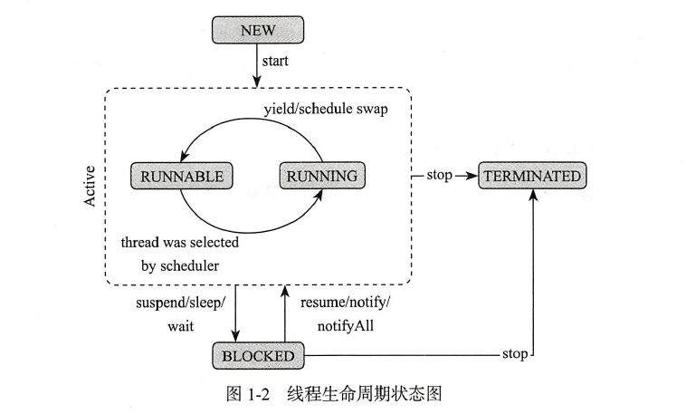
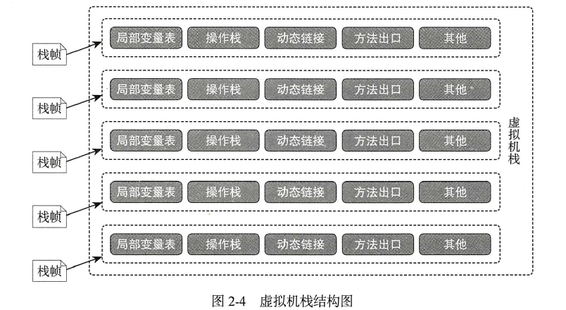

[TOC]
# Java线程学习笔记


## 一、JUC包含的内容

>- Java JUC 简介
>- volatile 关键字-内存可见性
>- 原子变量-CAS算法
>- ConcurrentHashMap 锁分段机制
>- CountDownLatch 闭锁
>- 实现Callable 接口
>- Lock 同步锁
>- Condition 控制线程通信
>- 线程按序交替
>- ReadWriteLock 读写锁
>- 线程八锁
>- 线程池
>- 线程调度
>- ForkJoinPool 分支/合并框架工作窃取  
### JUC简介
> java5.0中提供了 java.util.concurrent 包，此包增加了在并发编程中常用的实用工具类，用于定义类似于线程的自定义子系统，包括线程池、异步IO和轻量级任务框架，提供了灵活的、可调的线程池。还提供了设计用于多线程上下文中的Collection实现等。
>
>

### 1、volatile---内存可见性

**简介：**  
> ​	java语言提供了一种稍弱的同步机制，就是volatile变量。主要是用来确保变量更新操作会通知到其他线程，确保变量更新到主内存中，以及每次使用前都是从主内存中刷新数据。当把变量声明为volatile类型后,编译器与运行时都会注意到这个变量是共享的。volatile修饰变量,每次被线程访问时强迫其从主内存重读该值,修改后再写回。保证读取的可见性,对其他线程立即可见。

**1）内存可见性产生的原因：**

> 当一个共享数据再被两个线程同时使用的时候，当一个线程将共享数据修改以后，另一个线程无法知道共享数据已经发生了变化。   

**2）解决内存可见性，保证数据同步的方法：**
>- **方法一：**
使用同步锁机制，将synchronized关键字来监控共享数据。但是这样的程序效率将非常受影响。
>- **方法二：**
使用比synchronized关键字更加轻量级的 volatile 变量。  

**3）volatile关键字的使用方法：**
> **实现原理：**
被volatile关键字修饰的共享数据是放在一个公共的位置，每个线程对数据的修改都是对公共数据的修改，每个线程获取公共数据都是从公共位置读取实时的数据。  
**使用方法：**
例如：private volatile boolean flag = false; 使用volatile关键字来对数据进行修饰，解决内存可见性的问题。  

**4）volatile与synchronized的区别：**
>- volatile不具有”互斥性“，而synchronized具有“互斥性”。  
“互斥性”的意思是：在多个线程对变量的访问中，synchronized关键字只允许一个线程对其进行操作，其他线程不能执行操作。    而volatile关键字修饰的变量，多个线程能够同时对其进行访问，且能够实时的保证数据的同步。
>- volatile不能够保证变量的“原子性”。  

**5）原子变量---原子变量与volatile相结合保证内存的可见性**  

> **简介：**
原子变量是在java.util.courrent.atomic包下提供了原子变量类型，都是使用了 volatile 关键字修饰和采用了 CAS 算法，来实现内存的可见性问题与保证原子性问题。  
**CAS（Compare and Swap）算法：比较与替换的意思**
CAS 算法是对并发操作的共享数据的一种保证原子性的方法。 它具有三个数据：  

变量名 | 变量符号 | 备注
---|---|---
内存值 | V | 对共享变量操作之前的value     
预估值 | A | 更改共享变量之前共享变量的value
实际值 | B | 对共享变量进行操作之后的value
> CAS 实现方法：(当共享变量最开始的值)V == A(需要对共享变量的值更改之前的值) 的时候，才会将 B(线程对数据的更改的value) 赋值给共享变量，
**保证内存的可见性与原子性**。  

**6）什么是原子变量？**  
在Java中，多个线程操作共享数据的时候，会导致一些意外的数据产生，不符合数据的一致性规范。在java.util.current.atomic包下的原子变量，能够提供线程高效，线程安全的操作。

**原子变量的类型：**  

- AtomicBoolean 
- AtomicInteger 
- AtomicIntegerArray 
- AtomicIntegerFieldUpdater 
- AtomicLong 
- AtomicLongArray 
- AtomicLongFieldUpdater 
- AtomicMarkableReference 
- AtomicReference 
- AtomicReferenceArray 
- AtomicReferenceFieldUpdater 
- AtomicStampedReference 
- DoubleAccumulator 
- DoubleAdder 
- LongAccumulator 
- LongAdder 


**原子变量使用方法：**  
```java 
public class TestAtomicDemo {
	public static void main(String[] args) {
		AtomicDemo ad = new AtomicDemo();
		for (int i = 0; i < 10; i++) {
			new Thread(ad).start();
		}
	}
	
}

class AtomicDemo implements Runnable{
	//整形的原子变量，底层被volatile关键字修饰
	private AtomicInteger serialNumber = new AtomicInteger(0);

	@Override
	public void run() {
		
		try {
			Thread.sleep(200);
		} catch (InterruptedException e) {
		}
		
		System.out.println(getSerialNumber());
	}
	
	public int getSerialNumber(){
		return serialNumber.getAndIncrement();
	}
}

```
### 2、ConcurrentHashMap 锁分段机制
**1）简介：**
> 在java5中提供了ConcurrentMap接口和它的一个实现类ConcurrentHashMap。concurrentHashMap能够同时的并发的执行读、写的操作。是一个线程安全的集合。 


**2）实现原理：**
> ConcurrentHashMap中，默认是将hash表分为16个段，16个段中又有16个内存，每个内存后面相应的跟着的是一个链表(相当于每一个段中又有一个HashMap)。所以，同时能够让16个写线程并发的对其进行操作，而每一个线程只会操作一个桶，每个锁对应的添加单独的锁，实现高并发的效果。


**3）get、put方法：**  
>- get()方法：在ConcurrentHashMap中，读的操作是
**不需要加锁的**。因为在get方法中将要使用的共享变量都定义为了volatile，而volatile关键字能够保证内存的可见性，所以读的操作是不需要加锁的。
```java
	public V get(Object key) {
 	  int hash = hash(key.hashCode());
	  return segmentFor(hash).get(key, hash);
	}
```
>- put()方法：写的操作是
**需要上锁的**，一个线程独占一个段，来对数据进行写的操作。

**4）ConcurrentHashMap迭代器：**
> concurrentHashMap使用的 是不同于通常迭代器的另一种方式，称为**弱迭代器**。当iterator被创建以后集合发生改变，不会抛出ConcurrentModificationException，取而代之的是改变数据时，是new出来的新的数据，对之前的数据不会有影响，iterator完成后再将头指针替换为新的数据。这样子，能够让iterator线程使用原来的老数据，而写线程也能够并发的执行。提高多个线程的连续性和扩展性。


### 3、CountDownLatch 闭锁  与 CyclicBarrier 
**1）CountDownLatch简介：**  
> 在完成一组正在执行其他线程中的执行的操作之前，它允许一个或者多个线程进入等待状态。简单来说就是能够将部分操作放置在**其他线程执行完毕以后**再执行。  

**2）CountDownLatch功能：**  

>- 闭锁能够延迟线程进度直到其到达终止状态。
>- 闭锁能够用来确保其他活动完成以后才继续执行锁里面的操作，比如：  
    >   - 确保某个计算在其所需的所有资源都已经被初始化之后才执行。
    >   - 确保某个服务在其依赖的所有其他服务都已经启动之后才启动。
    >   - 确保某个操作某个操作的所有参与者都已经准备就绪以后再继续执行等。  

**3）实现方式：**  
```java
/**
 * 测试CountDownLatch--闭锁的效果，实现的功能是使某个或者多个线程在其他线程执行完毕之后执行。
 * @author 10838
 *
 */
public class TestConutDownLatch {

	public static void main(String[] args) {
		//创建CountDownLatch常量来对应需要执行的线程的数量
		final CountDownLatch latch = new CountDownLatch(5);
		
		//调用构造器来创建对象
		LatchDemo latchDemo = new LatchDemo(latch);
		
		long startTime = System.currentTimeMillis();
		
		for (int i = 0;i<5;i++)
		{
			Thread thread = new Thread(latchDemo);
			thread.start();
		}
		
		//为latch来指定哪个线程需要被锁定，待到线程执行完毕以后再自行
		try {
			latch.await();
		} catch (InterruptedException e) {
			// TODO Auto-generated catch block
			e.printStackTrace();
		}
		
		long endTime = System.currentTimeMillis();
		System.out.println("运行时间为："+(endTime-startTime));	
	}
}

/**
 * 使用CountDownLatch 来对线程进行监控，让线程执行完一次，CountDownLatch变量的值就减一。
 * @author 10838
 *
 */
class LatchDemo implements Runnable{

	//定义CountDownLatch变量来对其他线程进行监控
	private CountDownLatch latch;
	
	//构造器
	public LatchDemo(CountDownLatch latch) {
		this.latch = latch;
	}

	//构造器
	public LatchDemo() {
	}

	//线程的方法
	@Override
	public void run() {
		try {
			for(int i=0;i<10;i++)
			{
				System.out.println(i);
			}
		} finally {
			//latch的值减一。
			latch.countDown();
		}
	}
}
```

**4）CyclicBarrier简介：**  
当为线程添加了CyclicBarrier锁以后，会让所有添加了这个锁的线程一起结束线程的所有操作，无论是谁先执行完代码，都会等待其他线程执行完毕以后，一起执行完毕。  

也就是说：N个线程互相等待，任何一个线程完成之前，所有线程都必须等待。在最后一个未await之前，所有N个线程都不算完成，都处于阻塞状态。

**实现代码：**  

```java
public class Snippet {
	
    public static void main(String[] args){

        CyclicBarrier objectCyclicBarrier=new CyclicBarrier(3);
        
        Thread thread1=new Thread(){

            public void run(){
                try{
                	Thread.sleep(5000);
                    objectCyclicBarrier.await();
                }catch(Exception e){
                }
                System.out.println(1);
            }
        };
        System.out.println(4);
        thread1.start();

        Thread thread2=new Thread(){

            public void run(){
                try{
                    //objectCyclicBarrier.await();
                }catch(Exception e){
                }
                System.out.println(2);
            }
        };
        thread2.start();

        Thread thread3=new Thread(){

            public void run(){
                try{
                    objectCyclicBarrier.await();
                }catch(Exception e){
                }
                System.out.println(3);
            }
        };
        thread3.start();
    }
}
```
### 3、自旋锁
**1）简介：**  

> ​	指的是当一个线程获取锁的时候，如果锁被其他线程占用，那么该线程将进行循环等待，直到锁被释放，然后不断判断是否获取到锁，直到获取锁成功才退出循环。

**2）特点：**  

> ​	当线程获取锁的时候，如果发现锁被占用，那么互斥锁就会导致其他线程进行wait状态；然而自旋锁能够保持一致不断的去尝试获取锁而不进入wait状态。

**3）CAS与自旋锁的实现：**  

> ​	自旋锁的意思就是进入到一个无限循环的状态，然后进行CAS算法的执行，如果执行一次CAS算法，返回为false的话，就继续执行循环，如果返回为true的话，就退出循环。

**4）适用对象：**  

> ​	CountDownLatch、Semaphore、ReentrantLock、 AtomicBoolean、AtomicInteger 等，都是自旋锁的实现方式。


### 4、创建多线程的第三种方式--实现Callable接口  
**1）简介：**
> 实现Callable接口--相较于实现Runable接口的方式，其方法可以有返回值，**可以抛出异常**。  

**执行Callable方式：需要Future接口的支持。**也就是说，Callable的执行调用的返回结果，会被Future得到。

#### Future接口的子类：
CompletableFuture ， CountedCompleter ， ForkJoinTask ， **FutureTask** ， RecursiveAction ， RecursiveTask ， SwingWorker 

**2）优势：**

> 在主线程需要执行大量的串行运算的时候，将串行运算的内容提交给副线程去执行，而主线程继续去执行其他的操作，到最后使用 get() 方法来将副线程的返回值获取。  

**3）实现方式：**
```java
public class TestCallable {
	
	public static void main(String[] args) {
		//创建线程
		ThreadDemo1 td = new ThreadDemo1();
		//创建FutureTask实现类来执行多线程
		FutureTask ft = new FutureTask<>(td);
		//使用Thread来启动多线程
		Thread thread = new Thread(ft);
		thread.start();
		System.out.println("测试测试");
		//使用.get()方法得到线程运算以后的结果,会在副线程的运算结果结束以后才能够执行
		try {
			System.out.println(ft.get());
		} catch (Exception e) {
			e.printStackTrace();
		} 
	}

}

class ThreadDemo1 implements Callable<Integer>{

	@Override
	public Integer call() throws Exception {
		Integer sum = 0;
		for (int i = 0;i <100;i++)
		{
			sum = sum + i;
			System.out.println(i);
		}
		return sum;
	}
	
}
```

### 5、Lock 同步锁---保证多线程安全性问题
**1）简介：**  

> Lock 同步锁是一个显式锁，是一种更加灵活的方式来保证线程的安全性问题。它需要通过手动的调用 lock() 方法来进行上锁，手动的调用 unlock() 方法来进行解锁。  

**Lock的实现类：**  
- ReentrantLock --- 创建一个Lock锁
- ReentrantReadWriteLock.ReadLock --- 创建一个Lock读锁  
- ReentrantReadWriteLock.WriteLock --- 创建一个Lock写锁


**优势：**
> 更加灵活的去对多线程进行安全控制的操作，手动上锁与手动解锁能够更好的控制线程。
**注意：**
手动解锁，调用的是unlock()方法，一般是放在finally中执行，需要保证锁一定被释放。

**实现方式：**
```java
/*
 * 一、用于解决多线程安全问题的方式：
 * jdk 1.5 后：
 *   同步锁 Lock
 * 注意：是一个显示锁，需要通过 lock() 方法上锁，必须通过 unlock() 方法进行释放锁，
 * 		   一般unlock()方法需要放在finally中，保证其方法一直能够要执行成功。
 */
public class TestLock {
	
	public static void main(String[] args) {
		Ticket ticket = new Ticket();
		
		new Thread(ticket, "1号窗口").start();
		new Thread(ticket, "2号窗口").start();
		new Thread(ticket, "3号窗口").start();
	}
}

class Ticket implements Runnable{
	private int tick = 100;
	//创建Lock的实现类对象ReentrantLock来对票进行上锁
	private Lock lock = new ReentrantLock();
	@Override
	public void run() {
		while(true){
			lock.lock(); //上锁
			if ( tick > 0 ) {
				try{
					System.out.println(Thread.currentThread().getName() + " 完成售票，余票为：" + --tick);
				}finally{
					lock.unlock(); //释放锁
				}
			}
		}
	}
}
```
### 6、Condition--控制线程通信  
**1）简介：**  
> Lock的线程间的等待唤醒机制的控制，是对应着Condition中的await、signal 和signalAll三大方法，分别对应着wait、notify 和notifyAll三大方法。可以用于线程之间的通信。  

**2）使用方法：**

> 在创建Lock锁对象以后，调用newCondition()方法来创建Condition对象，实现对await、signal 和signalAll方法的调用。  


**3）通常使用场景：**  
一般是将Condition对象作为成员变量，当调用await()方法以后，当前线程会进入阻塞状态，并释放锁在此等待。当其他线程调用Condition对象的signal()方法的时候，会通知当前线程从等待状态中返回，并重新获取锁，继续执行。

**4）代码为：**
```
Lock lock = new ReentrantLock();
Condition condition = lock.newCondition();
public void conditionWait() throws InterruptedException {
    lock.lock();
    try {
        condition.await();
    } finally {
        lock.unlock();
    }
}
public void conditionSignal() throws InterruptedException {
    lock.lock();
    try {
        condition.signal();
    } finally {
        lock.unlock();
    }
}
```

### 7、虚假唤醒--使用synchronized或者Lock解决
**1）使用synchronized关键字来避免虚假唤醒**  
```java
/*
 * 生产者和消费者案例
 */
public class TestProductorAndConsumer {

	public static void main(String[] args) {
		Clerk clerk = new Clerk();
		
		Productor pro = new Productor(clerk);
		Consumer cus = new Consumer(clerk);
		
		new Thread(pro, "生产者 A").start();
		new Thread(cus, "消费者 B").start();
		
		new Thread(pro, "生产者 C").start();
		new Thread(cus, "消费者 D").start();
	}
	
}

//店员
class Clerk{
	private int product = 0;
	
	//进货
	public synchronized void get(){//循环次数：0
		while(product >= 1){//为了避免虚假唤醒问题，应该总是使用在循环中
			System.out.println("产品已满！");
			
			try {
				this.wait();
			} catch (InterruptedException e) {
			}
			
		}
		
		System.out.println(Thread.currentThread().getName() + " : " + ++product);
		this.notifyAll();
	}
	
	//卖货
	public synchronized void sale(){//product = 0; 循环次数：0
		while(product <= 0){
			System.out.println("缺货！");
			
			try {
				this.wait();
			} catch (InterruptedException e) {
			}
		}
		
		System.out.println(Thread.currentThread().getName() + " : " + --product);
		this.notifyAll();
	}
}

//生产者
class Productor implements Runnable{
	private Clerk clerk;

	public Productor(Clerk clerk) {
		this.clerk = clerk;
	}

	@Override
	public void run() {
		for (int i = 0; i < 20; i++) {
			try {
				Thread.sleep(200);
			} catch (InterruptedException e) {
			}
			
			clerk.get();
		}
	}
}

//消费者
class Consumer implements Runnable{
	private Clerk clerk;

	public Consumer(Clerk clerk) {
		this.clerk = clerk;
	}

	@Override
	public void run() {
		for (int i = 0; i < 20; i++) {
			clerk.sale();
		}
	}
}
```
**使用Lock与Condition来避免虚假唤醒：**
```java
/*
 * 生产者消费者案例：
 */
public class TestProductorAndConsumerForLock {

	public static void main(String[] args) {
		Clerk clerk = new Clerk();

		Productor pro = new Productor(clerk);
		Consumer con = new Consumer(clerk);

		new Thread(pro, "生产者 A").start();
		new Thread(con, "消费者 B").start();

//		 new Thread(pro, "生产者 C").start();
//		 new Thread(con, "消费者 D").start();
	}

}

class Clerk {
	private int product = 0;

	private Lock lock = new ReentrantLock();
	private Condition condition = lock.newCondition();

	// 进货
	public void get() {
		lock.lock();

		try {
			if (product >= 1) { // 为了避免虚假唤醒，应该总是使用在循环中。
				System.out.println("产品已满！");

				try {
					condition.await();
				} catch (InterruptedException e) {
				}

			}
			System.out.println(Thread.currentThread().getName() + " : "
					+ ++product);

			condition.signalAll();
		} finally {
			lock.unlock();
		}

	}

	// 卖货
	public void sale() {
		lock.lock();

		try {
			if (product <= 0) {
				System.out.println("缺货！");

				try {
					condition.await();
				} catch (InterruptedException e) {
				}
			}

			System.out.println(Thread.currentThread().getName() + " : "
					+ --product);

			condition.signalAll();

		} finally {
			lock.unlock();
		}
	}
}

// 生产者
class Productor implements Runnable {

	private Clerk clerk;

	public Productor(Clerk clerk) {
		this.clerk = clerk;
	}

	@Override
	public void run() {
		for (int i = 0; i < 20; i++) {
			try {
				Thread.sleep(200);
			} catch (InterruptedException e) {
				e.printStackTrace();
			}

			clerk.get();
		}
	}
}

// 消费者
class Consumer implements Runnable {

	private Clerk clerk;

	public Consumer(Clerk clerk) {
		this.clerk = clerk;
	}

	@Override
	public void run() {
		for (int i = 0; i < 20; i++) {
			clerk.sale();
		}
	}

}
```
### 8、ReadWriteLock 读写锁
**1）简介：**
> 读写锁维护了一对锁，一个用于读的操作，一个用于写的操作。读锁可以有多个线程进行共享数据而不会产生互斥效果。而写的操作只能有一个线程来进行操作，具有互斥效果。  

**2）特点：** 
> 在程序的执行过程中，添加读锁能够让多个线程都能够读取数据；添加写锁以后，只能够让一个线程对数据进行修改的的操作，提高程序的并发性能。

**3）实现方式：**
```java
public class TestReadWriteLock {
	public static void main(String[] args) {
		//创建对象
		ReadWriteLockDemo rw = new ReadWriteLockDemo();
		//创建写线程
		new Thread(new Runnable() {
			@Override
			public void run() {
				rw.set((int)(Math.random() * 101));
			}
		}).start();
		
		//创建读线程
		for (int i = 0; i < 100; i++) {
			new Thread(new Runnable() {
				
				@Override
				public void run() {
					rw.get();
				}
			}).start();
		}
	}
}

class ReadWriteLockDemo {
	private int number = 0;
	//创建读写锁
	private ReadWriteLock lock = new ReentrantReadWriteLock();
	
	//读
	public void get(){
		lock.readLock().lock(); //上锁
			
		try{
			System.out.println(Thread.currentThread().getName() + " : " + number);
		}finally{
			lock.readLock().unlock(); //释放锁
		}
	}
		
	//写
	public void set(int number){
		lock.writeLock().lock();
		try{
			System.out.println(Thread.currentThread().getName());
			this.number = number;
		}finally{
			lock.writeLock().unlock();
		}
	}
}

```
### 9、线程池（ExecutorService）
**1）简介：**  
> 传统创建线程的方式是需要的时候，创建线程，线程执行完毕，则马上关闭线程，在县城的重复创建、销毁的过程中，会导致内存资源的大连消耗与浪费。  
而线程池的方式是创建多个线程来存入到线程池中，当需要多线程，则从线程池中获取一个或者多个线程来使用，待到使用完毕，将使用的线程返回到线程池中。  

**2）线程的体系结构：**   


**3）线程池的工具类：Excutors**

>- ExecutorService newFixedThreadPool(int num) : 创建一个固定大小的线程池。
>- ExecutorService newCacheThreadPool() : 缓存线程池，线程池数量不固定，可以根据需要来自动更改数量。
>- ExecutorService newSingleThreadExecutor() : 创建单个线程池，线程池里面只有一个线程。  

>- ScheduleExecutorService newScheduledThreadPool() : 创建固定大小的线程池，而且还可以进行线程调度，延迟或者定时的执行任务。  

**4）执行代码：**
```java
public class TestThreadPool {
	
	public static void main(String[] args) {
		//创建一个固定大小的线程池
		ExecutorService pool = Executors.newFixedThreadPool(5);
		
		ThreadPoolDemo demo = new ThreadPoolDemo();
		
		//为线程池分配任务
		for(int i = 0;i < 10;i++)
		{
			pool.submit(demo);
		}
		
		//关闭线程池:这个是柔和的关闭线程池，执行这条语句以后，不会继续
		//		接收新的任务，待到以前的任务执行完毕以后，就能够关闭线程。
		pool.shutdown();
	}

}

class ThreadPoolDemo implements Runnable{

	@Override
	public void run() {
		System.out.println(Thread.currentThread().getName());
	}
	
}
```

**调用线程池的方式：**  
- 第一种方式：使用 submit() 方法来实现对线程池的线程进行调用。
```
Future<?> submit = pool.submit(demo);
```
- 第二种方式：使用 execute() 方法来对线程池的线程进行调用。
```
pool.execute(demo);
```

#### 如何合理的使用线程池
线程池的使用，主要是用于处理业务数据的，根据业务性质的不同来进行不同的对待。  

**业务性质：** CPU密集型任务、IO密集型任务、混合型任务等   

**最佳线程数的公式：**  
> 最佳线程数目 = （线程等待时间 / 线程CPU时间 + 1 ）* CPU数目

**总结：** 线程等待时间越长，需要的CPU更多，线程CPU时间越短，需要的CPU越少。

**分配方案：**  
- 高并发、任务执行时间短的业务，线程池线程数可以设置为CPU核数+1，减少线程上下文的切换。(当计算密集型任务偶尔由于页缺失故障或者其他原因而暂停时，这个额外的线程也能够确保CPU的时钟周期不会被浪费) 

- 任务IO时间长，并发不高的业务，线程主要是用于去进行IO的操作，对CPU消耗不高，可以创建更多的线程来合理利用CPU资源。
- 任务计算时间长，并发不高的情况下，计算对CPU消耗高，所以需要适量的减少线程的创建，将更多的CPU资源留给其他的线程池。
- 高并发，且时间长的情况下，可以使用多重缓存来降低服务器压力。也可以在必要的情况下，将其进行才分、解耦，使用消息中间件的方式来进行业务的处理。

### 10、ForkJoinPool分支/合并框架 工作窃取
**1）简介：**
> Fork/Join 框架：在必要的情况下，将一个大型人物，进行拆分(Fork)成若干个小任务(知道不可拆分为止)，再将一个个小任务运算的结果进行 join 汇总。

**2）特点：**
> 在多线程运行过程中，每个线程都分配了多个小任务，当某一个线程因为未能够获取到线程或者任务执行完毕以后，是线程一直处于阻塞(等待)状态，造成资源浪费。使用ForkJoin的话，能够使线程执行完毕所有的小任务以后，能够从其他的线程末尾拿到其他线程的小任务来执行，更加合理的使用资源。

### 11、阻塞队列
#### 简介：
> 阻塞队列就是在一个队列的基础之上来添加两个附属操作。  
>
> - 支持阻塞的插入方法---当队列满了的时候，会阻塞插入元素的线程，直到队列资源空闲以后才释放。
> - 队列空的时候，获取元素的线程会等待队列变为非空。

#### 使用场景：
> ​	阻塞队列常用语生产者与消费者的场景，生产者向队列里面添加元素，而消费者则从队列中取出元素。

#### 队列类别：
> 1、ArrayBlockingQueue 数组结构组成的有界阻塞队列。
>
> 此队列按照先进先出（FIFO）的原则对元素进行排序，但是默认情况下不保证线程公平的访问队列，即如果队列满了，那么被阻塞在外面的线程对队列访问的顺序是不能保证线程公平（即先阻塞，先插入）的。
>
> 2、LinkedBlockingQueue一个由链表结构组成的有界阻塞队列
>
> 此队列按照先出先进的原则对元素进行排序
>
> 3、PriorityBlockingQueue 支持优先级的无界阻塞队列
>
> 4、DelayQueue 支持延时获取元素的无界阻塞队列，即可以指定多久才能从队列中获取当前元素
>
> 5、SynchronousQueue不存储元素的阻塞队列，每一个put必须等待一个take操作，否则不能继续添加元素。并且他支持公平访问队列。
>
> 6、LinkedTransferQueue由链表结构组成的无界阻塞TransferQueue队列。相对于其他阻塞队列，多了tryTransfer和transfer方法
>
> transfer方法
>
> 如果当前有消费者正在等待接收元素（take或者待时间限制的poll方法），transfer可以把生产者传入的元素立刻传给消费者。如果没有消费者等待接收元素，则将元素放在队列的tail节点，并等到该元素被消费者消费了才返回。
>
> tryTransfer方法
>
> 用来试探生产者传入的元素能否直接传给消费者。，如果没有消费者在等待，则返回false。和上述方法的区别是该方法无论消费者是否接收，方法立即返回。而transfer方法是必须等到消费者消费了才返回。
>
> 7、LinkedBlockingDeque链表结构的双向阻塞队列，优势在于多线程入队时，减少一半的竞争。

### 11、同步容器与并发容器
#### 同步容器：
> ​	将方法通过synchronized关键字来修饰的线程安全的类，使用同步的方式将状态封装起来，对每个方法尽心同步，即使是多线程的情况下，也会只能够实现一个线程来对其进行操作。  
> 常见的同步类容器有；Vector、Hashtable等。

#### 并发容器：
> ​	在多线程的情况下，能够实现锁分段机制，能够实现为每个段添加锁，而不是将整个容器进行上锁。例如：ConcurrentHashMap就是将整个容器分为16个段，每个段里面存放着类似于HashMap的数据结构，但需要给容器上锁的时候，能够选择性的为某一个段进行上锁。
> 常见的有ConcurrentHashMap、 ConcurrentNavigableMap <K，V>等。

### 12、Semaphore信号量
#### 简介：
> 在Java中，为了保护共享数据的资源的访问,Semaphore内部存在一个计数器，能够限制数据同时进行使用的访问量。

#### 使用方式：
一个线程要访问共享资源，先获得信号量，如果信号量的计数器值大于1，意味着有共享资源可以访问，则使其计数器值减去1，再访问共享资源。  
如果计数器值为0,线程进入休眠。当某个线程使用完共享资源后，释放信号量，并将信号量内部的计数器加1，之前进入休眠的线程将被唤醒并再次试图获得信号量。

#### 代码操作：
```

Semaphore semaphore = new Semaphore(10,true);
semaphore.acquire();

//中间进行共享数据的访问等其他操作

semaphore.release();

```

### 13、死锁、活锁

#### 13.1 死锁

##### 13.1.1 死锁简介：
当一个线程占用着锁的资源，结果线程因为其他原因造成阻塞，使得这个线程对之前的锁的资源一直占用着，当其他线程来申请获取那个锁的资源的时候，会因为得不到锁而一直长时间的等待下去。

##### 13.1.2 死锁的常见原因：
- 一个线程两次申请锁
- 两个线程互相申请对方的锁，但是对方都不释放锁
- 系统资源不足
- 进程运行推进的顺序不合适
- 资源分配不当

##### 13.1.3 死锁产生的必要条件：
> （1）互斥：一次只有一个进程可以使用一个资源，其他进程不能够访问已经分配给其他进程的资源。  
> （2）占有且等待：当一个进程在等待分配得到其他资源的时候，对已经占有的资源部释放。 
> （3）非抢占：不能够强行抢占进程中已经被占有的资源。  
> （4）循环等待：存在一个进程链，使得每个资源至少占有此链中下一个进程所需要的一个资源。 

##### 13.1.4 两种死锁避免算法：
> **1）进程启动拒绝：**
>
> 如果一个进程的请求会导致死锁，则不启动该进程。
>
> **2）资源分配拒绝：**
>
> 如果一个进程增加的资源请求会导致死锁，则不允许此分配(银行家算法)。 

##### 13.1.5 死锁解除方法：
> **1) 资源剥夺法：**
>
> 挂起某些死锁进程，并抢占它的资源，将这些资源分配给其他的死锁进程。但应防止被挂起的进程长时间得不到资源，而处于资源匮乏的状态。
>
> **2) 撤销进程法：**
>
> 强制撤销部分、甚至全部死锁进程并剥夺这些进程的资源。撤销的原则可以按进程优先级和撤销进程代价的高低进行。

##### 13.1.6 死锁demo

```java
	public static void main(String[] args) {
		List<Integer> listle = new ArrayList<Integer>();
		List<Integer> listri = new ArrayList<Integer>();
		for (int i = 0; i < 10; i++) {
			listle.add(i+10);
			listri.add(i+20);
		}

		new Thread(() -> {
			synchronized (listle) {
				for (Integer integer : listle) {
					System.out.println("listle的遍历操作："+integer);
				}
				try {
					TimeUnit.SECONDS.sleep(1);
				} catch (InterruptedException e) {
					e.printStackTrace();
				}

				synchronized (listri) {
					System.out.println("在listle中给listri上锁");
				}
			}
		}).start();

		new Thread(() -> {
			synchronized (listri) {
				for (Integer integer : listri) {
					System.out.println("listri的遍历操作："+integer);
				}
				try {
					TimeUnit.SECONDS.sleep(1);
				} catch (InterruptedException e) {
					e.printStackTrace();
				}

				synchronized (listle) {
					System.out.println("在listri中给listle上锁");
				}
			}
		}).start();
	}
```

#### 13.2 活锁

##### 13.2.1 活锁简介

> 任务或者执行者没有被阻塞，由于某一些条件没有满足，导致一直重复进行尝试，失败，尝试，失败的过程。直到获得对应的锁。

##### 13.2.2 与死锁的差异

> ​	活锁与死锁的差别就在于：处于活锁的实体是在不断的改变状态的，所谓的“活”，而处于死锁状态的实体表现为等待；
>
> ​	死锁在于两个进程之间都不释放锁的资源，导致了彼此之间一直都处于等待状态。
>
> ​	活锁在于进程会不断的进行尝试获取锁的操作，一直改变进程的状态，保证进程的不进入死锁。

#### 13.3 饥饿

##### 13.3.1 饥饿简介

> 一个或者多个线程因为种种原因无法获得所需要的资源，导致一直无法执行的状态。

##### 13.3.2 饥饿原因

> - 高优先级线程吞噬了所有的低优先级的CPU时间。
> - 线程被永久堵塞在一个等待进入的同步块的状态，因为其他线程纵是能够给在它之前持续的对该同步块进行访问。
> - 线程在等待一个本身也处于永久等待完成的对象，其他线程总是被持续的唤醒。

### 14、ThreadLocal简介
**1）作用：**  
> ​	ThreadLocal用于维护变量的时候，为每个使用该变量的线程提供独立的变量副本，让每隔线程能够独立的改变自己的副本，而不影响其他线程的操作，也就是说线程之间是隔离的。

**2）默认提供的及几个方法：**    
- ThreadLocal.get(): 获取ThreadLocal中当前线程共享变量的值。

- ThreadLocal.set(): 设置ThreadLocal中当前线程共享变量的值。

- ThreadLocal.remove(): 移除ThreadLocal中当前线程共享变量的值。

- ThreadLocal.initialValue(): ThreadLocal没有被当前线程赋值时或当前线程刚调用remove方法后调用get方法，返回此方法值。

**3）使用方式：**  
方式一：创建一个默认值为 null 的ThreadLocal对象。  

注意：这种方式如果不先赋值就调用get()方法的话，容易造成空指针异常。
```java
//创建一个Long类型与一个String类型的 ThreadLocal对象。
ThreadLocal<Long> longLocal = new ThreadLocal<Long>();
ThreadLocal<String> stringLocal = new ThreadLocal<String>();

//为对象赋值：调用set方法
longLocal.set(Thread.currentThread().getId());
stringLocal.set(Thread.currentThread().getName());

//得到对象的值：调用get方法
long  lo = longLocal.get();
String str = stringLocal.get();
```

方式二：在创建对象的时候，重写initialValue方法,为对象附初始值（常用方式）。

注意：这种方式能够保证变量具有初始值，不会抛出空指针异常。
```java
ThreadLocal<Long> longLocal = new ThreadLocal<Long>(){
    protected Long initialValue() {
        return Thread.currentThread().getId();
    };
};
ThreadLocal<String> stringLocal = new ThreadLocal<String>(){;
    protected String initialValue() {
        return Thread.currentThread().getName();
    };
};
```

**4）ThreadLocal与synchronized关键字的区别：**  
首先,它们都是为了解决多线程中相同变量访问冲突问题。不过,在同步机制中,要通过对象的锁机制保证同一时间只有一个线程访问该变量。该变量是线程共享的, 使用同步机制要求程序缜密地分析什么时候对该变量读写, 什么时候需要锁定某个对象, 什么时候释放对象锁等复杂的问题,程序设计编写难度较大, 是一种“以时间换空间”的方式。 而ThreadLocal采用了以“以空间换时间”的方式。

### 15 用户线程、守护线程

#### 15.1 线程分类

- User Thread（用户线程、非守护线程）
- Daemon Thread（守护线程）

#### 15.2 守护线程Daemon

##### 15.2.1 基本介绍

> 守护线程在JVM的运行过程中就是非守护线程的保姆。
>
> **当JVM中的实例尚存着任何一个费守护线程没有结束，守护线程就全部继续工作。当只有最后一个非守护线程结束以后，守护线程随着JVM一同结束工作。**
>
> 守护线程通常情况下，是用作为其他线程的运行提供便利的操作。守护线程最定性的应用就是GC操作。

##### 15.2.2 注意事项

> - **thread.setDaemom(true)** 需要在 thread.start() 之前执行，否则会抛出IllegalThreadStateException异常。
> - Daemon线程中创建的也是Daemon线程。
> - Daemon守护线程通常情况下，不要进行读、写、计算等操作，可用于做 Hearth Check。

##### 15.2.3 代码示例

```java
public static void main(String[] args) {
		//创建一个非守护线程
		new Thread(() -> {

			//创建一个守护线程，用于进行Hearth check的操作
			Thread thread = new Thread(() -> {
				while (true) {
					System.out.println("hearth check操作");
					try {
						TimeUnit.SECONDS.sleep(1);
					} catch (InterruptedException e) {
						e.printStackTrace();
					}
				}
			});
			thread.setDaemon(true);
			thread.start();
            //验证是否是守护线程
            boolean daemon = thread.isDaemon();

			//user Thread的其他操作
			try {
				TimeUnit.MINUTES.sleep(2);
			} catch (InterruptedException e) {
				e.printStackTrace();
			}

		}).start();
	}
```

### 16 线程join

#### 16.1 基本介绍

​	Thread类中的join() 方法主要的作用就是同步，它可以使得线程之间的并行执行变成串行执行。

​	join方法的功能在于：在某一个线程中调用其他线程的join()方法，就能够实现这个线程在join()线程执行才进行执行，将两个并行的线程变成串行操作。

#### 16.2 详情介绍

​	线程 join() 方法的调用是在线程 start() 之后进行操作。

​	线程的 join() 方法是一个非常重要的方法，使用它的特性可以实现很多比较强大的功能，与sleep() 方法一样，是一个可中断的方法。

​	线程join()主要是用来进行阻塞当前线程，直到调用该方法的其他线程执行完毕以后，再进行当前线程后面的执行。

##### 16.2.1 join()源码

​	Thread的join()方法底层采用的是wait()方法进行等待的操作。

```java
    /**
     * Waits at most {@code millis} milliseconds for this thread to
     * die. A timeout of {@code 0} means to wait forever.
     *
     * <p> This implementation uses a loop of {@code this.wait} calls
     * conditioned on {@code this.isAlive}. As a thread terminates the
     * {@code this.notifyAll} method is invoked. It is recommended that
     * applications not use {@code wait}, {@code notify}, or
     * {@code notifyAll} on {@code Thread} instances.
     *
     * @param  millis
     *         the time to wait in milliseconds
     *
     * @throws  IllegalArgumentException
     *          if the value of {@code millis} is negative
     *
     * @throws  InterruptedException
     *          if any thread has interrupted the current thread. The
     *          <i>interrupted status</i> of the current thread is
     *          cleared when this exception is thrown.
     */
    public final synchronized void join(long millis)
    throws InterruptedException {
        long base = System.currentTimeMillis();
        long now = 0;

        if (millis < 0) {
            throw new IllegalArgumentException("timeout value is negative");
        }

        if (millis == 0) {
            while (isAlive()) {
                wait(0);
            }
        } else {
            while (isAlive()) {
                long delay = millis - now;
                if (delay <= 0) {
                    break;
                }
                wait(delay);
                now = System.currentTimeMillis() - base;
            }
        }
    }
```

#### 16.3 代码示例

**案例一：** Thread1与Thread2线程并行执行，而main线程则延迟执行。

```java
/**
 * join() 方法：针对的线程一直执行完毕以后，才会去执行其他的线程
 *      join()方法只是限制启动这个线程的线程延迟执行。
 *      也就是说：针对下面的方法 Thread1与Thread2交互执行完以后，才会继续执行main线程
 */
public class ThreadJoin {

    public static void main(String[] args) {
        Thread thread1 = new Thread(() -> {
            IntStream.range(1,1000).forEach(i -> System.out.println(Thread.currentThread().getName() + i));
        },"thread1");
        thread1.start();
        Thread thread2 = new Thread(() -> {
            IntStream.range(1,1000).forEach(i -> System.out.println(Thread.currentThread().getName() + i));
        },"thread2");
        thread2.start();
        try {
            thread1.join();
            thread2.join();
        } catch (InterruptedException e) {
            e.printStackTrace();
        }

        IntStream.range(1,1000).forEach(i -> System.out.println(Thread.currentThread().getName() + i));

    }
}
```

**案例二：** Thread2线程中调用Thread1线程的join()方法，main线程中调用Thread2线程的join()方法，则串行顺序为：先执行Thread1，再执行Thread2，最后执行thread的3.

```java
    public static void main(String[] args) {
        Thread thread1 = new Thread(() -> {
            IntStream.range(1,1000).forEach(i -> System.out.println(Thread.currentThread().getName() + i));
        },"thread1");
        thread1.start();
        Thread thread2 = new Thread(() -> {
            try {
                thread1.join();
            } catch (InterruptedException e) {
                e.printStackTrace();
            }
            IntStream.range(1,1000).forEach(i -> System.out.println(Thread.currentThread().getName() + i));
        },"thread2");
        thread2.start();
        try {
            thread2.join();
        } catch (InterruptedException e) {
            e.printStackTrace();
        }

        IntStream.range(1,1000).forEach(i -> System.out.println(Thread.currentThread().getName() + i));
    }
```

### 17 线程 interrupt

​	线程 interrupt ，主要是有与线程中断相关的API。

- public  void  interrupt()
- public  static  boolean  interupted()
- public  boolean  isInterrupted()

#### 1）interrupt

​	当很多方法调用以后，线程能够进入到阻塞状态；而调用当前线程的 interrupt 方法，就可以打断当前线程的阻塞状态。

##### 让线程进入阻塞状态的方法：

- Object 的 wait()  方法。

- Object 的 wait( long ) 方法。

- Object 的 wait( long,int ) 方法。

- Thread 的 sleep( long ) 方法。

- Thread 的 sleep( long,int ) 方法。

- Thread 的 join() 方法。

- Thread 的 join( long ) 方法。

- Thread 的 join( long,int ) 方法。

- TnterruptibleChannel 的 IO 操作。

- Selector 的 wakeup() 方法。

- .......

  ​	当使用以上方法进入了阻塞状态以后，在其他线程中为这个阻塞的线程调用 interrupt() 方法的时候，就能够打断这个阻塞的状态。打断阻塞状态不是意味着线程生命周期结束，仅仅是打断当前阻塞的这个状态而已。

  ​	**一旦线程在阻塞情况下被打断，都会抛出一个 InterruptedExectpion 异常。**

  ​	代码实现：

  ```java
  /**
  * 创建一个新的线程，启动该线程，让其阻塞一分钟；再在主线程中调用 interrupt() 方法，让其从阻塞状* 态结束，抛出异常：java.lang.InterruptedException: sleep interrupted
  */
  public static void main(String[] args) {
      Thread thread = new Thread(() -> {
          try {
              //让当前线程阻塞以秒
              TimeUnit.MINUTES.sleep(1);
          } catch (InterruptedException e) {
              e.printStackTrace();
          }
      });
  
      thread.start();
      thread.interrupt();
  }
  ```

#### 2）isInterrupted

​	isInterrupted是Thread一个成员方法，主要适用于判断当前线程是都被中断，该方法仅仅是对interrupt() 标识的一个判断，并不会影响标识。

#### 3）interrupted

​	interrupted() 方法是一个静态方法，也是用来判断当前线程是否被打断。但是它的实现过程是：调用该方法，会直接搽除掉线程的 interrupt标识，第一次返回结果为true，第二次以及以后返回的结果都是false。

### 18 关闭线程

#### 18.1 开关关闭线程

​	使用开关来进行线程的关闭，能够保证线程的在执行此次以后就停止执行了。

```java
public class CloseThread {

    public static void main(String[] args) {
        MyThread runnable = new MyThread();
        Thread thread = new Thread(runnable);
        thread.start();
        try {
            Thread.sleep(10000);
        } catch (InterruptedException e) {
            e.printStackTrace();
        }
        runnable.shutDown();
    }

}

class MyThread implements Runnable {

    /**
     * 线程启动的开关
     */
    private volatile boolean start = true;

    @Override
    public void run() {
        while (start) {
            Optional.of("线程再执行").ifPresent(System.out::println);
            try {
                TimeUnit.SECONDS.sleep(1);
            } catch (InterruptedException e) {
                e.printStackTrace();
            }
        }
    }

    /**
     * 关闭线程的开关
     * @return
     */
    public boolean shutDown() {
        start = false;
        System.out.println("线程已经关闭");
        return start;
    }
}
```

#### 18.2 interrupt打断

​	调用线程的 interrupt() 方法将线程进行打断操作。

```java
public class CloseThread1 {

    public static void main(String[] args) {
        MyThread1 thread1 = new MyThread1();
        Thread thread = new Thread(thread1);
        thread.start();

        try {
            TimeUnit.SECONDS.sleep(10);
        } catch (InterruptedException e) {
            e.printStackTrace();
        }

        thread.interrupt();
    }

}

class MyThread1 implements Runnable {

    @Override
    public void run() {
        while (true) {
            if (Thread.interrupted()) {
                System.out.println("线程已经停止");
                break;
            }
            Optional.of("线程正在执行").ifPresent(System.out::println);
        }
    }
}
```


### 线程面试题

#### 1）乐观锁与悲观锁？   

> - 乐观锁：乐观锁就是每次自己对数据的操作，都想象为没人会在释放锁之前来修改我的数据，当自己需要提交的时候，进行数据的标记验证，验证失败表示数据被别人修改过，就需要重试进行，直到成功为止。  
> - 悲观锁：每次自己对数据的操作的时候，都会有人来修改我的数据，加上锁，保证数据只能我自己一个人使用。  
>   实现方式： 
>   - 乐观锁：volatile + CAS算法  
>   - 悲观锁：synchronized 或者 Lock

#### 2）如果你提交任务时，线程池队列已满。会时发会生什么？

> 如果一个任务不能被调度执行那么ThreadPoolExecutor.submit()方法将会抛出一个RejectedExecutionException异常。  
> 也就是说，当线程队列已满的时候，继续提交线程任务的时候，就会抛出异常。

#### 3）同步代码块抛出异常以后会怎样？

> 同步代码块中的代码，无论是正常退出还是异常退出，都会对锁进行释放。所以，在同步代码块中，抛出了异常，就会导致同步代码块的异常退出，并且释放锁资源，其他线程能够继续对其进行操作。

#### 4）线程类的构造方法、静态块是被哪个线程调用的？

请记住：线程类的构造方法、静态块是被new这个线程类所在的线程所调用的，而run方法里面的代码才是被线程自身所调用的。

假设Thread2中new了Thread1，main函数中new了Thread2，那么：

（1）Thread2的构造方法、静态块是main线程调用的，Thread2的run()方法是Thread2自己调用的

（2）Thread1的构造方法、静态块是Thread2调用的，Thread1的run()方法是Thread1自己调用的

#### 5）同步方法与同步代码块的优先选择？

在同步方法中，对同步方法进行上锁，是将整个对象进行上锁，导致其他不相关的代码块都会被锁住。

在同步代码块中，只会锁住一段代码块，能够有效的避免整个对象的上锁。

#### 6） wait/notify/notifyAll方法需不需要被包含在synchronized块中？这是为什么？

wait()/notify()方法是用于实现线程之间的数据传递以控制的，而且这几种方法都是基于**对象锁**的概念，实现线程对 某个对象锁 的消息之间的传递。

因为都是基于对象而存在的，那么就需要一个数据结构来存放这些等待的线程，而这个数据结构应该是与这个对象相绑定的。而当我们对对象进行wait/notify()的时候，为了避免对象被多个线程操作，所以必须要添加synchronized关键字保证线程的安全性。

当未使用synchronized的时候，就会抛出：IllegalMonitorStateException 异常。

#### 7）java中，编写多线程程序的时候你会遵循哪些最佳实践？

- 给线程命名，有助于帮助调试。
- 最小同步范围原则，能同步关键的代码就不要同步整个方法。
- 在能够使用volatile的时候， 尽量偏向于使用volatile。，提高并发。
- 优先选择并发集合，避免对集合进行同步操作。

#### 8）Java 内存模型是什么

Java 内存模型规定和指引Java 程序在不同的内存架构、CPU 和操作系统间有确定性地行为。它在多线程的情况下尤其重要。Java内存模型对一个线程所做的变动能被其它线程可见提供了保证，它们之间是先行发生关系。这个关系定义了一些规则让程序员在并发编程时思路更清晰。

线程内的代码能够按先后顺序执行，这被称为程序次序规则。

对于同一个锁，一个解锁操作一定要发生在时间上后发生的另一个锁定操作之前，也叫做管程锁定规则。

前一个对volatile的写操作在后一个volatile的读操作之前，也叫volatile变量规则。

一个线程内的任何操作必需在这个线程的 start ()调用之后，也叫作线程启动规则。

一个线程的所有操作都会在线程终止之前，线程终止规则。

一个对象的终结操作必需在这个对象构造完成之后，也叫对象终结规则。

a先行于b，b先行于c，传递性

#### 9）怎么检测一个线程是否拥有锁

> ​	在 java.lang.Thread 中有一个方法叫 holdsLock，当且仅当当前线程拥有某个具体对象的锁时它返回true。


#### 10）线程优化策略

- 使用线程池管理对应的线程，避免出现野线程问题。
- 避免使用线程组来对线程进行分组，无实际意义。

#### 11）线程调度算法


---

---

---

---

---

---

---

---

---

---


## 二、Java高并发编程详解

### 1、线程状态流程图



#### 1）线程 NEW 状态

​	当使用 new 创建一个Thread对象的时候，就会创建一个线程，也就表示这个线程进入了 NEW 的状态。

#### 2）线程 RUNABLE 状态

​	启动线程，需要调用 **start()** 方法，实现线程的启动，进入到 RUNABLE 状态。之所以未直接进入 RUNING状态，是因为启动线程以后，也需要受到 CPU调度的限制，只能使用CPU使用特定的规则（比如轮循、随机）来对线程进行调度工作。所以，**线程调用 Start() 方法以后，只是进入了一个就绪的状态，具备了被调度的资格，并未真正的执行起来**。

#### 3）线程RUNNING状态

​	一旦CPU通过各种方式从可执行任务中选中了线程，这个线程就获得了CPU的可执行权限，这时才是真正的再执行编写的代码与指令。也就是说：**一个正在执行的RUNNING对象，事实上也是RUNNABLE状态的，反之却不成立。**

​	该状态与其他状态的转换：

- 直接调用不常用的 stop() 方法，让线程直接进入 TERMINATED 状态。
- 进入 BLOCKED 状态，通过调用 sleep()、wait() 方法等。
- 进行阻塞的 IO 操作，比如：因网络的数据读写操作而进入 BLOCKED 状态。
- 获取某个锁资源，从而为了获取锁对象而加入到获取锁的阻塞队列中，从而进入BLOCKED状态。
- 由于CPU的调用轮询使该线程放弃执行，则进入到了RUNNABLE 状态。
- 线程主动调用 yield() 方法，放弃CPU执行权，进入 RUNNABLE 状态。

#### 4）线程的 BLOCKED状态

​	线程因为某些原因，如调用了 sleep()、wait() 方法，则就会进入到 BLOCKED状态，也就是阻塞状态，可以使用 notify() 、notifyAll() 、resume() 方法进行重新加入到 RUNNABLE状态。

​	该状态与其他状态的转换：

- 调用 JVM不推荐使用的 stop() 方法，会导致线程直接进入 TERMINATED 状态。
- 线程阻塞的操作结束，比如读取了对应的数据字节进入到 RUNNABLE 状态。
- 线程指定的休眠时间结束以后，进入到 RUNNABLE 状态。
- 线程被唤醒，例如：调用 notify/notifyall() 方法。
- 线程获取到了锁资源，进入到了 RUNNABLE 状态。
- 线程在阻塞过程中被打断，进入到 RUNNABLE 状态。

#### 5）线程的 TERMINATED 状态

​	线程的 TERMINATED 状态是一个线程的最终状态，在该状态将不再切换回其他状态，也不再执行线程的指令，意味着线程的整个生命周期都已经结束了。

​	进入该状态的情况：

- 线程正常结束，结束线程的生命周期。
- 线程运行出错，意外结束。
- JVM崩溃，导致线程都结束。


### 2、线程的 start() 方法普析

#### 1）start() 方法源码：

```java
    public synchronized void start() {

        if (threadStatus != 0)
            throw new IllegalThreadStateException();
        
        group.add(this);

        boolean started = false;
        try {
            //这个是启动多线程的核心，是一个本地方法：
            //    private native void start0();
            start0();
            started = true;
        } finally {
            try {
                if (!started) {
                    group.threadStartFailed(this);
                }
            } catch (Throwable ignore) {
            }
        }
    }
```

#### 2）基本理解：

- Thread被构造后的NEW 状态，事实上 threadStatus的内部属性为0；
- 不能够两次启动 Thread，否则会报异常：java.lang.IllegalThreadStateException。这个是由于线程不能够从 TERMINATED 状态转换到 RUNNABLE 状态。
- 线程启动以后，会将线程加入到 ThreadGroup 中。

#### 3）创建与实现线程的区别：

​	**创建线程**只有一种方式，就是通过构造 Thread 类来进行创建。

​	**实现线程**的执行单元包含两种方式：

​	    - 重写 Thread 类的 run() 方法来实现线程的编写。

​	    - 实现Runnable接口，编写 run() 方法，然后将 Runnable 对象作为 Thread的参数进行传递。


### 3、线程父子关系

​	在Thread的构造函数中，最终都会去调用一个静态的方法 init 静态方法。

```java 
    public Thread(Runnable target, String name) {
        init(null, target, name, 0);
    }
```

​	

init() 静态方法，新创建的任何线程都会有一个父线程。

在 init() 方法中，调用 currentThread() 方法，就是获取当前线程。在这个函数里面可以得到：

- 一个线程的创建肯定是由另一个线程完成的。
- 被创建线程的父线程是创建它的线程。在JVM中，面函数所在的线程是由java虚拟机创建的，也就是常说的main() 线程；也就意味着，前面创建的所有线程，其父线程都是main线程。

```java
    /**
     * Initializes a Thread.
     *
     * @param g the Thread group
     * @param target the object whose run() method gets called
     * @param name the name of the new Thread
     * @param stackSize the desired stack size for the new thread, or
     *        zero to indicate that this parameter is to be ignored.
     * @param acc the AccessControlContext to inherit, or
     *            AccessController.getContext() if null
     * @param inheritThreadLocals if {@code true}, inherit initial values for
     *            inheritable thread-locals from the constructing thread
     */
    private void init(ThreadGroup g, Runnable target, String name,
                      long stackSize, AccessControlContext acc,
                      boolean inheritThreadLocals) {
        if (name == null) {
            throw new NullPointerException("name cannot be null");
        }

        this.name = name;
		//获取当前线程作为副线程
        Thread parent = currentThread();
        SecurityManager security = System.getSecurityManager();
        if (g == null) {
            /* Determine if it's an applet or not */

            /* If there is a security manager, ask the security manager
               what to do. */
            if (security != null) {
                g = security.getThreadGroup();
            }

            /* If the security doesn't have a strong opinion of the matter
               use the parent thread group. */
            if (g == null) {
                g = parent.getThreadGroup();
            }
        }

        /* checkAccess regardless of whether or not threadgroup is
           explicitly passed in. */
        g.checkAccess();

        /*
         * Do we have the required permissions?
         */
        if (security != null) {
            if (isCCLOverridden(getClass())) {
                security.checkPermission(SUBCLASS_IMPLEMENTATION_PERMISSION);
            }
        }

        g.addUnstarted();

        this.group = g;
        this.daemon = parent.isDaemon();
        this.priority = parent.getPriority();
        if (security == null || isCCLOverridden(parent.getClass()))
            this.contextClassLoader = parent.getContextClassLoader();
        else
            this.contextClassLoader = parent.contextClassLoader;
        this.inheritedAccessControlContext =
                acc != null ? acc : AccessController.getContext();
        this.target = target;
        setPriority(priority);
        if (inheritThreadLocals && parent.inheritableThreadLocals != null)
            this.inheritableThreadLocals =
                ThreadLocal.createInheritedMap(parent.inheritableThreadLocals);
        /* Stash the specified stack size in case the VM cares */
        this.stackSize = stackSize;

        /* Set thread ID */
        tid = nextThreadID();
    }
```


### 4、Thread与ThreadGroup

​	在Thread的构造函数中，可以显式的指定先后才能Group，也就是ThreadGroup。

​	ThreadGroup如果没有设置group的话，默认直接获取起启动该线程的group。

```java 
//创建一个线程组
ThreadGroup group = new ThreadGroup("testGroup");
//为线程分配线程组
Thread thread = new Thread(group,test,"my-thread");
```

​	Thread的参数构造器：

```java
/**
* group ：线程的group组
* traget ： runable对象
* name ：线程的名称
* stackSize ：栈帧大小
*/
public Thread(ThreadGroup group,
              Runnable target,
              String name,
              long stackSize)
```


### 5、Thread与Runnable的区别

​	Thread 类 主要是负责线程本身相关的职责与控制。

​	Runnable 接口 主要是负责逻辑执行单元的部分。


### 6、Thread的stackSize

​	在Thread函数中，有一个特定的参数叫 stackSize，这个参数主要是设置栈内存地址空间字节数。通常情况下，stackSize越小则代表着创建的线程数量越多，stackSize越大，则表示正在线程内的方法调用递归深度越深。根据不同的操作系统以及不同的硬件水平来决定。


### 7、JVM内存结构


#### 1）程序计数器

​	任何语言编写代码，都是会需要操作系统通过控制总线向CPU发送机器指令。在java中，程序计数器在JVM中起的作用就是**用于存放接下来将要执行的字节码文件、分支、循环、跳转、异常处理等信息**。在任何时候，一个处理器只执行一个县城中的指令，为了能够在CPU时间轮片切换上下文之后顺利的回到正确的执行位置，每隔线程都需要一个独立的程序计数器，各个线程之间互不影响，也就是说：**程序计数器是线程私有的**。

#### 2）java虚拟机栈

​	Java虚拟机栈是**线程私有的**，与线程紧密相邻，其生命周期与现场相同，是在JVM运行时所创建的，在线程中，方法的执行的时候会创建一个**栈帧(Stack frame)** 的数据结构，用于存放局部变量表、操作栈、动态链接、方法出口等信息。方法的调用过程就对应的栈帧在雪泥机中的压栈和弹栈的过程。



- 在每个线程创建的时候，JVM都会为其创建对应的虚拟机栈；

- 虚拟机栈的大小可以通过 -xss 来进行配置。

- 方法的调用就是栈帧被压入和弹出的过程。在同等的虚拟机栈中，如果局部变量表等数据占用的空间较少的话，压入内存中的栈帧就可以压入更多，否则可能压入的栈帧就越少。通常情况下，栈帧的内存大小称为 **宽度**，栈帧的数量称为 虚拟机栈的深度。

#### 3）本地方法栈

​	在java中，提供了调用本地方法的接口（java native interface），底层实现是 c/c++程序。线程执行的过程中，经常会碰到调用 **JNI**(也就是本地方法) 的情况，比如：网络通信、文件操作等。

​	JVM中的本地方法内存所划分的区域 **本地方法栈**，这块内存中的自由度较高，完全靠不同的JVM厂商来实现。**本地方法栈是线程私有的**。

#### 4）堆内存

​	堆内存是jvm中最大的一块内存区域，是**所有线程共享的**，java在运行期间创建的所有对象几乎都是放在堆内存中的，该内存空间是JVM经常光顾与执行的地方。

​	堆内存分为新生代与老年代，更加细致的划分：**Eden区**、**From Survivor区** 和 **To Survivor区**。 


#### 5）方法区

​	**方法区是所有线程共享的区域**，主要是用于存储已经被虚拟机加载的**类信息、常量、静态变量、即时编译器(JIT)编译后的代码**等数据。通常情况下，根据GC的划分，也可以将方法区称为 **“非堆”**，有时也称为 **“持久带”**。在 HotSpot JVM中，方法区还被细分为了 **持久带与代码缓存区**。代码缓存区主要是用于存储编译后的本地代码以及 JIT编译生成的代码。


#### 6）java 8 元空间

​	**在java 8中，持久带被彻底删除，取而代之的是元空间。**

​	元空间 Meta Space是堆内存的一部分，jvm根据每个类加载器分配一块内存块列表，进行线性分配，块的大小取决于类加载器的类型，sun/反射/代理 对应的类加载器块相对内存较小。

​	优势在于：以前是单独的删除某一个类，而现在则可以根据GC来判断某个类加载器如果具备了被回收的条件，那么就可以直接回收这个类加载器相关的元空间，减少内存碎片，节约GC扫描与压缩的时间。


### 9、守护线程

​	JVM中，守护线程是一类比较特殊的线程，主要是进行后台的线程操作。

​	JVM中，在启动的时候，可以创建多个线程，其中包括main线程、守护线程、非守护线程等。

​	守护线程的开启，当程序的主线程结束以后，JVM进程也就跟着一起结束；

​	未开始守护线程的话，当有一部分线程执行完毕以后，剩下一部分未执行完毕，则JVM进程不会结束。

#### 1）开启守护线程

​	为线程设置为守护线程：

```java 
	//开启守护线程
	thread.setDaemon(true);
```

#### 2）守护线程简介

​	守护线程的特征就是：在程序运行过程中，守护线程能够实现自动结束生命周期的特性；通常情况下，守护线程使用在JVM的垃圾回收线程中，当程序的main线程结束以后，垃圾回收的守护线程也就跟着一起结束。

​	

### 10、线程sleep

​	sleep在java中时一个静态方法，其中有两个重载方法：

- 其中一个需要传入毫秒数；

- 另外一个既需要毫秒数，也需要纳秒数。

#### 1）sleep方法简介：

```java
// 使当前正在执行的线程以指定的毫秒数暂停（暂时停止执行），具体取决于系统定时器和调度程序的精度和准确性。 线程不会丢失任何显示器的所有权。 
// millis - 以毫秒为单位的睡眠时间长度 
public static void sleep(long millis)throws InterruptedException
```

```java 
// 导致正在执行的线程以指定的毫秒数加上指定的纳秒数来暂停（临时停止执行），这取决于系统定时器和调度器的精度和准确性。 线程不会丢失任何显示器的所有权。 
参数 
// millis - 以毫秒为单位的睡眠时间长度 
// nanos - 0-999999额外的纳秒睡眠 
public static void sleep(long millis,int nanos) throws InterruptedException
```

#### 2）异常情况：


- InterruptedException ： 如果任何线程中断当前线程，则抛出异常。
- IllegalArgumentException：当线程的sleep设置时间为负数的时候，会抛出去异常。

#### 3）特征：

​	在线程进入到sleep()状态以后，就会暂停执行线程，在这个暂停的时间中，**先传给你不会放弃monitor锁的所有权。**

#### 4）使用 TimeUnit代替Thread.sleep

​	在jdk1.5以后，java中引入的TimeUnit，其对sleep方法进行了更好的封装，**sleep能够实现的功能，TimeUnit都能够更好的进行实现**。且能够更加高效的来省去时间单位的换算步骤：

```java
//线程的sleep方法       
Thread.sleep(2000);
//线程的TimeUnit方法，能够更加精确的进行线程的休眠的时间
TimeUnit.HOURS.sleep(3);
TimeUnit.MINUTES.sleep(24);
TimeUnit.SECONDS.sleep(17);
TimeUnit.MILLISECONDS.sleep(88);
```


### 11、线程yield

#### 1）yield方法介绍：

​	yield方法属于一种启发式的方法，能够实现 **放弃当前的CPU资源**。 使用yield()方法，能够让线程从 RUNNING切换到 RUNNABLE 状态。

#### 2）sleep与yield的区别：

- sleep是导致当前线程停止一段时间，没有CPU时间片的消耗。
- yield只是对CPU调度器一个指示，如果CPU未忽略这个指示的话，就能够实现线程切换。
- sleep几乎能够百分百的完成指定的暂停时间，二yield的提示并不能够保证。


### 12、设置线程、线程组优先级

- 设置线程优先级： public final void setPriority( int newPriority)
- int newPriority 数字越高，则线程的优先级越高。

- 获取线程优先级： public final int getPrioity()
- 线程的默认优先级是 5；

```java
//设置线程组的优先级
ThreadGroup threadGroup = new ThreadGroup("my-threadgroup");
threadGroup.setMaxPriority(8);
System.out.println(threadGroup.getMaxPriority());

//设置线程优先级
thread.setPriority(7);
int priority = thread.getPriority();
System.out.println(priority);
```

### 13、获取线程id、name

- 获取线程id： public long getId() 
- 获取线程name：public String getName()
- 设置线程name：public void setName()

```java 
thread.getName();
thread.setName("asdf");
thread.getId();
```

### 14、获取当前线程

- 获取当前线程： public  static Thread currentThread()

```java
//获取当前线程 的  线程名
String thread1 = Thread.currentThread().getName();
```


### 15、设置线程上下文加载器

#### 1）获取线程上下文类加载器

- public  ClassLoader  getContextClassLoader()  --- 返回的是此Thread的ClassLoader。

  ​    简介： 上下文 ClassLoader由线程的创建者提供，以便在加载类和资源时在此线程中使用。

  ​    简单来说：就是获取加载这个线程的类加载器，如果未修改的话，则其类加载器是与其父线程的类加载器一致。

  ​    代码实现：

  ```java
  System.out.println("创建的线程的类加载器："+thread.getContextClassLoader());
  System.out.println("当前线程的类加载器："+Thread.currentThread().getContextClassLoader());
  ```

#### 2）设置线程上下文类加载器

- public  void  setContextClassLoader(ClassLoader cl)  ---  为线程设置类加载器。

  ​     简介：设置线程的类加载器，主要是这个方法可以打破java类加载器的双亲委托机制，为类添加对应的类加载器。

  ​    代码实现：

  ```java
  thread.setContextClassLoader(new ClassLoader() {
      @Override
      public Class<?> loadClass(String name) throws ClassNotFoundException {
          return super.loadClass(name);
      }
  });
  System.out.println("当前线程的类加载器："+Thread.currentThread().getContextClassLoader());
  ```


### 18、关闭线程

#### 1）正常关闭

- 线程的运行结束，完成自己的使命以后，就会正常退出。如果线程中的任务耗时可控，则任由其正常结束即可。

- 捕获中断信号关闭线程。
- 使用volatile开关控制。


