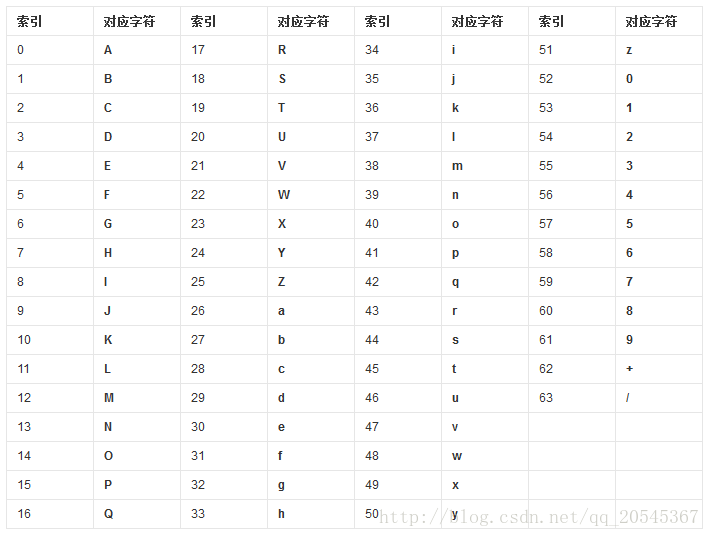
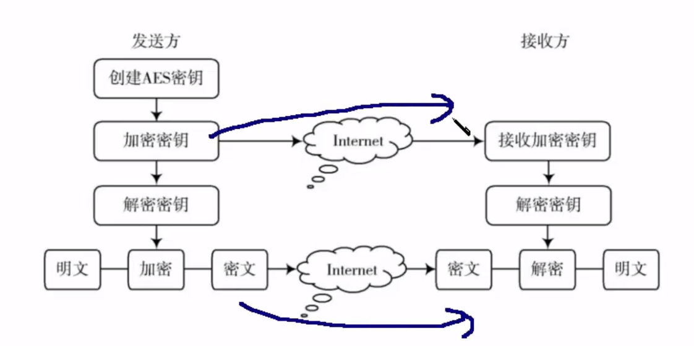

# 加密、编码技术

[TOC]

## 一、Md5

### 1、Md5简介

​	MD5全称为：**Message-Degist Algorithm 5**。其主要作用一是对一段信息产生信息摘要；二是进行加密解密的技术应用。

​	MD5是不可逆的。

​	一个原始的数据，只对应者一个MD5值；一个MD5值，可能对应着多个原始数据。

### 2、MD5长度

**MD5的默认长度为 128bit，也就是128个0和1组成的二进制串。**

由于128个0和1组成的串太长，所以讲将其转换为16进制，也就是 128/4=**32 位**。

**16位**的MD5是将32的 MD5的前八位与后八位进行删除，得到的结果。

### 3、MD5使用场景

- 一致性检验，也就是提供文件下载的MD5值。
- 数字签名，让生成的MD5作为一个唯一的标识符。
- 安全访问认证。将用户的登录、注册的密码进行加密，保证数据的存储与传输是安全的。

### 4、Java中生成MD5

```java
/**
* 使用Java代码来进行MD5的加密操作
*/
public static String getMD5 (String message) {

		MessageDigest md5;
		String str = null;
		try {
			//设置使用什么样的机密算法
			md5 = MessageDigest.getInstance("MD5");
			//将得到的message转换为byte[]数组
			byte[] messageBytes = message.getBytes();
			//经过加密得到的数据
			byte[] digest = md5.digest(messageBytes);
			//调用方法，将byte数组转换为16进制的字符串
			str = bytesToHexFun3(digest);

		} catch (NoSuchAlgorithmException e) {
			e.printStackTrace();
		}
		return str;
	}

	/**
	 * @param bytes : 输入byte[] 数组，让其实现转换为16进制的字符串数据
	 * 
	 * @return
	 */
	public static String bytesToHexFun3(byte[] bytes) {
		StringBuilder buf = new StringBuilder(bytes.length * 2);
		for (byte b : bytes) {
			buf.append(String.format("%02x", new Integer(b & 0xff)));
		}

		return buf.toString();
	}
```

### 5、使用Spring调用MD5加密

```java
	/**
	 * @param message : 需要进行加密的信息
	 * @param slat ： 加密的盐，用于混淆MD5的
	 * @return ： 返回的是转换为了16进制的MD5字符串
	 */
	public static String SpringMD5AddSlat(String message,String slat){
		String base = message + "/" + slat;
		String md5 = DigestUtils.md5DigestAsHex(base.getBytes());

		return md5;
	}

	/**
	 * @param message : 需要进行加密的信息
	 * @return ： 返回的是转换为16进制了的md5字符串
	 */
	public static String SpringMD5(String message){
		String base = message;
		String md5 = DigestUtils.md5DigestAsHex(base.getBytes());

		return md5;
	}

```

### 6、MD5制作信息摘要

> MD5 (tanajiya.tar.gz) = 0ca175b9c0f726a831d895e269332461 
>
> 　　这就是tanajiya.tar.gz文件的数字签名。MD5将整个文件当作一个大文本信息，通过其不可逆的字符串变换算法，产生了这个唯一的MD5信息摘要。如果在以后传播这个文件的过程中，无论文件的内容发生了任何形式的改变（包括人为修改或者下载过程中线路不稳定引起的传输错误等），只要你对这个文件重新计算MD5时就会发现信息摘要不相同，由此可以确定你得到的只是一个不正确的文件。如果再有一个第三方的认证机构，用MD5还可以防止文件作者的 "抵赖"，这就是所谓的数字签名应用。 

### 7、MD5加密解密

> MD5还广泛用于加密和解密技术上。比如在UNIX系统中用户的密码就是以MD5（或其它类似的算法）经加密后存储在文件系统中。当用户登录的时候，系统把用户输入的密码计算成MD5值，然后再去和保存在文件系统中的MD5值进行比较，进而确定输入的密码是否正确。通过这样的步骤，系统在并不知道用户密码的明码的情况下就可以确定用户登录系统的合法性。这不但可以避免用户的密码被具有系统管理员权限的用户知道，而且还在一定程度上增加了密码被破解的难度。 


## 二、Base64

### 1、Base64简介

Base64 是一种用64个字符来表示任意二进制数据的方法。

Base64是一种网络上常见的用于传输8Bit字节的编码方式之一，Base64是一种基于64为的可打印字符来表示的二进制数据的方法。

### 2、Base的好处

​	在网络传送渠道中，并不是支持ASCLL表中的所有字符的传送，比如很多邮件系统，就是只支持可见字符的传送，而不可见字符(也就是那种不能够打印的字符)无法传送。所以只能够在不改变传统协议的情况下，开辟一种新的方案来支持二进制文件的传送。把不可见字符转换来用可见字符表示。而Base64就是一种基于64个可见字符来表示二进制数据的方法。

### 3、Base64对应的字符编码表



### 4、Base64编码原理

​	Base64是有64个可见字符组成的二进制编码，编号为0到63。然而这64个字符，每一个都可以使用 **6个bit位** 表示出来。而一个字节有8个bit位，所以剩下两个bit位，使用00进行填充。也就是说：一个Base64仍然是有8个bit位，但是有效部分只有这8个bit位的右边6位。

​	Base64中的编码规格是将3个8位字节(3 * 8 = 24)编码成4个6位字节(4 * 6 = 24),然后再每隔6位，添加两个0，将其转换为总共有(4 * 8 = 32)  位的数据。然后进行数据的传输操作。

​	Base64如果进行编码，如果字节的bit数不是3的倍数(如：4个8bit的字节，总共是32bit ，不是三的倍数)，那么就是用 0 来进行填充，知道成为3的倍数。然后再进行每6bit就加两个0的操作。

### 5、Base64主要作用

​	Base64主要的目的就是将任何字符都用“可视”字符表示出来。先将字符拆开，然后在进行Base64的编码操作。

### 6、Base进行Java操作

```java
	public static void MyBase64Do(String message) {
		//进行编码操作
		try {
			String str1 = Base64.getEncoder().encodeToString(message.getBytes("UTF-8"));
			System.out.println(str1);

			byte[] bytes = Base64.getDecoder().decode(str1);
			System.out.println(new String(bytes,"UTF-8"));

		} catch (UnsupportedEncodingException e) {
			e.printStackTrace();
		}
	}
```


## 三、RSA算法

### 1、RSA简介

RSA加密算法是一种 **非对称加密算法**。它既能用于加密，也能用于数字签名。


### 2、公开密钥加密

​	公开密钥加密(public-key cryptography)也称为 非对称密钥加密。是一种密码学算法类型。该加密算法使用两个不同的密钥：加密密钥和解密密钥。

​	在这一对密钥中，一个是私人密钥，一个是公开密钥，公开密钥进行对数据进行加密，然后解密者使用私密密钥进行解密成明文。

### 3、算法实现过程为：

1.找出两个质数 p 与 q 。

2.求出两个质数的乘积： n = p * q

3.使用欧拉函数 ： φ(n) = (p - 1) * (q - 1)

4.公钥 e ，是一个 **1 < e < φ(n)  且 与 φ(n) 互质的数**。

5.私钥 d ，是一个 **(e * d)/φ(n) 的余数为 1 的数**  。

6.加密过程：将公钥 e 发送给加密方，然后将数据进行加密算法：  **(正常数据 m) 的 e 次方，除以 n，得到的余数 c**，就是加密以后的数据。 然后将其发送给接收方。

7.解密过程：将接受的加密的数据 c 解压： **(加密数据c) 的 d 次方，除以 n，得到的余数 m，解释解密以后的数据 m。**


## 四、DES/3DES算法

### 1、DES算法简介

​	DES全称：Data Encryption Standard，即：数据加密标准，是一种使用密钥加密的块算法。是一种对称密钥算法。**对称密钥**的加密密钥与揭秘密钥一致。



### 2、DES算法原理

- DES算法的入口有三个：Key、Data、Mode；
  - 其中Key位8个字节，总共64位，是DES算法的工作密钥。
  - Data总共8个字节，总共64位，是要被加密或者被解密的数据。
  - Mode是DES的工作方式，分别为：加密与解密。
- DES算法过程：
  - 如果Mode是加密，则用Key去对数据Data进行加密，生成的Data的密码形式(64位)作为DES的输出结果输出。
  - 如果Mode是解密，则用Key去吧密码形式的数据Data进行解密，还原为Data的明码形式(64位)作为DES的输出结果。
- 在通讯的两端，双方先约定一致性的Key，在通信的源头，对数据进行DES加密操作，然后以密码的形式在网络中进行传输，传输到终点；数据到达终点以后，用同样的Key对数据进行解密的操作，实现将数据还原。这样子能够保证数据在公共网络中的安全性。

- 定期的在源地址和目的端进行更新Key，能够更加有效的保证数据的保密操作。

### 3、DES算法实现

DES算法主要是包含两步：

   ①初始置换

​       其功能是把输入的64位数据块按位重新组合，并把输出分为L0、R0两部分，每部分各长32位，其置换规则为将输入的第58位换到第一位，第50位换到第2位……依此类推，最后一位是原来的第7位。L0、R0则是换位输出后的两部分，L0是输出的左32位，R0是右32位，例：设置换前的输入值为D1D2D3……D64，则经过初始置换后的结果为: L0=D58D50……D8；R0=D57D49……D7。

​	其置换规则见下表：
   	58，50，42，34，26，18，10，2，60，52，44，36，28，20，12，4，
​    	62，54，46，38，30，22，14，6，64，56，48，40，32，24，16，8,
​    	57，49，41，33，25，17，9， 1，59，51，43，35，27，19，11，3，

   	61，53，45，37，29，21，13，5，63，55，47，39，31，23，15,  7

 ②逆置换

​     经过16次迭代运算后,得到L16、R16,将此作为输入,进行逆置换,逆置换正好是初始置换的逆运算，由此即得到密文输出。

### 4、DES的java代码实现

​	主要步骤：在加密与解密的操作过程中，主要是使用了 ==Cipher== 工具类进行加密与解密的操作。主要是传入加密的数据与加密的秘钥。在这个过程中，需要将秘钥进行封装，转换为秘钥，然后再进行调用加密以后的秘钥key进行加密。揭秘过程也是调用被封装了的秘钥Key，使用Cipher工具类进行解密操作。

```java
/**
 * @author ${张世林}
 * @date 2018/11/25
 * 作用：进行DES算法的操作。
 */
public class DES {

    public static void main(String[] args) {
        //先创建一个明文
        String clearText = "Hello";
        //再创建原始秘钥：长度为64位，8个字节
        String originKey = "12345678";

        //调用加密算法来进行加密
        String cipherText = desEncript(clearText,originKey);

        //打印密文
        System.out.println("加密以后的数据：" + cipherText);

        //解密操作
        String clearText2 = desDecript(cipherText,originKey);
        System.out.println("解密以后的数据：" + clearText2);
    }

    /**
     * 进行解密的操作
     * @param cipherText ：需要被解密的内容
     * @param originKey ： 解密秘钥
     * @return ： 解密以后的数据
     */
    private static String desDecript(String cipherText, String originKey) {
        //解密工具类
        Cipher cipher = null;
        //解密以后的字节数组
        byte[] doFinal = null;

        try {
             cipher = Cipher.getInstance("DES");
            //解密的秘钥,和加密的秘钥一致
            SecretKeySpec key = getKey(originKey);
            try {
                //初始化解密工具类
                cipher.init(Cipher.DECRYPT_MODE,key);
                byte[] decode = new byte[0];
                try {
                    decode = Base64Util.decode(cipherText);
                } catch (Exception e) {
                    e.printStackTrace();
                }
                try {
                    //进行解密的操作
                    doFinal = cipher.doFinal(decode);
                } catch (IllegalBlockSizeException e) {
                    e.printStackTrace();
                } catch (BadPaddingException e) {
                    e.printStackTrace();
                }
            } catch (InvalidKeyException e) {
                e.printStackTrace();
            }
        } catch (NoSuchAlgorithmException e) {
            e.printStackTrace();
        } catch (NoSuchPaddingException e) {
            e.printStackTrace();
        }

        return new String(doFinal);
    }

    /**
     * 作用：使用DES算法进行加密的操作
     * @param clearText:明文对象
     * @param originKey：原始秘钥
     * @return ： 返回的加密以后的对象
     */
    private static String desEncript(String clearText, String originKey) {
        //加密工具类
        Cipher cipher = null;
        //返回的加密以后的字节数组
        byte[] doFinal = null;
        try {
            //获取加密算法工具类对象
            cipher = Cipher.getInstance("DES");

            //获得可以对象
            SecretKeySpec key = getKey(originKey);
            try {
                //初始化加密对象工具类
                cipher.init(Cipher.ENCRYPT_MODE,key);
            } catch (InvalidKeyException e) {
                //无效的秘钥异常
                e.printStackTrace();
            }
            try {
                //得到加密以后的对象
                doFinal = cipher.doFinal(clearText.getBytes());
            } catch (IllegalBlockSizeException e) {
                e.printStackTrace();
            } catch (BadPaddingException e) {
                e.printStackTrace();
            }
        } catch (NoSuchAlgorithmException e) {
            e.printStackTrace();
        } catch (NoSuchPaddingException e) {
            e.printStackTrace();
        }

        //使用base64解码器进行解码
        String encode = Base64Util.encode(doFinal);
        return encode;
    }

    /**
     * 得到 SecretKeySpec 对象，主要是将秘钥进行封装
     * @param originKey
     * @return
     */
    private static SecretKeySpec getKey(String originKey) {

        //为了避免用户输入的秘钥长度不够或者超出，需要对用户的数据进行截取
        byte[] bytes = new byte[8];
        byte[] originKeyBytes = originKey.getBytes();
        for (int i = 0 ;i < 8 && i < originKeyBytes.length ;i++) {
            bytes[i] = originKeyBytes[i];
        }

        SecretKeySpec des = new SecretKeySpec(bytes, "DES");
        return des;
    }

}
```

### 5、AES加密算法

#### 1）基本简介：

​	AES算法中，主要是将秘钥 Key 更改为了16位的长度，在DES的秘钥基础之上增加了一倍，增加了更多的难度。

#### 2）AES代码实现：

```java
/**
 * @author ${张世林}
 * @date 2018/11/25
 * 作用：进行AES算法的操作。
 */
public class AES {

    public static void main(String[] args) {
        //先创建一个明文
        String clearText = "Hello";
        //再创建原始秘钥：长度为128位，16个字节
        String originKey = "12345678abcdefgh";

        //调用加密算法来进行加密
        String cipherText = aesEncript(clearText,originKey);

        //打印密文
        System.out.println("加密以后的数据：" + cipherText);

        //解密操作
        String clearText2 = aesDecript(cipherText,originKey);
        System.out.println("解密以后的数据：" + clearText2);
    }

    /**
     * 进行解密的操作
     * @param cipherText ：需要被解密的内容
     * @param originKey ： 解密秘钥
     * @return ： 解密以后的数据
     */
    private static String aesDecript(String cipherText, String originKey) {
        //解密工具类
        Cipher cipher = null;
        //解密以后的字节数组
        byte[] doFinal = null;

        try {
             cipher = Cipher.getInstance("AES");
            //解密的秘钥,和加密的秘钥一致
            SecretKeySpec key = getKey(originKey);
            try {
                //初始化解密工具类
                cipher.init(Cipher.DECRYPT_MODE,key);
                byte[] decode = new byte[0];
                try {
                    decode = Base64Util.decode(cipherText);
                } catch (Exception e) {
                    e.printStackTrace();
                }
                try {
                    //进行解密的操作
                    doFinal = cipher.doFinal(decode);
                } catch (IllegalBlockSizeException e) {
                    e.printStackTrace();
                } catch (BadPaddingException e) {
                    e.printStackTrace();
                }
            } catch (InvalidKeyException e) {
                e.printStackTrace();
            }
        } catch (NoSuchAlgorithmException e) {
            e.printStackTrace();
        } catch (NoSuchPaddingException e) {
            e.printStackTrace();
        }

        return new String(doFinal);
    }

    /**
     * 作用：使用DES算法进行加密的操作
     * @param clearText:明文对象
     * @param originKey：原始秘钥
     * @return ： 返回的加密以后的对象
     */
    private static String aesEncript(String clearText, String originKey) {
        //加密工具类
        Cipher cipher = null;
        //返回的加密以后的字节数组
        byte[] doFinal = null;
        try {
            //获取加密算法工具类对象
            cipher = Cipher.getInstance("AES");

            //获得可以对象
            SecretKeySpec key = getKey(originKey);
            try {
                //初始化加密对象工具类
                cipher.init(Cipher.ENCRYPT_MODE,key);
            } catch (InvalidKeyException e) {
                //无效的秘钥异常
                e.printStackTrace();
            }
            try {
                //得到加密以后的对象
                doFinal = cipher.doFinal(clearText.getBytes());
            } catch (IllegalBlockSizeException e) {
                e.printStackTrace();
            } catch (BadPaddingException e) {
                e.printStackTrace();
            }
        } catch (NoSuchAlgorithmException e) {
            e.printStackTrace();
        } catch (NoSuchPaddingException e) {
            e.printStackTrace();
        }

        //使用base64解码器进行解码
        String encode = Base64Util.encode(doFinal);
        return encode;
    }

    /**
     * 得到 SecretKeySpec 对象，主要是将秘钥进行封装
     * @param originKey
     * @return
     */
    private static SecretKeySpec getKey(String originKey) {

        //为了避免用户输入的秘钥长度不够或者超出，需要对用户的数据进行截取
        byte[] bytes = new byte[16];
        byte[] originKeyBytes = originKey.getBytes();
        for (int i = 0 ;i < 16 && i < originKeyBytes.length ;i++) {
            bytes[i] = originKeyBytes[i];
        }

        SecretKeySpec des = new SecretKeySpec(bytes, "AES");
        return des;
    }

}
```


### 6、3DES算法

#### 1）简介：

​	3DES是进行了三重数据加密。即：每个数据快进行了三次DES加密计算，使用3条64位的密码对数据进行三次加密，故：比DES加密更加安全，更难破解。

#### 2）加密算法实现：

​	设Ek()和Dk()代表DES算法的加密和解密过程，K代表DES算法使用的密钥，M代表明文，C代表密文：

 		3DES加密过程为：C=Ek3(Dk2(Ek1(M)))
​        	3DES解密过程为：M=Dk1(EK2(Dk3(C)))

> 注：K1、K2、K3决定了算法的安全性，若三个密钥互不相同，本质上就相当于用一个长为168位的密钥进行加密。多年来，它在对付强力攻击时是比较安全的。若数据对安全性要求不那么高，K1可以等于K3。在这种情况下，密钥的有效长度为112位。


