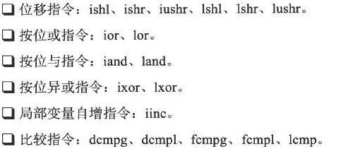

# JVM虚拟机笔记

## 命令

-XX:+<option> 开启 option 参数

-XX:-<option>  关闭 option 参数

-XX:<option>=<value>  将option参数设置为 value

- **-XX:+HeapDumpOnOutOfMemoryError**  生成对应的OutOfMemory对应的Dump文件，生成对应的.hprof文件存放在该项目的根目录。
- **-XX:+HeapDumpOnCtrlBreak**  能够使用 Ctrl+Break 快捷键生成对应的dump文件。
- **-Xms20m  -Xmx20m**   指定对应的虚拟机堆内存大小。
- **-Xss128k**   指定虚拟机栈的内存大小。由于HotSpot虚拟机的虚拟机栈与本地方法栈是一起的，所以可以一起设置。
- **-Xoss128k**  指定本地方法栈的内存大小，在HotSpot虚拟机中无效。
- **-XX:PermSize=10M**  指定虚拟机方法区的大小。
- **-XX:MaxPermSize=20m**   指定虚拟机方法区的最大值。
- **-XX:+PrintGC**   输出GC日志
- **-XX:+PrintGCDetails**   输出GC详细日志
- **-XX:+PrintHeapAtGC**   在进行GC前后打印出堆信息
- **-Xmn10M**   设置年轻代的大小
- **-XX:SurvivorRatio=8**   设置新生代中Eden区与Survivor区的比例为8:1.
- **-XX:MaxPermSize=16m**   设置持久带大小为16m。
- **-XX:PretenureSizeThreshold=3145782**   设置大对象的阈值。
- **-XX:MaxTenuringThreshold=15**   设置对象年龄计数器，当对象的年龄超过了这个值仍然存活，则进入老年代。
- **-XX:+PrintFlagsFinal**  打印对应的java的虚拟机默认参数。
- **java -Xint -version**   查看jvm的解释器版本。
- **java -Xcomp -version**   查看jvm的编译器版本。


## 工具

### 1. Eclipse Memory Analyzer

下载地址：

- https://www.eclipse.org/mat/

> ​	使用Eclipse Memory Analyzer工具能够对java虚拟机生成的Dump文件进行解析操作。

### 2 java字节码指令表

<https://blog.csdn.net/YY_xiaozhu/article/details/81108601>


## 1 对象管理

### 1.1 对象的创建

> ​	java是专注于面向对象的语言，无时无刻都存在着对象的创建。

#### 1.1.1 创建步骤

- 检查new指令对应的类是否已经被加载解析和初始化。
- 类加载检查通过以后，即可确定对象创建所需的内存。
- 为对象分配内存空间：
  - 采用**`指针碰撞`**：虚拟机内存的占用是规整的，采用指针来作为分界线，当创建新的对象时，直接将对应的指针进行挪动对应的距离。
  - 采用**`空闲列表`**：虚拟机的内存占用是不规整的，维护一个对应的列表，记录哪一些内存块是可用的，在可分配的列表中找到足够大内存空间划分给对象实例。
- 内存分配完成，虚拟机需要将分配的的内存空间对象都进行初始化值的赋值，即赋值为零值。
- 虚拟机需要对对象进行必要的设置，包括对象所属实例、对象的元数据信息、对象的哈希码等等。该数据都存放在**对象头**中进行存储。
- 虚拟机基础工作完成，一个新的对象已经产生。但是从java角度来看，对象的创建才刚刚开始——<init> 方法还未执行，所有的字段还是零值。所以，执行new指令之后需要接着执行<init>方法，把对象按照代码的值进行初始化赋值，即可完成对象的创建工作。

#### 1.1.2 安全限制

> ​	在创建虚拟机的过程中，多线程频繁创建对象实例，则线程安全操作需要设置。
>
> - 采用**指针碰撞**的方式，就是修改对应的指针位置，那么需要采用CAS算法配置上失败重试的方式保证更新操作的原子性。
> - 采用**空闲列表**的方式，则可以把内存分配的动作按照线程划分在不同的空间之中进行，即每一个线程在java堆中预先分配一块小内存空间，称为本地线程分配缓冲（Threead Local Allocation Buffer，TLAB）。对应的线程在对应的TLAB中完成分配以后，才需要对内存进行同步锁定。

### 1.2 对象的内存布局

> ​	对象在内存中存储的布局主要分为3块区域：
>
> - **对象头（Header）**：对象头主要包含两部分信息
>   - 第一部分：存储对象自身的运行时数据，包括哈希码、GC分代年龄、锁状态标志、线程持有的锁、偏向线程ID、偏向时间戳等。该部分数据在32位与64位虚拟机中分别占用32bit与64bit，官方简称：**Mark Word**。
>   - 第二部分：存储的是类型指针，即对象指向它的类元数据的指针，虚拟机通过该这个指针来确定这个独享是哪一个类的实例。
> - **实例数据（Instance Data）**
> - **对齐填充（Padding）**

### 1.3 对象的访问定位

> ​	Java程序主要是通过栈上面的reference数据来操作堆中的具体对象。**通常情况下，对象访问方式采用的是`句柄`和`直接指针`两种。**
>
> - **`句柄`**：java堆中将会划分出一块内存来作为句柄池，reference中存储的就是对象的句柄地址，而句柄中包含了对象实例数据与类型数据各自的具体地址。
>
> 
>
> - **`直接指针`**：java的reference中存储的直接就是对象地址。
>
> 
>
> ​	句柄的最大优势在于reference中存储的是稳定的句柄地址，在对象被移动（垃圾收集时移动对象是非常普遍的行为）时只会改变句柄中的实例数据指针，而不是修改reference本身。
>
> ​	直接指针访问的优势在于访问速度更快，节省了一次指针定位的时间开销工作。HotSpot虚拟机采用的是直接指针方式。

## 2 内存管理

### 2.1 Java堆溢出

> ​	Java堆用于存储对象实例，只要不断的创建对象，并且保证GC Roots到对象之间有科大路径来避免垃圾回收机制清楚这些对象，那么在对象数据到达最大堆的容量限制以后就会产生内存溢出异常。

```java
	public static void main(String[] args) {
		List<Demo> list = new ArrayList<>();
		while(true) {
			list.add(new Demo());
		}
	}
```

​	抛出异常java.lang.OutOfMemoryError，并且后面跟随这个 Java heap space。通常采用的是Eclipse Memory Amalyzer打开存储快照hprof文件进行分析。

### 2.2 虚拟机栈、本地方法栈溢出

> ​	虚拟机栈与本地方法栈溢出主要分为：
>
> - 如果线程请求的栈深度大于虚拟机所允许的最大深度，则抛出StackOverFlowError。
> - 如果虚拟机在扩展栈时无法申请到足够的内存空间，则抛出OutOfMemoryError。

```java
package com.zsl.test2;

public class JconsoleTest {

	public static void main(String[] args) {
//		JavaVMStackSOF jcss = new JavaVMStackSOF();
//		jcss.stackLeak();
		JavaVMStackOOM jvom = new JavaVMStackOOM();
		jvom.stackLeakByThread();
	}
	
}

/**
 * Stack对应的StackOverFlowError
 * @author 10838
 *
 */
class JavaVMStackSOF {
	private int stackLength = 1;
	public void stackLeak() {
		stackLength++;
		stackLeak();
	}
}

/**
 * Stack对应的OutOfMemoryError
 * @author 10838
 *
 */
class JavaVMStackOOM {
	private void dontStop() {
		while(true) {
			
		}
	}
	public void stackLeakByThread() {
		while (true) {
			Thread thread = new Thread(new Runnable() {
				@Override
				public void run() {
					dontStop();
				}
			});
			thread.start();
		}
	}
}
```

### 2.3 方法区溢出

> ​	运行时常量池也是方法区的一部分，将字符串常量池溢出工作，能够测试出对应的异常数据。方法区主要是存储Class的相关数据结构，其中包括了类名、访问修饰符、常量池、字段描述、方法描述等数据。

```java
public class RuntimeConstantPoolOOM {

	public static void main(String[] args) {
		List<String> list = new ArrayList<>();
		int i = 0;
		while (true) {
			list.add(String.valueOf(i++).intern());
		}
	}
}
```

​	出现异常：java.lang.OutOfMemoryError：PerGen space，也就是通常情况下的方法区溢出。

## 3 垃圾收集器

### 3.1 垃圾回收算法

#### 3.1.1 引用计数算法

> **简介：**给对象添加一个引用计数器，当对象存在一个地方引用它时，计数器的值就加1；当对象引用失效时，计数器的值减1；当引用计数器为0的时刻，表明该对象已经没有被其他对象所引用了，可以进行垃圾回收GC的操作。
>
> **缺陷：**当两个对象之间相互引用，但是两个对象都已经没有被其他对象所引用了，则垃圾收集器也不会对其进行GC操作，导致内存泄漏。市场中主流的JVM未使用该方法。

#### 3.1.2 可达性分析算法

> **简介：**通过一系列可达性分析（Reachability Analysis）来判定对象是否存活的。这个算法的基本思想是通过一系列称为 **`GC Roots`** 的对象作为起始点，从这些节点开始向下搜索，搜索所走过的路径称为**引用链**，当一个对象GC Roots没有任何引用链相连，则表示该对象不可达，那么即可将其进行GC操作。
>
> **GC Roots对象：**
>
> - 虚拟机栈（栈帧中的本地变量表）中引用的对象。
> - 方法区中类静态属性引用的对象。
> - 方法区中常量引用的对象。
> - 本地方法栈JNI（即一般说的Native方法）引用的对象。

### 3.2 对象死亡过程

​	对finalize()方法的深刻理解，以及进行GC的整个流程操作如下：

> ​	当对象使用无引用或不可达时，其死亡过程还需要经历**两次标记过程：如果对象在进行可达性分析后发现没有GC Roots相连接的引用链，则它将会被`第一次标记`并且进行一次筛选，筛选的条件是对象是否有必要执行finalize()方法。当对象没有覆盖finalize()方法，或者finalize()方法已经被虚拟机调用过，则虚拟机将这两种情况都视为“没有必要执行”。**
>
> ​	**当对象被判定为有必要执行finalize()方法，则会将该对象加入到一个叫做`F-Queue`的队列中，并在稍后由虚拟机自动创建一个低级Finalizer线程去执行finalize()方法。**
>
> ​	**finalize()方法是对象逃脱死亡命运的最后一次机会，稍后GC将对F-Queue只能够的独享进行`第二次小规模的标记`操作，如果对象在finalize()方法中成功拯救了自己——重新与引用链中的一个对象相关联，则会在第二次标记的时候被移除出“即将回收”的集合中；如果对象未能够成功自救，则对象会被回收。**
>
> ​	**对象的finalize()方法最多只能够被调用一次，也就是说对象在第一次GC的时候调用了finalize()方法并成功自救，那么第二次进行GC操作的时候，就不会再次执行finalize()方法，直接进行GC回收操作。**

### 3.3 方法区回收

​	通常情况下，对方法区进行垃圾回收操作效率较低。方法区永久带主要的垃圾回收包括：**`废弃常量`以及`无用的类`**。

- **回收废弃常量**：当常量池中存在对应的字符串“ABC”，却没有对饮的String对象对字符串字面量“ABC”进行引用，则需要进行内存回收操作，将“ABC”常量进行清除操作。

- **回收无用的类**：判断无用的类的条件如下：

  - 该类的所有实例都已经被回收，也就是在Java队中不存在该类的任何实例。
  - 加载该类的ClassLoader已经被回收。
  - 该类对应的java.lang.Class对象没有在任何地方被引用，无法在任何地方通过反射访问该类的方法。

  当类具备上诉条件，则该无用类即可进行回收操作。

### 3.4 垃圾回收算法

#### 3.4.1 标记-清除算法

> **原理：**首先标记所有需要被回收的对象，在标记完成以后统一回收已经被标记了的对象。
>
> **缺陷：**
>
> - 效率低，标记与清除两个过程的效率较低；
> - 标记清除算法容易产生大量不连续的内存碎片，空间碎片太多导致分配大内存对象时无法找到对应的内存空间。


#### 3.4.2 标记-复制算法

> **原理：**将内存按照容量划分为大小相等的两块，当一块内存使用完毕，将存活的对象复制到另外一块上面，然后再将已经使用过的内存空间直接全部清理。
>
> **实现方式：**在商业虚拟机中，并非是按照1:1的比例进行比较，而是将JVM内存划分为  一块较大的Eden空间以及两块较小的Survivor区域  ，每次使用Eden和其中一块Survivor区。当进行回收操作时，将正在使用的Eden区和Survivor区中存活的对象一次性的复制到另外一块Survivor区中，最后清除掉已经使用的Eden和Survivor区域。
>
> **HotSpot实现方式：** HotSpot虚拟机针对Eden区域与Survivor区域的比例是： 8:1:1，所以每一次垃圾回收操作只会有10%的内存会被浪费掉。当Survivor区域无法存储所有存活的对象，则使用其他内存（老龄代）进行分配担保。
>
> **优势：**
>
> - 直接对一块内存进行全部清理工作，能够有效地避免内存碎片等复杂情况。
>
> **劣势：**
>
> - 将内存划分为两块，内存利用效率变得比较低。
> - 在对象存活率较高的区域采用标记-复制算法，效率更低。


#### 3.4.3 标记-整理算法

> **原理：** 针对需要进行垃圾回收操作的对象，首先对其进行标记，后续步骤是将所有存活的对象都向一端进行移动，然后直接清理掉端边界以外的内存。


#### 3.4.4 分代收集算法

> ​	当前商业虚拟机都采用的是“分代收集”算法，这种算法是根据对象存活周期的不同将内存划分为几块。通常在java中根据新生代老龄代分别选择不同的垃圾算法。
>
> - 新生代垃圾收集算法：主要是针对大量对象的存活效率低，大批对象的死去，采用标记-复制算法，效率较高。
> - 老龄代垃圾收集算法：老龄代中对象的存活率高，没有额外空间对其进行分配担保，可以采用标记-清理/整理算法。

#### 3.4.5 GC术语

>**`Minor GC---新生代GC`**：指发生在新生代的垃圾收集动作，因为java大多数对象具有朝生夕死的特征，所以Minor GC非常频繁，一般回收速度较快。
>
>**`Major/Full GC`**：指发生在老年代的GC，出现了Major GC，经常会伴随至少一次的Minor GC操作，Major GC发生速度一般比Minor GC速度更慢。

#### 3.4.6 大对象进入老龄代

> ​	所谓的大对象，就是需要大量连续内存空间的Java对象，对典型的就是数组大对象。通常情况下，是根据JVM设定的大对象的最小值进行比较，当对象大于设定的值，则直接对大对象进入老龄代。
>
> **命令：**使用 **`-XX:PertenureSizeThreshold=3145728`** 设置大对象的阈值。

#### 3.4.7 长期存活对象进入老龄代

> ​	虚拟机采用分代收集的思想来管理内存空间。针对对象设置对象年龄数据，当对象在Survivor中熬过了设置的年龄值，则进入到老龄代。在Survivor中熬过一次，则年龄加1.
>
> 命令：使用**`-MaxTenuringThreshold=15`**来设置晋升老龄代的阈值。

#### 3.4.8 动态对象年龄判定

> ​	根据不同程序的内存状况，虚拟机并不是永远的要求对象年龄必须达到MaxTenuringThreshold才能晋升老龄代，**当Survivor区中相同年龄的对象所占内存超出Survivor区中的一半，则Survivor中大于等于该年龄的对象就可以直接进入到老年代**。

## 4 JVM监控、故障处理

### 4.1 命令行工具

#### 4.1.1 jps——虚拟机进程状况工具

> **简介：** jps（JVM Process Status Tool），其主要作用是列出正在运行的虚拟机进程，并显示`虚拟机执行主类（Main Class，也就是main()方法所在的类）的名称`以及该进程的`本地虚拟机唯一ID（Local Virtual Machine Identifier，LVMID）`。
>
> **命令：** `jps  [options]  [hostid]`
>
> **选项：**
>
> - -q：只输出LVMID，省略主类的名称。
> - -m：输出虚拟机进程启动时传递主类main()函数的参数。
> - -l：输出主类的全名，如果进程执行的是Jar包，则输出Jar路径。
> - -v：输出虚拟机进程启动时JVM参数。
>
> **例如：** jps   查看正在运行的java虚拟机进程。

#### 4.1.2 jstat——虚拟机统计信息监视工具

> **简介：** jstat（JVM Statistics Monitoring Tool），是用于监视虚拟机各种运行状态信息的命令行工具。主要显示的四本地或者远程虚拟机进程中的`类装载、内存、垃圾收集、JIT编译等运行数据`，无GUI图形界面，只提供了纯文本控制台环境的服务器，它将是运行期定位虚拟机性能问题的首选工具。
>
> **命令：** `jstat [option vmid [interval[s|ms] [count]] ]`
>
> **解释：**
>
> - option：表示的是对应的虚拟机操作，例如GC操作
>   - -class：监视类装载、卸载数量、总空间以及类装载所耗费时间。
>   - -gc：监视java的gc堆状况，新生区、老年区、永久带等容量、GC时间合计等数据。
>   - -gccapacity：监视gc堆状况，主要是输出java堆中各个区域使用到的最大、最小空间。
>   - -gcutil：监视gc操作，主要是输出关注已经使用空间占总空间的百分比。
>   - -gcnew：监视新生代GC状况。
>   - -gcnewcapacity：监视新生代的最大、最小空间。
>   - -gcode：监视老年代GC状况。
>   - -gcodecapacity：监视老年代GC状况的最大、最小空间。
>   - -gcpermcapacity：输出永久带使用到的最大、最小空间。
>   - -complier：输出JIT编译器编译过的方法、耗时等信息。
>   - -printcompliation：输出已经被JIT编译的方法。
>
> - vmid：表示的是虚拟进程id
> - interval：表示的是查询间隔，可以省略，默认是采用ms作为时间单位。
> - count：表示的是查询的次数，默认值为1，可以省略
>
> **例如：** jstat  -gc  2764  250  20  表示的是针对2764的垃圾收集状况进行每隔250ms查询一次，总共查询20次

#### 4.1.3 jinfo——java配置信息工具

> **简介：**jinfo（Configuration Info for Java）的作用是实时地查看和调用虚拟机各项参数。
>
> **命令：** `jinfo [option] pid`
>
> **option：**
>
> - -flag
>
> **例如：** jinfo  -flag  CMSInitiatingOccupancyFraction  1444  查询对应的参数值

#### 4.1.4 jmap——java内存印像工具

> **简介：**jmap（memory Map for Java）命令是用于生成`堆转储快照`（通常称为heapdump或者dump文件）。其他作用包括：`查询finalize执行队列，java堆和永久带详细信息`。
>
> **命令：** jmap  [option]  vmid  
>
> **解释：**
>
> - option：参数的选择
>   - -dump：生成java堆转储快照，格式为：  -dump:format=b,file=<filename>
>   - -finalizerinfo：显示F-Queue中等待Finalizer线程执行finalize方法的对象，只在linux平台开放
>   - -heap：显示java堆详细信息，如使用哪种回收器、参数配置、分代状况等
>   - -histo：显示堆中对象统计信息、包括类、实例数量、合计容量等
>   - -permstat：一ClassLoader为统计口激动显示永久带状态。
>   - -F：强制生成对应的dump快照。
> - vmid：java的jvm虚拟进程id
>
> **例如：** jmap -dump:format=b,file=Eclipse.bin 6244

#### 4.1.5 jhat——虚拟机堆转储快照分析工具

> **简介：**jhat（JVM Heap Analysis Tool）命令与jmap搭配使用，用于分析jmap生成的堆转储快照。通常不适用该工具。

#### 4.1.6 jstack——java堆栈跟踪工具

> **简介：** jstack（Stack Trace for Java）命令用于生活才能虚拟机当前时刻的**线程快照**（一般称为threaddump或者Javacore文件）。线程快照就是当前虚拟机内每一条线程正在执行的方法堆栈的集合，生成线程快照的主要目的是定位线程出现长时间停顿的原因，常用于`线程间死锁、死循环、请求外部资源导致长时间`等待等都是导致线程长时间停顿的原因。
>
> **命令：** `jstack  [option] vmid`
>
> **option：**
>
> - -F：强制输出线程堆栈快照。
> - -l ：除了堆栈信息以外，显示关于锁的附加信息。
> - -m：如果调用到本地方法的话，可以显示C/C++的堆栈。

#### 4.1.7 HSDIS——JIT生成代码反编译


#### 4.1.8 JConsole——java监视与管理控制台

> **简介：**JConsole工具是用于对JVM实现实时监控操作。主要的监控包括：概述、内存、线程、类、VM摘要、MBean等。
>
> **作用：**
>
> - 内存监控
> - 线程监控

#### 4.1.9 VisualVM——多合一故障处理工具

> **简介：**VisualVM（All-in-one Java Troubleshooting Tool）是JVM工具中最强大的运行监视和故障处理程序。暴扣性能分析、线程监控等操作。
>
> **功能：**
>
> - 显示虚拟机进程以及进程的配置、环境信息（jps、jinfo）
> - 监视应用程序的CPU、GC、堆、方法区以及线程的信息（jstat、jstack）
> - dump以及分析堆转储快照（jmap、jhat）
> - 方法级别的程序运行性能分析，找出被调用最多、运行时间最长的方法。
> - 离线程序快照：手机程序的运行时配置，线程dump、内存dump等信息建立一个快照，将快照发送开发者处进行Bug反馈。
>
> **启动：** 输入命令  **`jvisualvm`**  即可打开VisualVM。

#### 4.1.10 javap——Class文件解析器

> **简介：**javap命令是Java Class文件分析器。可以反编译.class文件。
>
> **命令：** `javap [option] classes文件`
>
> **option：**
>
> - -help  查看帮助
> - -version  查看版本信息
> - -v  -verbose   输出附加信息
> - -l  输出行号和本地变量表
> - -public  仅显示公共类和成员
> - -protected  显示受保护的/公共类和成员
> - -package   显示程序包/受保护的/公共类和成员
> - -p  -private  显示所有类和成员
> - -c  对代码进行反汇编
> - -s   输出内部类型签名
> - -sysinfo   显示正在处理的类的系统信息
> - -constants  显示静态最终常量
> - -classpath <path>  指定查找用户类文件的位置
> - -bootclasspath <path>  覆盖引导类文件的位置

## 5 Class类文件

### 5.1 专业名词

- `Magic Number`：   Class文件中的魔数，唯一 的作用就是用于确定该文件是否是一个能够被虚拟机接受并执行的Class文件。所占位置为：前四个字节。

- `Minor Version`： Class文件对应的次版本号。所占位置：第五、第六两个字节。
- `Major Version`： Class文件对应的主版本号。所占位置：第七、第八两个字节。
- `Constant Pool`：class文件对应的常量池，主要存放两大类：
  - 字面量：相对于是java语言中的常量概念，包括String、final修饰的常量等。
  - 符号引用：
    - 类和接口的全限定名（Fully Qualified Name）
    - 字段的名称和描述符（Description）
    - 方法的名称和描述符

### 5.2 .Class对应的十六进制位数转换

> ​	.Class文件使用WinHat软件打开以后，变成了16进制的一个文档，对应的就是.class文件的16进制编码。
>
> 16进制编码的位数代表的是：
>
> - 横向编码，0 - 3 这几个字节，表示的是class文件魔数。
> - 横向编码，4 - 5 这几个字节，表示的是class文件对应的次版本号。
> - 横向编码，6 - 7 这几个字节，表示的是class文件对应的次版本号。
> - 横向编码，8 - 9 这两个字节，用于表示常量池中的常量数量。通常的运算结果为：将其转换为10进制，然后在十进制的基础之上 - 1，即可表示对应的常量数量。
> - 横向编码，10 - 11 这两个字节，代表的是 访问标志。该标志主要的作用是标识一些类或者接口层次的访问信息，包括：Class是类还是接口、权限修饰符、是否是abstract抽象类、是否使用final修饰。

### 5.3 访问标志

​	访问标志（access_flag）是使用  `javap -v .class文件名` 命令以后，查看到的类或者接口层次的访问信息。具体显示如下：

| 标志名称       | 标志值 | 含义（返回值都为true或者false）                   |
| -------------- | ------ | ------------------------------------------------- |
| ACC_PUBLIC     | 0x0001 | 是否为public类型                                  |
| ACC_FINAL      | 0x0010 | 是否使用的是final修饰                             |
| ACC_SUPER      | 0x0020 | jdk1.0.0编译以后的类这个标志都为真                |
| ACC_INTERFACE  | 0x0200 | 标识这是一个接口                                  |
| ACC_ABSTRACT   | 0x0400 | 标识这是抽象类型，接口与抽象类为true，其他为false |
| ACC_SYNTHETIC  | 0x1000 | 标识这个类并非用户代码所产生的                    |
| ACC_ANNOTATION | 0x2000 | 标识这是一个注解                                  |
| ACC_ENUM       | 0x4000 | 标识这是一个枚举                                  |
| 其他           | 0x0000 | 值为0                                             |

###    5.4 字段表集合

​	使用`javap -v TestClass` 命令以后，字段表（field_info）用于描述接口或者类中声明的变量。字段表描述的是 类级变量以及实例变量，无法描述方法内部声明的变量。**具体查看 深入理解java虚拟机6.3节**

## 6 字节码指令简介

### 6.1 字节码与数据类型

> ​	在Java虚拟机的指令中，对应着很多的命令。不同的数据类型对应的字节码指令是不一致的，拥有着虚拟机规范中特定的字节码指令。当int与float类型数据从局部变量表中加载到操作数栈中的时候，分别使用的命令是：iload与fload
>
> 
>
> 

### 6.2 加载和存储指令

> 简介：加载和存储指令用于：**将数据在栈帧中的局部变量表和操作数栈之间来回传输。**
>
> 功能：
>
> - 将局部变量表中的数据加载到操作数栈中：
>
>   - 命令：load指令
>   - 例如：iload、aload---将int、float类型的数据加载到操作数栈中。
>
> - 将操作数栈中的数据存储到局部变量表中：
>
>   - 命令：store指令
>   - 例如：istore、lstore---将int、float类型的数据存储到局部变量表中。
>
> - 将常量加载到操作数栈中：
>
>   - 命令：
>
>     
>
> - 扩充局部变量表的访问索引指令：
>
>   - 命令：wide

### 6.3 运算指令

> 简介：运算或者算术指令用于对两个操作数栈上面的值进行某种特定的运算，并将结果重新存入到操作栈顶。Java虚拟机支持 int、long、float和double四种类型的指令；而对于byte、short、char以及boolean运算使用int数据类型代替。
>
> 指令：
>
> - 加法指令：add
> - 减法指令：sub
> - 乘法指令：mul
> - 除法指令：div
> - 求余指令：rem
> - 取反指令：neg
> - 位移指令：shl
> - 按位或指令：or
> - 按位与指令：and
> - 按位异或指令：xor
> - 局部变量自增指令：inc
> - 比较指令：dcmpg、dcmpl、fcmpg、fcmpl、lcmp
>
> 
>
> 

### 6.4 类型转换指令

> 简介：类型转换指令可以将两种不同的数字类型进行相互的转换，这些转换操作通常用于实现用户代码中农显示类型转换操作，或者采用字节码指令集中数据类型转换。
>
> 指令：
>
> - Java虚拟机直接支持（无须显示的转换指令）----宽化类型转换：
>   - int类型到long、float或者double类型。
>   - long类型到float、double类型。
>   - float类型到double类型。
> - 需要命令支持转换----窄化类型转换：
>   - 命令：i2b、i2c、i2s、l2i、f2i、f2l、d2i、d2l、d2f

### 6.5 对象创建与访问指令

> 简介：在java中对象的创建包括数组和实例对象的创建，但其创建对象的指令有所差异。
>
> 指令：
>
> - 创建类实例的指令： new
> - 创建数组的指令：newarray、anewarray、multianewarray
> - 访问类字段、实例字段的指令：getfield、putfield、getstatic、putstatic
> - 将一个数组元素加载到操作数栈的指令：baload、caload、saload、iaload、laload、faload、daload、aaload。
> - 将操作数栈中的值存储到数组元素的指令：bastore、castore、sastore、iastore、fastore、dastore、aastore。
> - 获取数组长度的指令：arraylength
> - 检查类实例类型的指令：instanceof、checkcast

### 6.6 操作数栈管理指令

> 简介：java虚拟机的操作数栈其实和普通的堆栈数据结构类似，也提供了直接操作操作数栈的指令。
>
> 指令：
>
> - 将操作数栈的栈顶一个或者两个元素出栈：pop、pop2
> - 复制栈顶一个或者两个数值并将复制值重新压入栈顶：dup、dup2、dup_x1、dup2_x1、dup_x2、dup2_x2.
> - 将栈最顶端的两个数值交换：swap

### 6.7 控制转移指令

> 简介：控制转移指令主要是用于程序的运行流程判断并执行对应的指令，控制转移指令是在有条件或者无条件的修改PC寄存器的值。
>
> 指令：
>
> - 条件分支：ifeq、iflt、ifne、ifgt、ifge、ifnull、ifnonnull、if_icmpeg、if_icmpne、if_icmplt、if_icmple、if_icmpge、if_acmpeg、if_acmpne
> - 符合条件分支：tableswitch、lookupswitch
> - 无条件分支：goto、goto_w、jsr、jsr_w、ret
>
> 关注：java中存在着专门的指令来进行int与reference类型的条件分支比较操作，针对boolean、byte、char和short采用的是int类型的指令进行比较；long、float和double类型的条件分支比较操作，采用的是先执行指令比较运算，然后将返回的整数值存放在操作数栈中，随后再执行int类型的条件分支比较操作完成分支跳转。

### 6.8 方法调用和返回指令

#### 6.8.1 方法调用

> 方法调用的指令与数据类型无关，具体包括：
>
> - invokevirtual 指令，用于调用对象的实例方法，根据对象的实际类型进行分派。
> - invokeinterface 指令，用于调用接口方法，会在运行时搜索一个实现了这个接口方法的对象，并调用。
> - invokespecial 指令，用于调用一些需要特殊处理的实例方法，包括实例初始化方法、私有和父类方法。
> - invokestatic 指令，用于调用类方法，也就是static方法。
> - invokedynamic 指令，用于在运行时动态解析出调用点限定符所引用的方法，并执行该方法。

#### 6.8.2 方法返回

> 方法放回与返回数据类型有关，具体包括：
>
> - ireturn 指令，返回值为 boolean、byte、char、short和int类型的数据。
> - lreturn 指令，返回值是long类型的数据。
> - freturn 指令，返回值时float类型的数据。
> - dreturn 指令，返回值是double类型的数据。
> - areturn 指令，返回值是对象引用类型的数据。
> - return 指令，表示的是void方法、实例初始化方法以及和接口的类初始化方法使用。

### 6.9 异常处理指令

> 简介：java程序中显式的抛出异常的操作（throw）都是由 `athrow`指令来实现；java中的运行时异常在虚拟机检测到异常状况时自动抛出。
>
> 指令： athrow
>
> 注意：java中处理异常采用的是catch语句，是使用的异常表来实现异常的处理工作。

### 6.10 同步指令

> 简介：Java虚拟机支持`方法级别的同步`和`方法内部一段指令序列的同步`，这两种同步结构都是使用`管程（Monitor）`实现的。
>
> 操作：
>
> - 方法级别的同步是隐式的，无需通过字节码指令来控制。其实现原理是：虚拟机从字符串常量池中的方法表结构中的`ACC_SYNCHTONIZED`访问标志得知该方法被声明为了一个同步方法，当方法被调用时，则执行线程就需要被要求持有管程，然后才能执行该方法，执行完成（正常完成或者非正常完成）释放管程。
> - 同步一段指令集序列通常是由java语言中的synchroized关键字表示的，采用的是指令集中的`monitorenter`和`monitorexit`两条指令来支持。例如：
> - 

## 7 虚拟机类加载机制

### 7.1 类加载动作

> ​	类的加载到虚拟机内存中，一直到从内存中将其卸载，整个生命周期包括：**加载（Loading）、连接（Linking），初始化（Initialization）、使用（Using）、卸载（Unloading），而连接中包括了：验证（Verification）、准备（Perparation）和解析（Resoultion）7个阶段。** 
>
> 

#### 7.1.1 类的主动加载

> - 在JVM中，使用 `new、getstatic、putstatic、invokestatic`对应的关键字以后，如果对应的类未进行初始化，则需要进行类的初始化操作。
>   - 对应着Java中的 new 操作。
>   - 对应着Java中的读取、或者设置一个类的静态字段。
>   - 对应着Java中的调用类的静态方法。
> - 使用java.lang.reflect包的方法对类进行反射调用的时候，如果类未进行初始化，则需要进行类的初始化。
> - 当调用一个类的时候，如果发现其父类没有初始化，则需要先触发其父类的初始化。
> - 虚拟机启动时，用户需要制定一个要执行的主类（也就是包含main()方法的类）进行初始化。
> - JDK1.7的动态语言支持，使用java.lang.invoke.MethodHandle实例后的解析结果句柄，对应的类如果未进行初始化，则需要先触发其初始化。

#### 7.1.2 类的被动使用

> 简介：类的被动使用是在不需要加载对应的类的情况下，即可使用类中对应的数据。**除了类的主动加载，其他都是类的被动使用。**

### 7.2 加载

> 简介：类的加载过程中，虚拟机需要完成的三件事情：
>
> - 通过一个类的全限定名来获取定义此类的二进制字节流。
> - 将这个字节流所代表的静态存储结构转化为方法区的运行时数据结构。
> - 内存中生成一个Class类对象，作为方法区中这个类的各种数据的访问入口。
>
> 加载路径：
>
> - 从ZIP包中读取文件，发展到了现在的JAR、WAR文件。
> - 从网络中获取图片，使用的是Applet。
> - 运行时计算生成，这种场景使用得最多的就是动态代理技术，在java.lang.reflect.Proxy中来生成对应的代理类的二进制流。
> - 从其他文件中生成，例如JSP生成对应的Class类对象。
> - 从数据库中读取。
> - 。。。

### 7.3 验证

> 简介：验证属于连接阶段的第一步，这一阶段主要是为了确保Class文件的字节流中包含的信息是否符合当前虚拟机的要求，并且不会危害到虚拟机的安全。验证阶段主要是包含四种验证：`文件格式验证、元数据验证、字节码验证、符号引用验证`。

#### 7.3.1 文件格式验证

> 文件格式验证的验证点包括：
>
> - 是否以魔数0xCAFEBABE开始。
> - 主次版本号是否在当前虚拟机处理范围内。
> - 常量池的常量是否有不支持的常量类型。
> - 指向常量的各种索引值是否指向了不存在的常量过不符合的常量。
> - CONSTSNT_utf8_info性的常量是否有不符合UTF_8编码的数据，
> - Class文件中各个部分以及文件本身是否有被删除或者附加的其他信息。

#### 7.3.2 元数据验证

> 元数据验证的验证点包括：
>
> - 这个类是否有父类（除了java.lang.Object这个类）。
> - 这个类的父类是否继承了不允许被继承的类。
> - 这个类如果不是抽象类，那么是否完全实现类父类或者接口之中要求实现的所有方法。
> - 验证该类的字段、方法是否与父类的产生矛盾（例如覆盖了父类中final修饰的字段、不符合规则的重载等）。

#### 7.3.3 字节码验证

> 简介：字节码验证主要是通过数据流和控制流分析，确定程序语义是合法的、符合逻辑的。
>
> - 保证任意时刻操作数栈的数据类型与指令代码序列都能配合工作，也就是操作数栈的数据与指令符合。
> - 保证跳转指令不会跳转到方法体以外的字节码指令中。
> - 保证方法体中的类型转换是有效的。

#### 7.3.4 符号引用验证

> 简介：符号引用验证可以对类自身以外（也就是常量池中的各种符号引用）的信息尽心匹配性校验操作。
>
> - 符号引用中通过字符串描述的全限定名是否能找到对应的类。
> - 指定类中是否存在符号方法的字段描述符以及简单明湖曾呢锁描述的方法和字段。
> - 符号引用中的类、字段、方法的访问性（private、protected、default、public）是否可被当前类访问。

### 7.4 准备

> 简介：准备阶段是正式**为类变量分配内存并设置类变量初始值的阶段，并对其赋值零值**（也就是为被static修饰的变量分配内存空间）。在这个阶段，实例变量是不会被分配内存的，实例变量只能是随着对象一起分配在java堆中。
>
> 例如：
>
> ​	public static int ki = 123;   //这里主要是调用putstatic指令，将其存放与类构造器<clinit>()方法中，而<clinit>()方法是在初始化阶段执行，所以，这个时候只是进行了类变量的内存空间分配，并赋值初始值。

### 7.5 解析  

> 简介：`解析阶段是虚拟机将常量池中的符号引用替换为直接引用的过程`。符号引用在Class文件中是以CONSTANT_Class_nfo、CONSTANT_Fieldref_info、CONSTANT_Methodref_info等类型的常量出现，在解析阶段进行关联：
>
> - 符号引用（Symbolic References）：符号引用以一组符号来描述锁引用的目标，符号可以是任何形式的字面量，只要使用时能无歧义地定位到目标即可。
> - 直接引用（Direct References）：直接引用可以直接指向目标的指针、相对偏移量或是一个能简介定位到目标的句柄。

### 7.6 初始化--<clinit>()

> 简介：类初始化阶段是类加载过程中的最后一个阶段，该阶段是由虚拟机主导与控制。该阶段主要的工作是：**初始化阶段是执行类构造器<clinit>()方法的过程。**
>
> - <clinit>() 方法是由编译器自动收集类的所有类变量的赋值动作和静态代码块(static{}块)中的语句合并产生的。编译器收集的顺序时有语句中元问及那中出现的顺序决定的，静态语句块中只能访问到定义在静态语句块之前的类变量，定义在其之后的类变量，能够在静态语句快中赋值，但是无法访问。
> - <clinit>() 方法不需要显式的调用父类的构造器，虚拟机会自动的在执行子类<clinit>()方法之前，先执行父类的<clinit>()方法。所以java中第一个被执行的<clinit>()是Object对象。
> - 由于父类的<clinit>()方法先执行，所以父类的静态代码块优先于子类静态代码块的执行。
> - <clinit>() 方法对于类和接口不是必须存在的。如果一个类中不存在静态代码块，已经没有对类变量进行赋值，则编译器将不会为这个类生成<clinit>()方法。
> - 接口中不能存在静态代码块，但是有变量初始化赋值操作。接口也生成<clinit>()方法，但是执行接口不需要执行父接口的<clinit>()方法；接口的实现类初始化时也不需要执行接口的<clinit>()方法
> - 多线程环境下，只有一个线程执行<clinit>()方法，其他线程只会进入阻塞状态，但是当该线程执行完<clinit>()方法以后，其他线程也将不会再进入该方法。也就是说<clinit>()只能被执行一次。

### 7.8 类加载器

#### 7.8.1 类与类加载器

> 简介：虚拟机设计过程中，将类加载阶段中的“把一个类的全限定名来获取描述此类的二进制字节流”这个动作放到java虚拟机外部去实现，以便让应用程序自己决定如何获取所需的类。
>
> 关注：对于任意一个类，都需要由加载它的类加载器和这个类本身一同确立其在java虚拟机中的唯一性；对于每一个类加载器，都有一个独立的类名称空间。也就是说：一个类必须被同一个类加载器加载，才“相等”；有不同的类加载器加载的同一个类，则“不相等”。通常的相等是针对于 equals()、isInstance()方法。

## 8 虚拟机字节码执行引擎

​	代码编译的结果是从本地机器码转变为字节码，是存储格式的一小步，却是编程语言的一大步。

### 8.1 概述

> 简介：执行引擎是java虚拟机最核心的组成部分之一。“虚拟机”是一个相对于“物理机”的概念，物理机的执行引擎是直接建立在处理器、硬件、指令集和操作系统层面上的；而**虚拟机执行引擎**是由自己实现的，可以自行制定指令集和执行引擎的体系结构，并能够执行那些不被硬件直接支持的指令集格式。

#### 8.1.1 Java执行引擎

> 简介：Java虚拟机执行引擎，通产有三种方式：**解释执行（通过解释器执行）、编译执行（通过即时编译器产生本地代码）、两者兼具**。Java虚拟机执行引擎对外是统一外观（Facade），所以从外观上面来看Java虚拟机执行引擎都是一样的：输入的是字节码文件，处理过程是字节码解析的等效过程，输出的是执行结果。

### 8.2 运行时栈帧结构

#### 8.2.1 栈帧结构

> 简介：栈帧（Stack Frame）是用于支持虚拟机进行方法调用和方法执行的数据结构，它是虚拟机运行时数据区中的虚拟机栈（Virtual Machine Stack）的栈元素（也就是说：是虚拟机栈的一部分）。**栈帧存储了方法的局部变量表、操作数栈、动态连接和方法返回地址等信息**。`每一个方法从调用开始至执行完成的过程，都对应着一个栈帧在虚拟机栈里面从入栈到出栈的过程`。
>
> ​	栈帧中包含的数据信息，在编译程序代码的时候，栈帧需要多大的局部变量表，多深的操作数栈都是已经完全确定了，并写入到方法表的Code属性之中。
>
> ​	一个线程中的的方法调用链是很长的，很多方法都同时处于执行状态。对于执行引擎来说，`在活动线程中，只有位于栈顶的栈帧才是有效的，称为当前栈帧（Current Stack Frame）`，`与这个栈帧相关联的方法称为当前方法（Current Method）`，`执行引擎运行的所有字节码指令只针对当前栈帧进行操作`。
>
> 

#### 8.2.2 局部变量表


> 简介：**局部变量表（Local Variable Table）是一组变量值存储空间，用于存放方法参数和方法内部定义的局部变量**。在Java程序编译为Class文件时，就在方法的Code属性的max_locals数据项中确定了该方法所需要分配的局部变量表的最大容量。
>
> ​	局部变量表的容量是以**变量槽**（Variable Slot）为最小单位，通常情况下，一般是采用32位内存空间来设置为一个Slot的大小，也就是能够存放boolean、byte、char、short、int、float、reference和returnAddress类型的数据，而对于64位数据类型（long和double），将分配两个Slot进行存放。
>
> ​	`在方法执行的时候，虚拟机是视同局部变量表完成参数值到参数变量列表的传递过程`。如果执行的是实例方法（非static关键字修饰的方法），则可以使用 `this`关键字。改关键字在局部变量表中的第一个Slot；静态方法则无法使用`this`关键字。

#### 8.2.3 操作数栈

> 简介：操作数栈（Operand Stack）也称操作栈，是一种`后入先出(Last In First Out，LIFO)栈`。操作数栈的最大深度也是在编译的时候将其写入到了Code属性的max_stacks属性中。操作数栈能够存放任意Java类型的数据，存放机制为：当数据类型未超出32位，则占用的栈容量为1；如果超出了32位（例如double与long类型），则所占的栈空间为2。
>
> ​	**方法刚开始执行的时间段，该方法的操作数栈是空的，在方法的执行阶段，会有各种字节码指令对操作数栈中写入和提取内容，也就是对应着 `入栈/出栈`**。 例如：执行iadd操作，则是将栈顶的两个元素变为int类型的数字，然后调用iadd操作，让其进行相加操作。
>
> ​	两个栈帧作为虚拟机栈的元素，是相互之间独立的。但是当两个栈帧出现一部分重叠，则在进行方法调用的时候让一部分数据共享。

#### 8.2.4 方法返回地址

> 简介：方法执行以后，只能拥有两种方式可以退出该方法。
>
> - 第一种：正常完成出口（Normal Method Invocation Completion）。执行引擎遇到任意一个方法返回的字节码指令，这个时候可能会有返回值传递给上层的方法调用者（调用当前方法的方法称为调用者），是由有返回值与返回值的类型，是根据遇到的方法返回指令来确定。
> - 第二种：异常完成出口（Abrupt Method Invocation Comletion）。在方法执行的过程中遇到异常，并且该异常未能够在方法体内得到处理，也就是说在本方法的异常表中没有搜索到匹配的异常处理器，就会导致方法退出。异常完成出口的方式退出方法，无法返回方法值给上层调用者。
>
> 注意：
>
> - 方法退出以后，需要返回到方法被调用的位置，程序才能够继续执行下去，所以方法返回时需要在栈帧中保存对应的信息，用来恢复它的上层方法的执行状态。
> - **方法退出的过程实际就是等同于把当前栈帧出栈**。
> - 方法退出时可能执行的操作：
>   - 恢复上层方法的局部变量表和操作数栈。
>   - 将返回值压入栈中，调用PC计数器的值以指向方法调用指令后面的一条指令。

#### 8.2.5 动态连接

> 简介：每个栈帧都包含一个指向运行时常量中该栈帧所属的方法的引用，持有这个引用是为了支持方法调用过程中的动态连接（Dynamic Linking）。**在字节码中的方法调用指令就是以常量池中指向方法的符号引用作为参数，这些符号引用一部分是在类加载阶段或者第一次使用的时候就转化为`直接引用`；另外一部分将在每一次运行期间转化为直接引用，称为`动态连接`。**

> 简介：虚拟机允许具体的虚拟机在栈帧中添加其他信息，例如：调试信息等等。通常

### 8.3 方法调用

> 简介：方法调用并不等同于方法执行，方法调用阶段唯一的任务就是确定被调用方法的版本（确定是哪一个方法需要被调用），暂未涉及方法内部的具体运行过程。Class文件的编译过程不包含传统编译中的连接过程，一切方法调用都是使用在Class文件存储的符号引用，而不是方法在实际运行时内存布局中的入口地址。该方式能够提供高效的动态扩展能力，保证能够在程序运行时确定目标方法的直接引用。

#### 8.3.1 解析

> 简介：所有方法调用的目标方法在Class文件中都是常量符号引用的。在类加载解析阶段，会将其中一部分符号引用转化为直接引用，这种解析能成立的前提：方法在程序真正运行之前就有一个可确定的版本，该方法的引用在运行期间是不会改变的。也就是说：调用目标在程序代码写好、编译器进行编译时就必须确定下来，这种操作就叫解析。
>
> ​	Java语言中符合 **编译期可知，运行期不可变** 这个要求的方法，主要是：`静态方法`和`私有方法`两大类。前者与类直接关联，后者无法重写、继承等操作，都能够在解析阶段确定。对应的方法调用指令为：
>
> - invokestatic  调用静态方法。
>
> - invokespecial  调用实例构造器<init>方法、私有方法和父类方法。
>
> - invokevirtual  调用所有的虚方法。
>
> - invokeinterface  调用接口方法，在运行时在确定一个实现此类的接口对象。
>
> - invokedynamic  先在运行时动态解析出调用点限定符所引用的方法，然后再执行该方法。
>
>   `解析调用是一个静态的过程`，在编译期间就能够完全确定，在类的装载解析阶段就能够把所涉及的符号引用全部转变为可确定的直接引用。

#### 8.3.2 分派

##### 8.3.2.1 静态分派

​	使用静态类型来定位方法执行的版本的分派动作称为静态分派。静态分派典型应用就是方法重载。静态分派发生在编译阶段，因此确定静态分派的动作实际不是由虚拟机来执行的。重载方法有很多，但是通常情况下是选择“更加适合的”重载版本。

​	例如：say()方法的参数重载，最开始传入一个  'c'  字符，则编译器会根据say()方法的参数选择最佳方法：char → int → long → Character → Serializable → Object → char可变数组。这就是编译器会选择重载方法的版本排序，Character因为实现了Serializable接口，所以向上转型就是这个。

​	静态分派主要是体现在：当对应的变量为静态类型的时候，将直接使用静态类型而不是实例类型来进行执行过程的分析。具体表现为代码所示：

> 代码为：
>
> 
>
> 
>
> 结果为：
>
> ​	
>
> 

##### 8.3.2.2 动态分派

> ​	动态分派和多态性的另外一个重要体现——重写 有着密切关联。

### 8.4 基于栈的字节码解释执行引擎

​	通常情况下， Java虚拟机的执行引擎在执行Java代码的时候都有**解释执行和编译执行**两种选择。也就是说：Class文件中过的代码在虚拟机中采用的执行方式。

#### 8.4.1 解释执行

> 简介：Java中有对应可以直接生成本地代码的编译器（如GCJ——GNU Compiler for the Java），将java文件编译成Class文件。具体编译过程：Java语言中，javac编译器完成了程序代码经过词法分析、语法分析到抽象语法树，再便利语法树生成线性的字节码指令流的过程。由于一部分动作是在java虚拟机外部完成的，所以java程序的编译就是半独立的实现。
>
> 
>
> 

## 9 编译器优化

### 9.1 概述

> - **前端编译器**编译 .java 文件转换为 .class 文件；
>   - javac 编译器
>   - Eclipse JDT 编译器
> - **后端运行时编译器**（JIT编译器，Just In Time Compiler）把字节码转变为机器码的过程；
>   - HotSpot VM的C1、C2编译器
> - **静态提前编译器**（AOT编译器，Ahead Of Time Compiler）直接将 .java 文件转变为 本地机器代码：
>   - GCJ（GNU Compiler for the Java）编译器
>   - Excelsior JET编译器

### 9.2 Javac 编译器

#### 9.2.1 编译过程

> javaC编译器的编译过程主要包括三部分：
>
> - 解析与填充符号表过程；
> - 插入式注解处理器的注解处理过程；
> - 分析与字节码生成过程。
>
> 

#### 9.2.2 解析与填充符号表

##### 9.2.2.1 词法、语法分析

> ​	**词法分析**是将源代码的字符流转变为**标记（Token）**集合，单个字符是程序编写过程中的最小元素，而标记则是编译过程中的最小元素，关键字、变量名、字面量、运算符都可以成为标记，将其对应的数据转变为标记，是由 `com.sun.tools.javac.parser.Scanner` 类来实现。
>
> ​	**语法分析**是根据token标记序列构造抽象语法树的过程，**抽象语法树（Abstract Syntax Tree，AST）**是一种用于表述程序代码语法结构的树形表示方式。语法树的每一个节点都代表着程序代码中的一个语法结构（Construct），例如：包、类型、修饰符、运算符、接口、返回值甚至代码注释等都可以是语法结构。

##### 9.2.2.2 填充符号表

> ​	**符号表**（Symbol Table）是由一组符号地址和符号信息构成的表格。填充符号表的过程由 `com.sun.tools.javac.comp.Enter`类实现。符号表在编译的不同阶段都会使用：
>
> - 在语义分析阶段，符号表所登记的内容将用于语义检查（例如：检查一个名字的使用和原先的说明是否一致等）和产生中间代码。
> - 在目标代码生成阶段，当对符号名进行地址分配的时候，符号表是地址分配的依据。

#### 9.2.3 注解处理器

> 深入理解java虚拟机 10.2.3 节。

#### 9.2.4 语义分析与字节码生成

##### 9.2.4.1 语义分析

> ​	语法分析结束以后，编译器将会获得程序代码的抽象语法树表示，语法树表示一个结构正确的源程序的抽象，但是无法保证源程序是符合逻辑的。**语义分析的主要任务是对结构上正确的源程序进行上下文有关性质的审查。**语义分析过程主要分为 标注检查  和  数据及控制流分析。
>
> **1）标注检查**
>
> ​	标注检查的内容包括诸如变量使用前是否被声明、变量与赋值之间的数据类型是否能够匹配等等。标注检查使用的是`com.sun.tools.comp.Attr`类和`com.sun.tools.comp.Check`类。
>
> **2）数据及控制流分析**
>
> ​	数据及控制流分析是对程序上下文逻辑更近一步验证，它可以检查出诸如程序局部变量使用前是否赋值、方法的每条路径是否都有返回值、是否所受异常都被正确处理等。
>
> **3）解语法糖**
>
> ​	**语法糖（Syntactic Sugar）**，也称糖衣语法。使用语法糖能够增加程序的可读性，降低程序代码的复杂性，并且不会对语言的功能有其他的影响。
>
> ​	java语言中的泛型、变长参数、自动装箱/拆箱等，都是语法糖的表现。虚拟机在运行时不支持语法糖，所以在编译阶段需要使用解语法糖的功能，将其还原为简单的基础语法结构，这个过程叫解语法糖。

##### 9.2.4.2 字节码生成

> ​	字节码生成是javac编译过程的最后一个阶段，是由`com.sun.tools.javac.jvm.Gen`类完成的。字节码生成阶段首先是将之前各个步骤生成的信息（语法树、符号表）转化成字节码写入到磁盘，其次是进行少量的代码添加和转换工作。
>
> ​	例如实例构造器<init>()方法和 类构造器<clinit>()方法，都是在该阶段添加到语法树中的；将字符串相加的操作替换为StringBuffer或者StringBuilder。完成树的遍历与调整以后，将信息提交给 `com.sun.tools.javac.jvm.ClassWriter`类生成字节码，生成对应的Class文件。


### 9.3 语法糖

#### 9.3.1 泛型语法糖

> ​	泛型是JDK1.5新增的特性，本质是参数化类型（Parametersized Type）的应用，也就是说所操作的数据类型被指定为一个参数。这种参数能够使用在类、接口和方法中，称为泛型类、泛型接口、泛型方法。
>
> ​	Java语言中的泛型，只是在源程序代码的存在，在编译后的字节码文件中，就已经将其泛型替换为了原生数据类型（Raw Type），并添加了强制转换代码，让其生成的字节码文件中的数据就是原生数据类型。

#### 9.3.2 自动装箱、拆箱与遍历循环

> ​	**包装类的 “==” 运算在不遇到算术运算的情况下不会自动拆箱，以及equals()方法不理数据转型的关系。**

```java
	public static void main(String[] args) {
		Integer a = 1;
		Integer b = 2;
		Integer c = 3;
		Integer d = 3;
		Integer e = 321;
		Integer f = 321;
		Long g = 3L;
		System.out.println(c == d);  //true
		System.out.println(e == f);  //false
		System.out.println(c == (a + b));  //true
		System.out.println(c.equals(a + b));  //true
		System.out.println(g == (a + b));  //true
		System.out.println(g.equals(a + b));  //false
	}
```

## 10 晚期（运行期）优化

### 10.1 概述

> ​	Java程序最初是通过该解释器（Interpreter）进行解释执行的。当虚拟机发现某个方法或者代码块运行特别频繁时，就会将其定义为 **热点代码**。为了提高热点代码的运行效率，在运行时，虚拟机将会把这些代码编译成与本地平台相关的机器码，进行各种层次的优化操作，完成这个任务的编译器就是 **即时编译器（Just In Time Compiler）**。
>
> ​	即时编译器不是虚拟机的必要组成成分，但是却是衡量一款虚拟机优秀与否的关键指标之一。

### 10.2 HotSpot虚拟机的即时编译器

> ​	HotSpot虚拟机是具有解释器与编译器共存的Java VM，且HotSpot虚拟机是拥有着即时编译器。

#### 10.2.1 解释器与编译器

> **解释器：**当应用程序需要迅速启动和执行的时候，解释器可以首先发挥作用，省去编译时间，立即执行。
>
> **编译器**：在程序运行以后，使用编译器编译代码，越来越多的代码编译成本地代码之后，可以获得更高的执行效率。编译器与解释器进行“逃生门”的按操作图如下所示：
>
> 

> ​	HotSpot虚拟机中内置了两个即时编译器，分别为 `Client Compiler`与`Server Compiler`，简称C1编译器和C2编译器（也叫Opto编译器）。HotSpot虚拟机默认采用的是**解释器+其中一个即时编译器**直接配合的方式工作，程序使用的编译器，取决于虚拟机运行的模式，HotSpot虚拟机会根据自身版本与宿主机器硬件性能自动选择运行模式，用户可以使用“-client”与“-server”参数来强制指定即时编译器。
>
> - JVM默认采用的是混合模式，编译器与解释器混合执行。
> - 使用参数 **`-Xint`** 来指定虚拟机进入解释模式，只使用解释器来进行程序的执行。
> - 使用参数 **`-Xcomp`** 来指定虚拟机进入编译模式，但是偶尔也需要使用到解释器。

> ​	编译器编译出优化程度高的代码，需要更多的时间，所以采用 **分层编译策略** 来实现：
>
> - 第0层，程序解释执行，解释器不开启性能监控（Profiling）。
> - 第1层，也称C1编译，将字节码编译为本地代码，进行简单、可靠的优化。
> - 第2层，将字节码编译 为本地代码，会启用一些编译耗时较长的优化，甚至会根据性能监控信息进行一些不可靠的激进优化。

#### 10.2.2 编译对象与触发条件

> ​	在程序运行过程中，被编译器编译的“热点代码” 有两类：
>
> - 被多次调用的方法。当方法被多次调用，编译器即可将整个方法作为编译对象进行编译，这种编译是虚拟机中标准的 **JIT编译方式**。
>
> - 被多次执行的循环体。多次执行的循环体，编译器也是针对整个方法作为编译对象进行编译。
>
>   上诉编译过程都是发生在方法执行过程中，因此形象地称之为 **栈上替换（On Stack Replacement，简称OSR编译）**。

> ​	确定代码片段是热点代码，需要使用 **热点探测（Hot  Spot Detection）**，主要的热点探测方式分两种：
>
> - 基于采样的热点探测（Sample Based Hot Spot Detection）：虚拟机会周期性的检查各个线程的栈顶，如果该方法经常出现在栈顶，则将其标记为“热点代码”。实现简单、高效，但是容易受线程阻塞等影响。
>
> - 基于计数器的热点探测（Counter Based Hot Spot Detection）：虚拟机为每个方法添加计数器，统计方法执行的次数，根据执行次数的阈值来判定该方法是否为“热点代码”。统计精确、严谨，但是维护计数器比较繁琐。
>
>   HotSpot虚拟机使用的是第二种——基于计数器的热点探测方法，它为每个方法准备了两类计数器：**方法调用计数器**(Invocation Counter)与**回边计数器**(Back Edge Counter)。两个计数器都对应着一定的阈值，当超出该阈值，则会触发JIT编译。
>
>   
>
>   

## 11 Java内存模型与线程

### 11.1 硬件的效率与一致性

> ​	由于计算机的存储设备与处理器的运算速度相差几个数量级，所以现代计算机为了压榨处理器效率，采用了 **高速缓存(Cache)** 来作为内存预处理器之间的缓冲：将运算需要使用的数据复制待缓存中，让运算能够快速进行，当运算结束以后再从缓存同步回内存之中，这样处理器就无需等待缓慢的内存读写操作了。
>
> ​	高速缓存 能够很好的解决了处理器与内存的速度矛盾，但是也为计算机系统带来了更高的复杂度，
>
> **缓存一致性** 问题：给个处理器的运算任务当涉及到同一块主内存区域时，将可能导致缓存数据不一致问题。
>
> **内存模型** 就是：在特定的操作协议下，对特定的内存或告诉缓存进行读写访问的过程抽象。 
>
> 
>
> ​	为了能够压榨使用运算单元的资源，处理器可能会对输入的代码进行**乱序优化**，将代码乱序执行以后，对结果进行重组，保证结果的一致性。类似于Java7中的fork-join框架技术。Java虚拟机中的即时编译器就是对应的重排序优化操作。

### 11.2 Java内存模型

> ​	Java虚拟机规范中定义了一种Java内存模型（Java Memory Model，JMM）来屏蔽不同硬件与操作系统的内存访问差异，让Java程序在各个平台下都能够达到一致的内存访问效果。

#### 11.2.1 主内存与工作内存

> ​	Java内存模型主要目标是为了定义程序中各个变量的访问规则，即在虚拟机中将变量存储到内存和从内存中取出变量这样的底层细节。在这里的通常语义中，变量主要是包括了实例字段、静态字段和构建数组对象的元素；不包含局部变量，局部变量属于线程私有的，无法被共享，不存在资源竞争问题。
>
> ​	Java内存模型定义了所有的 **全局变量等** 都存储在**主内存（Main Memory）**中，然后每一个线程都拥有着自己的**工作内存**。线程的工作内存中保存了该线程执行过程中使用到的变量的主内存副本拷贝（也就是把全局变量的数据拷贝到工作内存中），不能直接与读写主内存中的变量。不同的线程之间无法直接访问对方工作内存中的变量，线程间变量值的传递均需要通过主内存来完成。
>
> 

#### 11.2.2 内存间交互操作

> ​	主内存与工作内存之间具体的交互协议，即一个变量如何从主内存拷贝到工作内存、如何从工作内存同步回主内存的实现细节，Java内存模型中定义了8中操作来实现，虚拟机实现时必须保证下面提及的每一种操作都是原子的、不可分割的。8种基本操作如下：
>
> - **lock（锁定）：**作用域主内存的变量，它将变量标识为一条线程独占的状态。
>
> - **unlock（解锁）：**作用与主内存的变量，它将一个处于锁定状态的变量释放出来，释放后的变量才可以被其他线程锁定。
>
> - **read（读取）：**作用域主内存的变量，它将一个变量的值从主内存传输到线程的工作内存汇总，以便随后的load动作使用。
>
> - **load（载入）：**作用与工作内存的变量，它将read操作从主内存中得到的变量值放入到工作内存的变量副本中。
>
> - **use（使用）：**作用域工作内存的变量，它将工作内存中的一个变量的值传递给执行引擎，每当虚拟机遇到一个需要使用到变量的值的字节码指令时将会执行这个操作。
>
> - **assign（赋值）：**作用于工作内存的变量，它将一个从执行引擎接收到的值赋值给工作内存的变量，每当虚拟机遇到一个给变量赋值的字节码指令的时候执行这个操作。
>
> - **store（存储）：**作用于工作内存的变量，它将工作内存中一个变量的值传送到主内存中，以便write操作使用。
>
> - **write（写入）：**作用于主内存的变量，它将store操作从工作内存中得到的变量的值放入主内存的变量中。
>
>   
>
> 
>
> 8中基本操作的执行必须满足如下规则：
>
> - 不允许read和load、store和write单独出现。
> - 不允许一个线程丢弃它的最近的assign操作，即变量的工作内存中的改变必须同步到主内存中。
> - 不允许一个线程未发生assign操作，就将工作内存同步到主内存中。
> - 一个新的变量只能在主内存中诞生，不能够在工作内存中诞生。
> - 一个变量在同一个时刻只允许让一条线程执行 lock操作。
> - 一个变量如果未被lock，则无法执行unlock操作。
> - 一个变量执行unlock之前，必须将次变量同步到主内存中。

#### 11.2.3 volatile型变量

> - volatile 关键字能够保证变量的内存可见性，共享变量在多个线程之间的修改是及时可见的。
> - volatile 关键字能够避免指令重排序，让线程的代码执行过程中，是串行执行的，有效地避免了指令重排序优化策略。

#### 11.2.4 Java内存模型特性

> - 原子性
> - 可见性
> - 有序性

## 12 线程安全与锁

### 12.1 线程安全

> ​	线程安全是在多个线程访问一个对象时，如果不用考虑这些线程的运行时环境的调度和交替执行，也不需要进行额外的同步，或者在调用方法进行任何其他的协调操作，调用这个对象的行为都可以获得正确的结果，那么这个对象是线程安全的。
>
> ​	Java语言中，对线程安全的 “安全强度” 由强至弱来排序，可以将其各种操作共享的数据分为以下五类：**不可变、绝对线程安全、相对线程安全、线程兼容和线程对立**。

#### 12.1.1 不可变性

> ​	在java语言中，不可变的对象一定是线程安全的，无论是方法的实现或者方法的调用者，都不需要采用任何的线程安全措施。当不可变对象创建成功以后，在多个线程中的呈现结果都是一致的。

#### 12.1.2 绝对线程安全

> ​	类似于 java.util.Vector 类，这个类的方法都是使用synchronized关键字修饰的，但是方法的调用过程中还是需要使用synchronized进行控制，避免线程异常。

#### 12.1.3 相对线程安全

> ​	相对线程安全，就是针对的java中的线程安全的类，如HashTable等等。

### 12.2 线程安全的实现方法

#### 12.2.1 互斥同步

> ​	互斥同步是指在多个线程并发访问共享数据时，保证共享数据在同一个时刻只被一个线程使用。互斥是一种实现同步的手段，临界值、互斥量、信号量等都是实现互斥效果的方式。
>
> ​	Java中通常采用的是synchronized关键字来实现互斥效果。synchronized关键字会在同步快的前后分别形成 monitorenter 和 monitorexit 两个字节码质量，这两个字节码质量都需要一个reference类型的参数来指明要锁定和解锁的对象。
>
> ​	还有就是使用ReentrantLock来设置锁。

#### 12.2.2 非阻塞同步

> ​	非阻塞同步操作采用的是乐观锁机制实现的，常用的方式有：
>
> - 比较并交换（Compare-and-Swap，简称CAS）。
>
> - 加载链接/条件存储（Load-Linked/Store-Conditionl，简称LL/SC）。
>
>   CAS指令需要有三个操作数，分别是初始值V、更改之前的初始值A和最新的值B，需要执行 B的写入操作，需要判断 V==A，才能够进行替换操作。


