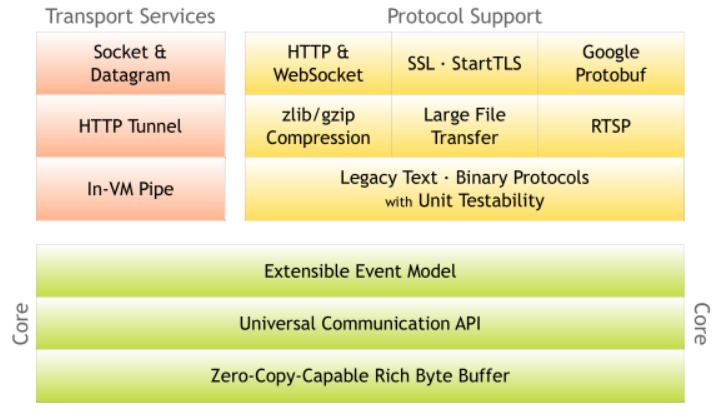

# Netty学习笔记

[TOC]

## 一、Netty简介

### 1、Netty基本介绍

​	Netty是一个 异步的、基于事件驱动的、网络 框架。用于快速开发可维护的高性能协议服务器和客户端。

​	Netty是一个基于NIO客户端、服务端的框架，它支持协议服务器以及网考应用程序的轻松开发。Netty极大地简化了基于TCP、UDP套接字服务器等网络编程。Netty是根据许多协议（如FTP、SMTP、HTTP等）设计而成的。Netty是一种无需妥协就可以轻松实现开发、性能、稳定性和灵活性的方法。

- Core模块：netty的核心模块。
  - Extensible Event Model：可扩展的事件驱动模型.
  - UNiversal Communication API：统一的通信的API。
  - Zero-CopyCapable Rich Byte Buffer：零拷贝的Byte Buffer。

- Transport Services模块：传输模块，主要是包含了各种传输机制。

- Protocol Support模块：协议模块，主要是包含了各种协议。

### 2、Netty特性

#### 1）设计

- 用于各种传输类型的统一API---阻塞与非阻塞套接字。
- 基于灵活和可扩展的事件模型，允许清晰的分离关注点。
- 高度的可定制的线程模型，可以提供单个、多个线程以及线程池。

#### 2）性能

- Netty具有更好地贪图量，更低的延迟。
- Netty能够减少资源消耗。
- Netty能够实现最小化的内存复制。
- Netty完成了SSL/TLS和StartTLS的支持，极大地保证了安全。

## 二、Netty架构实现

## 三、Netty模块分析

