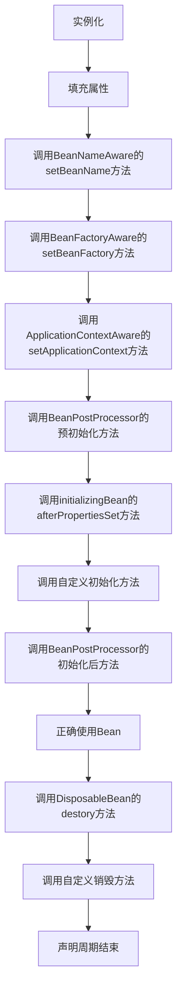

[TOC]

# Spring实战

## 一. Spring之旅
### 1.1 依赖注入
> 一个由实际意义的对象，通常情况下是由多个类组成，这些类相互作用、协作来完成特定的业务逻辑。非Spring项目中，每个对象负责管理与自己相互协作的对象的引用（即它依赖的对象），这样子是高度耦合的，例如：

```java
public class Apple implements Fuilt {
    
    private Tree tree;
    
    public Apple() {
        this.tree = new Tree();
    }
    
    //....
    
}
```

这样子做出来的项目，耦合度太高，将两个类紧密的联系在了一起，扩展能力较差。  
> **使用依赖注入，对象的依赖关系将由系统中负责协调各对象的第三方组件在创建对象的时候进行设定，对象无需自行创建或管理他们的依赖关系，容器自动的将依赖注入到对象中。**如下图所示：IOC容器在创建Foo对象的时候，会自动的将Bar与Baz实例对象注入到Foo对象引用中，实现解耦。
>
> 
>
> 当使用DI操作的时候，程序中只需要添加其引用对象即可：
>
> ```java
> public class Foo {
> 	Bar bar;
>  public Foo(Bar bar) {
>      this.bar = bar;
>  }
> }
> ```

### 1.2 应用切面

> DI能够让相互协作的团建组件保持松散耦合，面向切面编程（aspected-oriented programming, AOP）允许你把遍布应用各处的功能分离出来形成可重用的组件。
>
> 面向切面编程旺旺被定义为促使软件系统实现关注点的分离一项技术。系统由许多不同的组件组成，每一个组件各负责一块特定功能。除了实现自身核心的功能之外，这些组件还经常承担额外的职责，如日志、事务、安全等系统服务融入到核心业务逻辑的组件中去。

- 实现系统关注点功能的代码将会重复出现在多个组件中。这意味着如果你改变这些关注点的逻辑，必须修改各个模块中的相关实现。及时你把这些关注点抽象为一个独立的模块，其他模块只调用他的方法，但是方法的调用还是会重复出现在各个模块中。
- 组件会因为那些与自身核心业务无关的代码而变得混乱。向数据库中插入数据的方法只应该关注如何添加地址，而不是关注它是否安全或是否需要支持事务。如下图所示：混乱的关系图


> **AOP能够让服务模块化，以声明的方式将它们应用到他们需要影响的组件中去。**
>
> **AOP简单的理解为：在多个核心业务逻辑组件之上的一个外壳。使用AOP去包裹核心业务层，让其能够通过切面配置的方式切入到系统中，对其核心代码业务逻辑无影响。**
>
> 

### 1.3 Spring容器

> 容器是Spring框架的核心。Spring容器使用DI管理构成应用的组件，他会创建想回协作的组件之间的关联。
>
> Spring中容器的实现有多个，具体可以归结为两种类型：
>
> - **bean工厂**：org.springframework.beans.factory.BeanFactory 接口定义的基本工厂。
> - **应用上下文**：org.springframework.beans.context.ApplicationContext接口定义，基于BeanFactory构建，提供应用框架级别的服务，更加适合企业级开发。

### 1.4 Bean生命周期

1. Spring对Bean进行实例化；
2. Spring将值和Bean的引用注入奥Bean对应的属性中；
3. 如果Bean实现了BeanNameAware接口，Spring将bean的ID传递给setBeanName()方法；
4. 如果Bean实现了BeanFactoryAware接口，则调用setBeanFactory()方法，将BeanFactory容器实例传入；
5. 如果Bean实现了ApplicationContextAware接口，则调用setApplicationContext()方法，将应用上下文ApplicationContext容器实例传入；
6. 如果Bean实现了BeanPostProcessor接口，Spring将调用他们的postProcessBeforeInitialization()方法；
7. 如果Bean实现了InitializingBean接口，则调用afterPropertiesSet()方法；
8. 如果Bean实现了BeanPostProcessor接口，则调用postProcessAfterInitialization()方法；
9. Bean准备就绪；
10. 如果Bean实现了DisposableBean接口，则调用destory()接口方法；



### 1.5 Spring模块

- 数据访问集成模块
- Spring-Web与远程调用模块
- AOP面向切面编程模块
- Instrumentation模块
- Spring核心模块
- Spring-Test模块


## 二. 装配Bean

### 2.1 Spring配置的可选方案

- 在XML中进行显式配置；
- 在Java中进行显式配置；
- 隐式的Bean发现机制和自动装配。

#### 2.1.1 自动装配Bean

- **组件扫描（component scanning）**：Spring会自动发现应用上下文中所创建的Bean；
- **自动装配（autowiring）**：Spring自动昂满足bean之间的依赖；

#### 2.1.2 创建可被发现的bean


