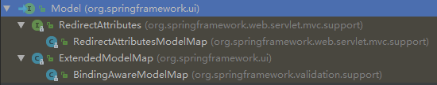

[TOC]
# Spring家族产品

## 一、官方文档
Spring--4.3.18版本官方文档：https://docs.spring.io/spring/docs/4.3.18.RELEASE/spring-framework-reference/htmlsingle/   

SpringBoot--1.5.13版本官方文档：https://docs.spring.io/spring-boot/docs/1.5.13.RELEASE/reference/htmlsingle/   

SpringCloud--Edgware.SR3版本官方文档：https://cloud.spring.io/spring-cloud-static/Edgware.SR3/single/spring-cloud.html

## 二、Spring注解开发
### 1、为容器添加Bean
#### 1）@Configuration注解：
##### 使用场景：
在需要给IOC容器添加Bean的时候，必须在类上面添加@Configuration注解。

#### 2）@Bean注解：
##### 使用场景：
当需要使用注解方式创建Bean的时候，需要在方法上面添加@Bean注解，标明这个方法是创建一个@Bean。
##### 注意：
@Bean标注的方法，方法名称表示的是这个Bean的id ；方法的返回值表示的是这个Bean的类型。

@Bean标注在带有参数的方法上，会从容器中找到对应的Bean来自动注入到这个形参中。

#### 3）@ComponentScan注解：
##### 使用场景：
相当于配置文件的包扫描。
##### 使用方式：
1）type=FilterType.ANNOTATION 表示按照注解的方式进行扫描。

//排除标记有Controller注解的包
```
@ComponentScan(value="com.zsl.spring",excludeFilters = {
	@Filter(type=FilterType.ANNOTATION,classes= {Controller.class})
})
```

//只扫描Controller注解的包
```
@ComponentScan(value="com.zsl.spring",includeFilters = {
	@Filter(type=FilterType.ANNOTATION,classes= {Controller.class})
},useDefaultFilters=false)
```

2）type=FilterType.ASSIGNABLE_TYPE  表示按照给定的类型进行扫描

3）type=FilterType.ASPECTJ  		   表示使用AspectJ表达式来进行扫描  

4）type=FilterType.REGEX   			   表示使用正则表达式来进行包扫描

5）type=FilterType.CUSTOM 		   表示使用自定义的包扫描规则


#### 4）@Scope注解：
##### 使用场景：
组件的作用域，用于指定@Bean是单实例还是多实例。
##### 使用方式：
1）prototype  多实例的    @Scope(value = "prototype")  ---IOC容器启动的时候不会创建对象，而是当获取的时候才调用这个方法来创建bean。

2）singleton   单实例       @Scope(value = "singleton")  ---IOC容器启动时候创建对象放置到IOC容器中。

#### 5）@Lazy懒加载
##### 使用场景：
在调用这个Bean的时候才会去调用这个方法创建Bean。
##### 注意：
- 懒加载一般是作用域 单实例 的Bean。  
- 只能作用于方法上。


#### 6）@Conditional()注解：
##### 使用场景：
按照一定的条件进行判断，满足条件的情况下为容器中添加Bean。
##### 使用方法：
第一步：创建一个类，实现spring的Condition接口。

第二步：在类里面实现接口的方法，根据条件来返回true或者false。

第三步：在需要创建Bean的方法或者类上面添加注解@Conditional，添加方式为：@Conditional({Conditional1.class}) 

#### 6、注解 @Import ：
##### 使用场景：
为容器中导入Bean组件，意思是将类加入到IOC容器中
##### 使用方法：
在类上添加注解  @Import({Color.class,car.class})    //这是一个数组形式

#### 7、ImportSelector ：
@Import 注解的另一种导入Bean方式

#### 9、注解 @Profile
##### 简介：
spring为我们提供当前需要的环境，动态的激活与切换一系列主键的功能
##### 使用方法：
在@Bean注解的位置添加注解 @Profile("指定在运行的什么环境才注册到IOC容器")

```
@Profile("dev")
@Bean("devDataSource")
public DataSource dataSourceDev(){.......}
```

##### 注意：
当运行不同的环境，注册不同的Bean到容器中。
##### 使用环境：
类(整个配置类的所有配置都受@Profile注解影响)，方法(这个方法受@Profile指定)


#### 8、FactoryBean ：工厂Bean来创建Bean加入到IOC容器中
##### 第一步：创建一个类实现FactoryBean

```
public class ColorFactoryBean implements FactoryBean<Color> {
    @Override
    public Color getObject() throws Exception {
        return new Color();
    }
    @Override
    public Class<?> getObjectType() {
        return Color.class;
    }
    @Override
    public boolean isSingleton() {
        return true;
    }
}
```

##### 第二步：在config中调用工厂来创建Bean对象；

```
@Bean
public ColorFactoryBean colorFactoryBean()
{
    return new ColorFactoryBean();
}
```


### 三、Bean的生命周期
#### 1、Bean的生命周期历程：
创建---》初始化---》销毁  
#### 2、Bean的初始化：
方法1：通过@Bean注解来指定初始化时执行的方法：

```
@Bean(initMethod = "init",destroyMethod = "detory")
```

方法2：通过实现 InitializingBean 接口来指定Bean的初始化。  

方法3：通过JSR250的标注注解@PostConstruct来指定初始化。  


#### 3、Bean的销毁：
方法1：通过@Bean注解来指定销毁时执行的方法：

```
@Bean(initMethod = "init",destroyMethod = "detory")
```

方法2：通过实现 DisposableBean 接口定义销毁单实例Bean的方法。

方法3：通过JSR250的标注注解@PreDestroy来指定销毁方法。

注意：
- 单实例会在关闭IOC容器的时候执行指定的Bean的销毁的方法。
- 多实例在IOC容器关闭的时候不会执行销毁的过程。

#### 4、BeanPostProcessor接口对Bean的控制：
方法：自定义类来实现这个接口  
- postProcessBeforeInitialization ：在Bean的初始化工作之前调用
- postProcessAfterInitialization ：在Bean的初始化工作之后调用
  ​    

注意：BeanPostProcessor的应用：spring底层大量使用。Bean的赋值，其他组件的注入，@Autowired的使用，数据的校验，@Ausyc注解等都是通过实现BeanPostProcessor接口来实现的。


### 四、Spring赋值
#### 1、使用注解 @Value 进行赋值
##### 使用方法：

最简单的方法：直接赋值  

```
@Value("张世林")
private String name;
```

使用SPEL表达式#{...}：    

```
@Value("#{2-20}")
private int age;
```

使用外部配置文件赋值：    

第一步：在创建bean的类上面添加  

```
@PropertySource(value={"classpath:db.properties"})
```


第二步：在需要配赋值的类的属性上添加：

```
@Value("${person.name}")
private String name；
```

### 五、自动装配
#### 简介：
Spring通过依赖注入（DI）来实现对IOC容器的各个组件依赖关系赋值。
#### 1、@Autowired----自动注入
#### 使用位置：
方法：直接标注在方法上，能够为方法的形参自动注入。  
属性：也可以将注解标注在这个属性的Set方法上面，在注入的时候，就能够完成属性的赋值。  
构造器：标注在构造器，也能够完成赋值。  
参数：比如标记在形参中，也能够从容器中对这个自动注入进行赋值。  

#### 注意：
可以在这个注解上面添加 注解 **@Qualifier**来指定使用限同类型的哪一个 Bean。  
可以使用@Autowired(**required=false**)  //容器中如果不存在这个bean，就不注入。  
可以使用 注解 **@Primary** 让spring自动装配的时候，不指定选哪一个的话，默认选择标注有这个注解的Bean。

#### 2、使用 @Resource 注解来实现自动注入：
JSR250的规范(是java的规范，不是spring的注解)
##### 使用方法：
@Resource(name="bookService")


### 六、AOP【动态代理】
#### 1、简介：
指在程序运行期间动态的将 某段代码 切入 到 指定方法 的指定位置进行运行的编程方式。
#### 2、AOP的分类：
1）前置通知(@Before)：目标方法(切入点的位置)运行之前执行

2）后置通知(@After)：目标方法(切入点的位置)运行之后执行

3）返回通知(@AfterReturning)：目标方法(切入点的位置)正常运行并返回之后执行

4）异常通知(@AfterThrowing)：目标方法(切入点的位置)运行异常之后执行

5）环绕通知(@Around)：动态代理，手动推动目标方法的运行

术语 |	描述
---|---
方面/切面(Aspect) |	一个具有一组API的模块，提供交叉要求。例如，日志记录模块被称为AOP方面用于记录。应用程序可以根据需要具有任意数量的方面。
加入点(Join point) |	这表示您的应用程序中可以插入AOP方面的一点。也可以说，这是应用程序中使用Spring AOP框架采取操作的实际位置。
通知(Advice) |	这是在方法执行之前或之后采取的实际操作。 这是在Spring AOP框架的程序执行期间调用的实际代码片段。
切入点(Pointcut) |	这是一组一个或多个连接点，其中应该执行通知(Advice)。 您可以使用表达式或模式指定切入点，我们将在AOP示例中看到。
介绍(Introduction) |	介绍允许向现有类添加新的方法或属性。
目标对象(Target object) |	对象被一个或多个方面通知(Advice)，该对象将始终是代理的对象。也称为通知(Advice)对象。
编织(Weaving) |	编织是将方面与其他应用程序类型或对象进行链接以创建通知(Advice)对象的过程。这可以在编译时，加载时间或运行时完成。


#### 注意：
- a：JoinPoint 形参必须放在第一位
- b：可以添加 Execption 异常形参


#### 3、注解 @ASpect ：
指定哪个类是切面类(配置在切面类上---必须存在)。

#### 4、注解 @EnableAspectJAutoProxy：
开启基于注解的AOP功能（配置在@Confignation注解的位置--必须存在）。

#### 5、注解 @PointCut ：
使用AspectJ表达式来定义切入点。


### 七、Spring事务控制

#### 声名式事务：
声明式事务管理也有两种常用的方式，一种是基于tx和aop名字空间的xml配置文件，另一种就是基于@Transactional注解。显然基于注解的方式更简单易用，更清爽。
#### 编程式事务：
spring不推荐使用编程式事务。

#### 方法一：
基于全注解的方式来控制事务：  

1、注解 @EnableTransactionManagement ：开启事务控制。  
2、注解 @Transactional ：加载在方法上，为方法提供事务控制。  
3、配置事物管理器：  

```java
@Bean
public PlatformTransactionManager platformTransactionManager(@Qualifier("dataSource")DataSource dataSource){
    return new DataSourceTransactionManager(dataSource);
}
```

#### 方法二：
基于xml开启注解事务的方式来控制事务：   

1、配置xml文件：

```xml
<!-- 配置事物管理器 -->
	<bean id="transactionManager" class="org.springframework.jdbc.datasource.DataSourceTransactionManager">
		<!-- 注入需要管理的数据源，DataSource -->
		<property name="dataSource" ref="dataSource"></property>
	</bean>
	<!-- 开启基于注解的事务 -->
	<tx:annotation-driven transaction-manager="transactionManager"/>
```

2、注解 @Transactional ：加载在方法上，为方法提供事务控制。

##### 注意：
@Transactional 注解可以作用于 接口方法、类以及类的方法上。  
@Transactional 作用于类上的时候，该类的所有 public修饰的方法都会具有事务控制。  
@Transactional 不推荐使用在接口、接口方法上，因为只有在使用基于接口的代理时它才会生效。  
@Transactional 应该只应用于 public修饰的方法上，如果用在 private、protected以及default修饰的方法上的话，注解@Transactional 会被默认忽略掉，也不会抛出异常。


#### 方法三：
纯xml方式来配置事物管理器。


```xml
<!-- 配置事物管理器 -->
	<bean id="transactionManager" class="org.springframework.jdbc.datasource.DataSourceTransactionManager">
		<!-- 注入需要管理的数据源，DataSource -->
		<property name="dataSource" ref="dataSource"></property>
	</bean>
	
	<tx:advice id="teadivce" transaction-manager="transactionManager">
		<tx:attributes>
			<tx:method name="*"/>
			<tx:method name="insert*" propagation="REQUIRED" timeout="11"/>
			<tx:method name="select*" propagation="REQUIRED" isolation="READ_COMMITTED" timeout="11"/>
		</tx:attributes>
	</tx:advice>
	
	<aop:config>
		<aop:pointcut expression="execution(* com.zsl.spring.*.*)" id="txpt1"/>
		<aop:advisor advice-ref="teadivce" pointcut-ref="txpt1"/>
	</aop:config>
```


### 八、Spring事务的传播行为
#### 1、什么是事务的传播行为？
当一个事务方法(也就是添加了事务控制的方法)被另外一个十五方法调用的时候，必须制定事务的传播行为。也就是说，当一个方法开启事务控制以后，调用第二个事务方法的时候该如何来选择事务，可以根据事务的属性来选择是该继续执行第一个方法的事务还是新开一个事务。

#### 2、事务的传播属性：
- TransactionDefinition.PROPAGATION_REQUIRED：如果当前存在事务，则加入该事务；如果当前没有事务，则创建一个新的事务。这是默认值。下面是这个事务的关系图：purchase() 方法加入到了 Tx1 的事务中。  


- TransactionDefinition.PROPAGATION_REQUIRES_NEW：创建一个新的事务，如果当前存在事务，则把当前事务挂起。下面是这个事务的关系图：  


- TransactionDefinition.PROPAGATION_SUPPORTS：如果当前存在事务，则加入该事务；如果当前没有事务，则以非事务的方式继续运行。
- TransactionDefinition.PROPAGATION_NOT_SUPPORTED：以非事务方式运行，如果当前存在事务，则把当前事务挂起。
- TransactionDefinition.PROPAGATION_NEVER：以非事务方式运行，如果当前存在事务，则抛出异常。
- TransactionDefinition.PROPAGATION_MANDATORY：如果当前存在事务，则加入该事务；如果当前没有事务，则抛出异常。
- TransactionDefinition.PROPAGATION_NESTED：如果当前存在事务，则创建一个事务作为当前事务的嵌套事务来运行；如果当前没有事务，则该取值等价于TransactionDefinition.PROPAGATION_REQUIRED。

#### 3、事务的传播行为的代码操作：

```
@Transactional(propagation = Propagation.REQUIRED)
```


### 九、Spring事务的隔离级别
#### 1、简介：
事务的隔离级别指的是若干个并发的事务之间的隔离程度。

#### 2、为什么要使用事务的隔离级别？
多个事务在同一个数据集上并发执行的时候，事务容易导致意外的出现。

- 脏读：两个事务操作同一个数据集，事务B读取了事务A已经修改但是还没有提交的数据。
- 幻读：两个事务操作同一个数据集，事务B读取了事务A添加了数据，但是还没有提交的数据。
- 不可重复读：事务A读取数据以后，再次来读取数据，结果发现两次的数据不同，数据已经被事务B修改过了。

#### 3、事务隔离级别（5种）：

- TransactionDefinition.ISOLATION_DEFAULT：这是默认值，表示使用底层数据库的默认隔离级别。对大部分数据库而言，通常这值就是TransactionDefinition.ISOLATION_READ_COMMITTED。

- TransactionDefinition.ISOLATION_READ_UNCOMMITTED：该隔离级别表示一个事务可以读取另一个事务修改但还没有提交的数据。该级别不能防止脏读，不可重复读和幻读，因此很少使用该隔离级别。比如PostgreSQL实际上并没有此级别。
- TransactionDefinition.ISOLATION_READ_COMMITTED：该隔离级别表示一个事务只能读取另一个事务已经提交的数据。该级别可以防止脏读，这也是大多数情况下的推荐值。
- TransactionDefinition.ISOLATION_REPEATABLE_READ：该隔离级别表示一个事务在整个过程中可以多次重复执行某个查询，并且每次返回的记录都相同。该级别可以防止脏读和不可重复读。
- TransactionDefinition.ISOLATION_SERIALIZABLE：所有的事务依次逐个执行，这样事务之间就完全不可能产生干扰，也就是说，该级别可以防止脏读、不可重复读以及幻读。但是这将严重影响程序的性能。通常情况下也不会用到该级别。

#### 4、事务隔离级别代码操作方式：

```
@Transactional(propagation = Propagation.REQUIRED
				,isolation = Isolation.READ_COMMITTED)
```

### 十、Spring事务回滚
#### 1、事务的回滚指定在什么异常下才会进行回滚：

```
@Transactional(propagation = Propagation.REQUIRED
				,isolation = Isolation.READ_COMMITTED
				,noRollbackFor = ZoneRulesException.class
				,rollbackFor = RuntimeException.class)
```

#### 2、事务回滚注意事项：
在Spring的默认配置下，只有抛出的异常为unchecked类型的异常时，才执行事务的回滚。也就是说只有是RuntimeException异常以及其子类，还有Errors错误才会执行事务回滚。也能够明确指定什么异常情况不事务回滚noRollbackFor ，审议异常情况下事务回滚rollbackFor 。


### 十一、Spring事务超时：
#### 1、事务超时的时间设定---是以秒为单位的：
@Transactional(propagation = Propagation.REQUIRED

```
,isolation = Isolation.READ_COMMITTED
				,noRollbackFor = ZoneRulesException.class
				,rollbackFor = RuntimeException.class
				,timeout = 60)
```

#### 2、事务的超时特点：
就是指一个事务所允许的最长执行时间，超过了最长执行时间，则自动进行事务回滚操作。其单位是 秒，默认的话，使用的底层数据库设置的超时时间。


### 十三、SpringMVC执行异步处理：
#### 1、使用Callable类型的返回值来操作异步处理：
##### 步骤：
第一步：创建一个返回类型为Callable接口类型的RequestMapping。  

第二步：创建Callable对象，重写call()方法，然后主线程是继续往下面执行的，一直到主线程执行完毕以后，主线程就能够继续处理其他的请求，而这个异步的请求一直未做Response响应。待到Callable对象返回结果以后，会执行下面的操作。  

第三步：待到Callable返回结果以后，SpringMVc会再次发送这个RequestMapping请求来恢复到之前的处理。  

第四步：将Callable返回的数据进行渲染等操作以后，再做出Response操作。


##### 代码：

```
@RequestMapping("/async01")
@ResponseBody
public Callable<String> async01()
{
	System.out.println("线程开始"+Thread.currentThread()+"==>"+System.currentTimeMillis());
	Callable<String> call = new Callable<String>() {
		@Override
		public String call() throws Exception {
			System.out.println("副线程开始"+Thread.currentThread()+"==>"+System.currentTimeMillis());
			Thread.sleep(10000);
			System.out.println("副线程结束"+Thread.currentThread()+"==>"+System.currentTimeMillis());
			return "123L";
		}
	};
	System.out.println("线程结束"+Thread.currentThread()+"==>"+System.currentTimeMillis());
	return call;
}
```


#### 异步方法的拦截器：
异步方法的拦截器比较特殊，因为异步处理是请求两次这个请求，所以，或导致正常拦截器使用效果不好。   

正确的拦截器：实现 AsyncHandlerInterceptor 接口。


### 十四、SpringMVC异常处理器
#### 方法一：使用 @ExceptionHandler 注解来实现异常的处理。
##### 特点：
@ExceptionHandler 只能够写在Handle中，只能够处理当前Handle中抛出的异常，不是一个全局异常处理。
**代码为：**
​	

```java
@ExceptionHandler({ArithmeticException.class,
						RuntimeException.class})
	public ModelAndView handleExecption(Exception ex) {
		ModelAndView mv = new ModelAndView();
		mv.addObject("execption", ex);
		mv.setViewName("error");
		return mv;
	}
	@RequestMapping("/test1/{id}")
	public String test1(@PathVariable("id") Integer id) {
		
		int k = 0;
		k = 10/id;
		return "test";
	}
```


#### 方法二：使用 @ControllerAdvice 来标记一个类专门用于处理异常。
##### 注意：
需要加入到springmvc的IOC容器中。
##### 特点：
如果@RequestMapping中抛出了异常，则先去找当前类中是否有 @ExceptionHandler    标注的处理异常的方法，如果没有的话，则进入到标注有 @ControllerAdvice    注解的类里面去查找处理异常的方法，返回的是ModelAndView里面的数据与返回跳转的页面。   

**代码为：**

```java
@ControllerAdvice
public class HandleExecption {
	@ExceptionHandler({ArithmeticException.class})
			public ModelAndView handleExecption1(Exception ex) {
			ModelAndView mv = new ModelAndView();
			System.out.println("12111111111111111111111111");
			mv.addObject("execption", ex);
			mv.setViewName("error");
			return mv;
		}
	
	@ExceptionHandler({RuntimeException.class})
		public ModelAndView handleExecption(Exception ex) {
		ModelAndView mv = new ModelAndView();
		mv.addObject("execption", ex);
		mv.setViewName("error");
		return mv;
	}
}
```


#### 方法三：使用 @RestControllerAdvice 注解来标记一个类专门用于处理异常。
##### 注意：
需要加入到springmvc的IOC容器中。
##### 特点：
如果@RequestMapping中抛出了异常，则先去找当前类中是否有 @ExceptionHandler   标注的处理异常的方法，如果没有的话，则进入到标注有 @RestControllerAdvice   注解的类里面去查找处理异常的方法，然后返回的是json数据，前台只需要接收json数据即可。

**代码为：**

```java
@RestControllerAdvice
public class HandleExecption {

	@ExceptionHandler({UserNotExecption.class})
	public Map<String,Object> handleExecption3(Exception ex) {
		Map<String,Object> map = new HashMap<>();
		map.put("execption", ex.getMessage());
		return map;
	}
}
```

### 十五、SpringMVC的运行流程


在整个 Spring MVC 框架中， DispatcherServlet 处于核心位置，负 责协调和组织不同组件以完成请求处理并返回响应的工作。

##### SpringMVC 正常的处理请求过程：  

①、若一个请求匹配 DispatcherServlet 的请求映射路径(在 web.xml 中指定), WEB 容器将该请求转交给 DispatcherServlet 处理。  

②、DispatcherServlet 接收到请求后, 将根据请求信息(包括 URL、HTTP 方法、请求头、请求参数、Cookie 等)及 HandlerMapping 的配置找到处理请求 的处理器(Handler). 可将 HandlerMapping 看成路由控制器，将 Handler 看成目标主机。 

③、当 DispatcherServlet 根据 HandlerMapping 得到对应当前请求的 Handler 后，通过 HandlerAdapter 对 Handler 进行封装，再以统一的适配器 接口调用 Handler。  

④、处理器完成业务逻辑的处理后将返回一个 ModelAndView 给 DispatcherServlet, ModelAndView 包含了视图逻辑名和模型数据信息。  

⑤、DispatcherServlet 借助 ViewResoler 完成逻辑视图名到真实视图 对象的解析。  

⑥、得到真实视图对象 View 后, DispatcherServlet 使用这个 View 对ModelAndView 中的模型数据进行视图渲染。  


##### SpringMVC未找到RequestMapping的请求处理流程：
①、若一个请求匹配 DispatcherServlet 的请求映射路径(在 web.xml 中指定), WEB 容器将该请求转交给 DispatcherServlet 处理。

②、如果未找到RequestMapping请求路径，则经过<MVC:default-servlet-handle/>来进行寻找静态资源文件，如果静态资源文件找到，就返回静态资源文件，如果未找到，则报404页面。

##### springmvc自己理解的运行流程
- 第一步：浏览器发送请求到spring的DispactherServlet，然后经过DispatcherServlet的url-pattern来进行请求的拦截。
- 第二步：根据springmvc对应的请求映射关系，**如果请求不存在**，则会去查看是否配置了<mvc:default-servlet-handler/>。
> 如果存在这个配置，使用<mvc:default-servlet-handler/>来进行静态资源的映射，如果静态资源也不存在，则抛出404页面。如果有存在的静态资源，则返回对应的目标资源。
>
> 如果不存在这个配置，则会在控制台抛出 NO Mapping found for HTTP request with URL........
- 第三步：如果springmvc**存在对应的请求映射关系**，则会进入下面的操作。


### 十六、处理SpringMVC的GET/POST请求中文乱码
#### 1、解决POST请求的方式：
在SpringMVC中，配置了一个characterEncodingFilter，专门用于拦截POST请求，然后设置字符集格式。在web.xml中进行设置：
```
<filter>
  	<filter-name>CharacterEncodingFilter</filter-name>
  	<filter-class>org.springframework.web.filter.CharacterEncodingFilter</filter-class>
  	<init-param>
  		<param-name>encoding</param-name>
  		<param-value>UTF-8</param-value>
  	</init-param>
  	<init-param>
  		<param-name>forceRequestEncoding</param-name>
  		<param-value>true</param-value>
  	</init-param>
  	<init-param>
  		<param-name>forceResponseEncoding</param-name>
  		<param-value>true</param-value>
  	</init-param>
  </filter>
  <filter-mapping>
  	<filter-name>CharacterEncodingFilter</filter-name>
  	<url-pattern>/</url-pattern>
  </filter-mapping>
```

#### 2、解决GET请求的方式：
在Servers文件夹下面的Connector标签添加 URIEncoding="UTF-8"

```
<Connector URIEncoding="utf-8" connectionTimeout="20000" port="8080" protocol="HTTP/1.1" redirectPort="8443"/>
```

### 十七、SpringMVC视图渲染

#### 1、Model

**1）层级关系**：Model接口主要的父子关系为：

	

**2）作用场景**：Model主要作用适用于 将数据放置到请求域中，页面获取请求域中的数据即可。

**3）基本介绍**：

- **Model**接口下的直接实现类是 ExtendedModelMap，也是Springmvc中**默认的实现类**的调用。

ExtendedModelMap继承了ModelMap，ModelMap继承了LinkedHashMap，主要是用于将数据进行存储。

- **Map**会直接调用 ExtendedModelMap 的子类 BindingAwareModelMap，用于存放Map类型的数据。

**4）实现步骤**：

- 第一步：将Model  或者 Map(SpringMVc的map或者java.util.map均可)对象放置到形参中保存。
- 第二步：调用 model.addAttribute() 方法，进行封装对应的数据。

**5）model接口方法**：

```java 
   /**
     * 添加键值属性对
     */
    Model addAttribute(String attributeName, Object attributeValue);

    /**
     * 以属性的类型为键添加属
     */
    Model addAttribute(Object attributeValue);

    /**
     * 以属性和集合的类型构造键名添加集合属性，如果有同类型会存在覆盖现象
     * key名称为：“简单类名（首字母小写）”+“List”，如List生成的模型对象属性名为“stringList”
     */
    Model addAllAttributes(Collection<?> attributeValues);

    /**
     * 将attributes中的内容复制到当前的model中
     * 如果当前model存在相同内容，会被覆盖
     * map 的 key就是对应的 key的值
     */
    Model addAllAttributes(Map<String, ?> attributes);

    /**
     * 将attributes中的内容复制到当前的model中
     * 如果当前model存在相同内容，不会被覆盖
     * map 的 key就是对应的 key的值
     */
    Model mergeAttributes(Map<String, ?> attributes);

    /**
     * 判断是否有相应的属性值
     */
    boolean containsAttribute(String attributeName);

    /**
     * 将当前的model转换成Map
     */
    Map<String, Object> asMap();
```

6）**RedirectAttributes接口：**

​	FlashAttributes 为一个请求存储意图为另外一个请求所使用的属性提供了一条途径. Flash attributes 在对请求的重定向生效之前被临时存储（通常是在session)中，并且在重定向之后被立即移除.

```java
	/**
	 * Add the given flash attribute.
	 * @param attributeName the attribute name; never {@code null}
	 * @param attributeValue the attribute value; may be {@code null}
	 */
	RedirectAttributes addFlashAttribute(String attributeName, Object attributeValue);

	/**
	 * Add the given flash storage using a
	 * {@link org.springframework.core.Conventions#getVariableName generated name}.
	 * @param attributeValue the flash attribute value; never {@code null}
	 */
	RedirectAttributes addFlashAttribute(Object attributeValue);

	/**
	 * Return the attributes candidate for flash storage or an empty Map.
	 */
	Map<String, ?> getFlashAttributes();
```

​	**FlashAttributes 可以用来进行重定向的操作的时候，在其他的controller中获取到数据。通常使用的是@ModelAttribute注解来获取请求域中的数据。**

### 十八、SpringMVC拦截器

​	在SpringMVC中，自定义拦截器，如果需要进行依赖注入其他Bean对象的时候，直接使用@Autowired注解会出现空指针异常。是因为拦截器是在ApplicationContext完成之前就已经创建好了的。

​	所以，解决办法：将创建这个拦截器Bean对象提前进行创建。

```java
@Configuration
public class WebMvcConfig implements WebMvcConfigurer {
	//在此处，将拦截器注册为一个 Bean
	@Bean
	public HandlerInterceptor getKillInterceptor(){
		return new KillInterceptor();
	}

	@Override public void addInterceptors(InterceptorRegistry registry) {
registry.addInterceptor(getKillInterceptor()).addPathPatterns("/kill/toKill");
	}
}
```

