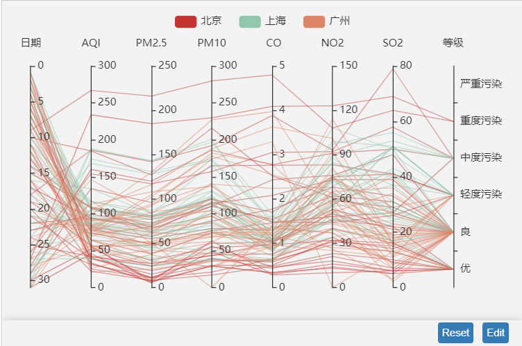
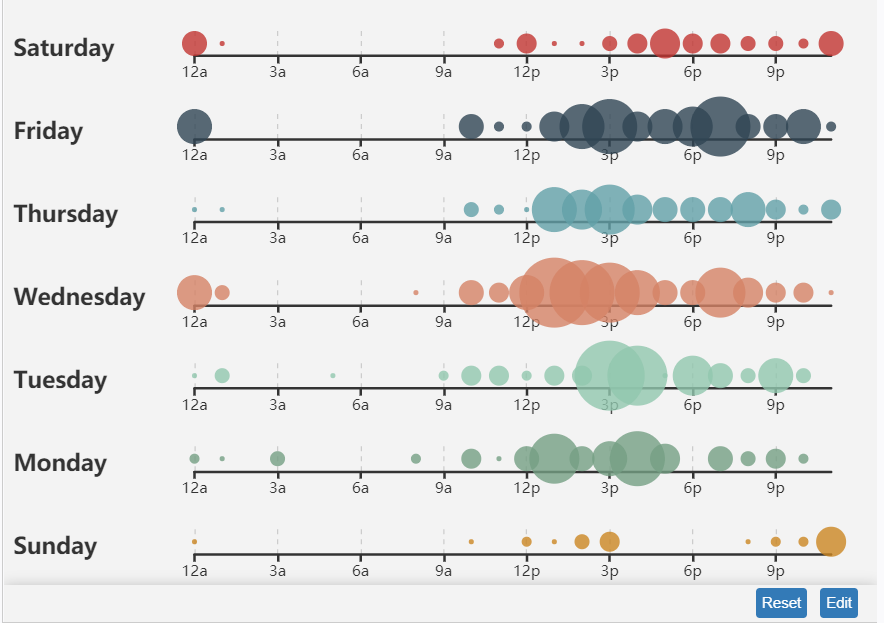

[TOC]

# ECharts 

> ECharts是一个开源的JavaScript实现的开源可视化库，提供了丰富的可视化类型：折线图、柱状图、散点图、饼图、k线图、用于统计的盒形图、用于地理数据可视化的地图、关系图、平面图等等图；
>
> 官网地址：<https://www.echartsjs.com/zh/index.html>


## 一. 基本配置

### 1. option --- title

> 作用：**用于标题组件、包含主标题和副标题**；参数包括：
>
> - `id` : String      组件ID，默认可以不指定，指定则可用于在option或者API中进行组件引用；
> - `show` : Boolean    是否显示组件标题；默认值为  `true`
> - `text` : String    主标题文本，支持 `\n` 换行；默认值为  `""`
> - `link` : String    主标题文本超链接；默认值为 `""`
> - `target` : String   指定窗口打开主标题超链接；默认值为 `blank`
>   - `'self'` :  当前窗口打开；
>   - `'blank'` :  新窗口打开；
> - 

### 2. option---legend

### 3. option---grid

> **`grid`属性用于 直角坐标系内绘图网格**，单个grid内最多可以放置上下两个X轴。可以再网格上绘制则线图、柱状图、散点图。
>
> - `id` : 组件id，默认不指定，指定则可以在option或者API中进行使用；
>
> - `show` : 是否显示直角坐标系网格；默认值为 `false`;
>
> - `zlevel` : 所有图形的zlevel值；**`zlevel`大的Canvas可以放在`zlevel`小的Canvas的上面。**默认值为 0；
>
>   - zlevel用于Canvas分层，不同zlevel值得图形会放置在不同的Canvas中，`Canvas`可以把一些图形变化频繁的组件设置成一个单独的`zlevel`。
>
> - `z` : 组件中的所有图形的 `z` 值；**控制图形的前后顺序**，默认值为 2；
>
> - `left` : 组件离容器左侧的距离；默认值为  10%;
>
> - `top` : 组件离容器上边的距离；默认值为 60；
>
>   - 该属性可以使用 数字与百分比例，例如 60 表示距离上边距60px，20%表示距离20%；
>
> - `right` : 组件离容器右侧的距离;默认值为 10%;
>
> -  `bottom` : 组件离容器下边距距离；默认值为 60；
>
> - `width` : 组件宽度，默认值为 ‘auto’ ，表示的是自适应；
>
> - `height` : 组件高度，默认值为 'auto'，表示的是自适应；
>
> - `containLabel` : grid区域是否包含坐标轴的刻度标签；
>
> - `backgroundColor` : grid区域网格背景色，默认值为 'transparent'，透明色彩；
>
>   - 支持 `rgb(128,128,128)`与`rgba(128,128,128,0.5)`以及 `#fff`三种方式；
>
> - `borderColor` : 网格边框颜色，默认值为 `'#ccc'`，该属性需要  `show=true` 才生效。
>
> - `borderWidth` : 网格边框线宽；
>
> - `shadowBlur` ：设置图像的阴影模糊大小
>
> - `shadowColor`：设置阴影颜色
>
> - `shadowOffsetX`：阴影水平方向上的偏移距离
>
> - `shadowOffsetY`:  阴影垂直方向上的偏移距离，下面是实例：
>
>   ```json
>   {
>   	shadowColor: 'rgba(0,0,0,0.5)',
>   	shadowBlur: 10
>   }
>   ```
>
> - `tooltip` : 本坐标系特定的tooltip设定；tooltip可以设置的地方包括：
>
>   - 全局 tooltip
>   - 坐标系中的：grid.tooltip、polar.tooltip、single.tooltip
>   - 设置在系列中的： series.tooltip
>   - 设置在系列中的每个数据项中: series.data.tooltip

### 4. option---xAxis

> **`xAxis`是直角坐标系grid中的x轴**，一般情况下单个grid组件最多只能放下两个x轴，多余两个x轴需要通过配置`offset`属性放置同一个位置出现多个x轴重叠的情况；
>
> - `id` : 组件id，默认不指定，指定则可以进行引用；
>
> - `show` : 是否显示x轴；默认值为 true
>
> - `gridIndex` : x轴所在的grid的索引，默认位于第一个grid，默认值为 0；
>
> - `position` : x轴的位置；默认 grid中的第一个x轴在grid的下方(`bottom`)，第二个x轴视第一个x轴的位置放在另一侧；可选参数：
>
>   - `top` : 顶部
>   - `bottom` : 底部
>
> - `offset` : x轴相对于默认位置的便宜，在相同的 `position`上有多个x轴的时候有用；
>
> - `type` : 坐标轴类型，默认值为 'category';
>
>   - 'value' : 数值轴，适用于连续数据；
>   - 'category' : 类目轴，适用于离散的类目数据，该类型必须通过 data 属性设置类目数据(也就是相当于柱状图上面的类型)；
>   - 'time' : 时间轴，适用于连续的时序数据，与数值轴相比时间轴带有时间的格式化，在刻度计算上有所不同；
>   - 'log' : 对数轴，适用于对数数据。
>
> - `name` : 坐标轴名称；
>
> - `nameLocation` : 坐标轴名称显示位置；默认值为 'end'
>
>   - 'start' : X坐标轴其实位置；
>   - 'middle' : 中间位置；
>   - 'center' : 中间位置；
>   - 'end' : 结束位置；
>
> - `nameTextStyle` : 做标注名称的文字样式；**细节配置参照官方文档；**
>
>   - `xAxis.nameTextStyle.color`
>   - `xAxis.nameTextStyle.fontStyle` : 默认值 normal，可选值为：`italic`、`oblique`
>   - `xAxis.nameTextStyle.fontWeight`：坐标轴名称文字字体粗细，可选值为：`normal`、`bold`、`bolder`、`lighter`
>
> - `nameGep` : 坐标轴名称与轴线之间的距离；默认值为 15
>
> - `nameRotate`  : 坐标轴名字旋转，角度值；默认值为 null
>
> - `inverse` : 是否反转坐标轴(就相当于是将x轴的数据反顺排序)；默认值为 false
>
> - `boundaryGap`: 坐标轴两边留白策略，详情参见官方文档；
>
> - `min` : 坐标轴刻度最小值，默认值为 null，可以使用函数返回最小值
>
> - `max` : 坐标轴刻度的最大值，默认值为null，可以使用函数方式返回最大值
>
> - `scale` : 没看懂
>
> - `tiggerEvent` : 坐标轴的标签是否响应和触发鼠标事件，默认 false；
>
> - `data` : 类目数据，在类目轴(type = 'category')时有效；数据实例：
>
>   ```javascript
>   // 所有类目名称列表
>   data: ['周一', '周二', '周三', '周四', '周五', '周六', '周日']
>   
>   // 每一项也可以是具体的配置项，此时取配置项中的 `value` 为类目名
>   data: [{
>       value: '周一',
>       // 突出周一
>       textStyle: {
>           fontSize: 20,
>           color: 'red'
>       }
>   }, '周二', '周三', '周四', '周五', '周六', '周日']
>   ```
>
> - .......

### 5. option---yAxis

> **直角坐标系grid中的y轴**，一般情况下单个grid组件最多只能放左右两个y轴，多余两个y轴需要听过offset配置，避免重复覆盖;大体跟XAxis类似：
>
> - `position` : y轴的位置，默认为 'left'；
>   - 'left' 
>   - ‘right’

### 6. option---polar

> **极坐标系，可以用于散点图和折线图**，每一个极坐标系拥有一个角度轴和一个半径轴；
>
> - `id` : 
>
> - `zlevel` :
>
> - `z` :  `z`相比 `zlevel`优先级更低，而且不会创建新的Canvas；
>
> - `center` : 极坐标系的中心（圆点）坐标，数组的第一项是横坐标，第二项是纵坐标；默认值为 ['50%',  '50%'] ；使用实例：
>
>   ```javascript
>   //使用百分比
>   center: ['50%','50%']
>   
>   //使用像素值
>   center: [400,300]
>   ```
>
> - `radius` : 极坐标系的半径，详情参见官方文档；
>
> - `tooltip` :  极坐标系的tooltip设定；

### 7. option---radiusAxis

> **极坐标系的径向轴**；

### 8. option---angleAxis

> **极坐标系的角度轴**；

### 9.option---radar

> **雷达图坐标系组件，只适用于雷达图**；

### 10.option---dataZoom

> **`dataZoom`组件 用于区域缩放，从而能自由关注细节的数据信息，或者概览数据整体，或者去除离群点的影响。** `dataZoom`支持的类型包括：
>
> - `内置型数据区域缩放组件(dataZoomInside)` : 内置于坐标系中，使用户可以在坐标系上通过鼠标拖拽、鼠标滚动、手指滑动来缩放或漫游坐标系；
>
> - `滑动条型数据区域缩放组件(dataZoomSlider)` ：有单独的滑动条，用户在滑动条上进行缩放或漫游；
>
> - `框选型数据区域缩放组件(dataZoomSelect)` : 提供一个选框进行数据区域缩放，即配置在 `toolbox`中，例如：
>
>   ```properties
>   toolbox.feature.dataZoom
>   ```
>
> **`dataZoom`主要是对`数轴(axis)`进行操作（控制数轴显示范围，或者称为窗口window）。**
>
> - `dataZoom.xAxisIndex` 
> - `dataZoom.yAxisIndex`
>
> - `dataZoom.radiusAxisIndex`
> - `dataZoom.angleAxisIndex`
>
> **`dataZoom`的运行原理是通过`数据过滤`以及在内部设置轴的显示窗口来达到 `数据窗口缩放**`。
>
> 数据过滤模式(`dataZoom.filterMode`)的设置不同，效果也不同，可选值为：
>
> - `filter` : 当前数据窗口外的数据，被过滤掉。即会影响其他轴的数据范围；
> - `weakFilter` : 当前数据窗口外的数据，被过滤掉；
> - `empty` : 当前数据窗口外的数据，被设置为空；
> - `none` : 不过滤数据，只改变数轴范围；
>
> 参考示例：
>
> ```json
>     dataZoom: [
>         {
>             id: 'dataZoomX',
>             type: 'slider',
>             xAxisIndex: [0],
>             filterMode: 'filter'
>         },
>         {
>             id: 'dataZoomY',
>             type: 'slider',
>             yAxisIndex: [0],
>             filterMode: 'empty'
>         }
>     ],
> ```

### 11. option---visualMap

> **`visualMap`是视觉映射组件，用于进行视觉编码，也就是将数据映射到视觉元素(视觉通道)中；**
>
> **视觉元素包括：**
>
> - `symbol` : 图元的图形类别；
> - `symbolSize` : 图元的大小；
> - `color` : 图元的颜色；
> - `colorAloha` : 图元的颜色的透明度；
> - `opacity` : 图元以及其附属物(如文字、标签等)的透明度；
> - `colorLightness` : 颜色的明暗度；
> - `colorSaturation` : 颜色的饱和度；
> - `colorHue` : 颜色的色调；
>
> **visualMap组件可以绑定多个，从而可以对数据从多个维度进行视觉映射；**
>
> **visualMap组件可以定义为 `分段型(visualMapPicewise)` 或 `连续型(visualMapContinuous)`，通过 `type`属性来进行区分：**
>
> ```javascript
> visualMap: [
>     { //第一个visualMap
>         type: "continuous", //定义为连续型的 visualMap
>         color: ["#ffffff"],
>         
>     },
>     { //第二个visualMap
>         type: "piecewise",  //定义为分段型的 visualMap
>         inRange: {
>             color: ['#121122', 'rgba(3,4,5,0.4)', 'red'],
>             symbolSize: [30, 100]
>         }
>         
>     }
> ],
> ```
>
> ...

### 12. option---tooltip

> **`tooltip`是提示框组件。**提示框组件可以用在：
>
> - 设置为全局，即`tooltip`;
> - 设置在坐标系中，即`grid.tooltip`、`polar.tooltip`、`single.tooltip`；
> - 设置在系列中，即：`serires.tooltip`；
> - 设置在系列的每个数据项中，即`series.data.tooltip`；
>
> `tooltip`组件设置：
>
> - `show` : 是否显示提示框组件，包括提示框浮层和axisPointer；默认值为 true；
> - `trigger` : 触发类型：
>   - `item` : 数据项图形触发，主要在散点图，饼图等无类目轴的图表中使用；
>   - `axis` : 坐标轴触发， 主要在柱状图，折线图等会使用类目图的图表中使用；
>   - `none` : 什么都不触发；
> - `axisPointer` : 坐标轴指示器配置项；设置 [tooltip.trigger](https://www.echartsjs.com/zh/option.html#tooltip.trigger) 设置为 `'axis'` 或者 [tooltip.axisPointer.type](https://www.echartsjs.com/zh/option.html#tooltip.axisPointer.type) 设置为 `'cross'`，则此时坐标系会自动选择显示哪个轴的 axisPointer；
>   - 显示axisPointer的label：axisPointer 的 label 默认不显示（也就是默认只显示指示线），
>     - 设置轴上的 `axisPointer.label.show`（例如 [xAxis.axisPointer.label.show](https://www.echartsjs.com/zh/option.html#xAxis.axisPointer.show)）为 `true`，则显示此轴的 axisPointer 的 label。
>     - 设置 [tooltip.axisPointer.type](https://www.echartsjs.com/zh/option.html#tooltip.axisPointer.type) 为 `'cross'` 时会自动显示 axisPointer 的 label。
>
> - `showContent` : 是否显示提示框浮层，默认显示，默认值为 true；
>
> - `alwaysShowContent`：是否永远显示提示框内容，默认情况下在移除可触发提示框区域后的一段时间后隐藏，默认值为 false；也就是说：如果设置为false，移出元素以后仍然会显示提示框内容；
>
> - `triggerOn` : 提示框触发事件：
>
>   - `mousemove` : 鼠标移动时触发；
>   - `click` : 鼠标点击时触发；
>   - `mousemove|click` : 鼠标移动和点击时触发；
>   - `none` : 不会触发；用户可以通过 `action.tooltip.showTip`和 `action.tooltip.hideTip`来手动触发和隐藏；
>
> - `showDelay` : 浮层显示的延迟，单位为ms。默认值为 0；
>
> - `hideDelay` : 浮层隐藏的延迟，单位为ms；默认值为 100；
>
> - `enterable` : 鼠标是否可以进入浮层中，默认为false，如需详情内交互，比如点击链接等，可设置为true
>
> - `renderMode` : 浮层渲染模式，默认使用 `html` 形式渲染，也可使用 `richText`富文本形式渲染，并将渲染的结果在图表中进行存放；
>
> - `confine` : 是否将tooltip限制在图标区域内；默认值为 false；
>
> - `transitionDuration` : 提示框浮层移动动画过渡时间，单位是s；设置为0表示紧跟着鼠标移动l；
>
> - `position` : 提示框浮层的位置，默认不设置时位置会跟随鼠标的位置；详情参考文档；
>
> - `formatter` : 提示框浮层内容格式器，支持字符串模板和回到函数两种形式；详情参看文档；
>
> - `backgroundColor`: 提示框浮层背景颜色
>
> - `borderColor`: 提示框浮层的边框颜色；默认值为 ''#333'
>
> - `borderWidth`: 提示框浮层边框宽度，默认值为 0
>
> - `padding`: 提示框浮层内边距，默认值为5；
>
> - `textStyle`: 提示框浮层文本样式
>
> - `extraCssText`: 额外附加到浮层的 css 样式,例如添加阴影：
>
>   ```css
>   extraCssText: 'box-shadow: 0 0 3px rgba(0, 0, 0, 0.3);
>   ```

### 13.option---axisPointer

> **通常情况下，是将axisPointer的具体配置配置到各个轴中(如：`xAxis.axisPointer`)或者tooltip中(如：`tooltip.axisPointer`)中；**
>
> **直角坐标系`grid`、极坐标系`polar`、单轴坐标系`single`中的每个轴都有自己的axisPointer，默认情况下不显示，显示方式：**
>
> - `axisPointer.show` 该值为 `true`的时候会显示axisPointer；例如(`xAxis.axisPointer.show` 为 true);
> - `tooltip.trigger`设置为 `axis`或者`tooltip.axisPointer.type`设置为`cross`，则此时坐标系会自动显示轴的axisPointer；
>
> **显示axisPointer的label：**
>
> - `axisPointer.label.show`设置为true即可，例如(`xAxis.axisPointer.label.show`)为true；
> - `tooltip.axisPointer.type`设置为 `cross` 即可一走动显示label；
>
> **自动吸附数据：** 对于数轴值、时间轴，如果开启了 `snap`功能，则axisPointer会自动吸附到最近的点；
>
> **axisPointer组件设置：**
>
> - `id` : 
>
> - `show` :
>
> - `type` : 指示器类型，默认为 'line'
>
>   - `'line'` : 直线指示器；
>   - `shadow` : 阴影指示器；
>   - `none` : 无指示器；
>
> - `snap` : 坐标轴指示器是否自动吸附到点上，默认自动判断；
>
> - `z` :  
>
> - `label` : 坐标轴指示器的文本标签，包括：
>
>   - `axisPointer.label.show` : 是否显示文本标签，默认为 false；
>   - `axisPointer.label.precision` : 文本标签中数值的小数点精度；默认值为 'auto'；
>   - `axisPointer.label.formatter` : 文本标签格式化器，详情参见官方文档；
>   - `axisPointer.label.margin` : 
>   - `axisPointer.label.color:` :
>   - `axisPointer.label.fontStyle` : 文字字体风格
>   - `axisPointer.label.fontWeight` : 文字字体粗细
>   - ....
>
> - `lineStyle` : 必须要 `axisPointer.type` 为 `'line'` 才生效；
>
>   - `axisPointer.lineStyle.color` : 线条颜色，默认为 '#555'；详情配置参考官方文档；
>   - `axisPointer.lineStyle.width` : 线条宽度，默认值为 1；
>   - `axisPointer.lineStyle.type` : 线条类型，默认值为 'solid'；配置参数包括：
>     - `'solid'` 
>     - `'dashed'`
>     - `'dotted'`
>   - `axiPointer.lineStyle.shadowBlur` : 图形阴影的模糊大小，`shadowColor、shadowOffsetX、shadowOffsetY`等一起设置；
>   - `opacity` : 图形透明度；支持从 0 ~ 1的数字，为0的时候不会绘制图形；
>
> - `shadowStyle` : 必须要 `axisPointer.type`为 `'shadow'`的时候才生效：
>
>   - `axisPointer.shadowStyle.color` : 填充的颜色；
>   - .....这里的配置和lineStyle配置类似；
>
> - `triggerToolTip` : 是否触发 tooltip，默认值为 true；
>
> - `value` : 当前的value值，可以使用`axisPointer.handle`属性设置；
>
> - `status` : 当前的状态，可选值为 `'show'` 与 `'hide'`两个；
>
> - `handle` : 拖拽手柄，适用于触屏环境，详情参见官方文档；
>
> - `link` : 不同轴的axisPointer可以进行联动，详情参见官方文档，例如：
>
>   ```javascript
>   link: [
>       {
>           // 表示所有 xAxisIndex 为 0、3、4 和 yAxisName 为 'someName' 的坐标轴联动。
>           xAxisIndex: [0, 3, 4],
>           yAxisName: 'someName'
>       },
>       {
>           // 表示左右 xAxisId 为 'aa'、'cc' 以及所有的 angleAxis 联动。
>           xAxisId: ['aa', 'cc'],
>           angleAxis: 'all'
>       },
>       ...
>   ]
>   ```
>
> - `triggerOn` : 触发条件；

### 14. option---toolbox

> **`toolbox` 工具栏，内置有导出图片、数据视图、动态类型切换、数据区域缩放、重置五个工具**。
>
> **toolbox参数配置：**
>
> - `id` : 
>
> - `show` :  是否显示工具栏
>
> - `orient` :  工具栏的 icon 的布局朝向，默认值为 'horizontal' 水平方向；
>
>   - `'horizontal'` : 水平朝向
>   - `'vertical'` :  竖直朝向
>
> - `itemSize` : 工具栏 icon 的大小；默认值为 15；
>
> - `itemGap` :  工具栏 icon之间的间隔，默认值为 10；
>
> - `showTitle` : 鼠标hover的时候每个工具 icon 的标题；
>
> - `feature` : 各工具配置项；可以使用内置的工具配置，也可以自定义工具按钮：
>
>   - `自定义工具`，只能以 `my`开头，例如：
>
>     ```javascript
>     {
>         toolbox: {
>             feature: {
>                 myTool1: {
>                     show: true,
>                     title: '自定义扩展方法1',
>                     icon: 'path://M432.45,595.444c0,2.177-4.661,6.82-11.305,6.82c-6.475,0-11.306-4.567-11.306-6.82s4.852-6.812,11.306-6.812C427.841,588.632,432.452,593.191,432.45,595.444L432.45,595.444z M421.155,589.876c-3.009,0-5.448,2.495-5.448,5.572s2.439,5.572,5.448,5.572c3.01,0,5.449-2.495,5.449-5.572C426.604,592.371,424.165,589.876,421.155,589.876L421.155,589.876z M421.146,591.891c-1.916,0-3.47,1.589-3.47,3.549c0,1.959,1.554,3.548,3.47,3.548s3.469-1.589,3.469-3.548C424.614,593.479,423.062,591.891,421.146,591.891L421.146,591.891zM421.146,591.891',
>                     onclick: function (){
>                         alert('myToolHandler1')
>                     }
>                 },
>                 myTool2: {
>                     show: true,
>                     title: '自定义扩展方法',
>                     icon: 'image://http://echarts.baidu.com/images/favicon.png',
>                     onclick: function (){
>                         alert('myToolHandler2')
>                     }
>                 }
>             }
>         }
>     }
>     ```
>
>   - `saveAsImage` : 保存为图片，具体参数包括：
>
>     - `toolbox.feature.saveAsImage.type`: 保存的图片格式，支持 'png'与'jpg'两种格式；
>     - `toolbox.feature.saveAsImage.name` : 保存文件名称，默认是使用 `title.text`作为名称；
>     - `toolbox.feature.saveAsImage.backGroundColor` : 保存的图片背景色，默认为白色；
>     - .....剩余参数参考官方文档；
>
>   - `restore` : 配置项还原；具体参数包括：
>
>     - `show` : 是否显示该工具；
>
>     - `title` : 显示该工具的 字，默认是 '还原'；
>
>     - `icon` : 配置icon的图片，可以使用 
>
>       ```dart
>       //以url为例：
>       'image://http://xxx.xxx.xxx/a/b.png'
>       
>       //URL 为 dataURI 例如：
>       'image://data:image/gif;base64,R0lGODlhEAAQAMQAAORHHOVSKudfOulrSOp3WOyDZu6QdvCchPGolfO0o/XBs/fNwfjZ0frl3/zy7////wAAAAAAAAAAAAAAAAAAAAAAAAAAAAAAAAAAAAAAAAAAAAAAAAAAAAAAAAAAAAAAACH5BAkAABAALAAAAAAQABAAAAVVICSOZGlCQAosJ6mu7fiyZeKqNKToQGDsM8hBADgUXoGAiqhSvp5QAnQKGIgUhwFUYLCVDFCrKUE1lBavAViFIDlTImbKC5Gm2hB0SlBCBMQiB0UjIQA7'
>           
>       //使用 path://将图片设置为适量路径
>       'path://M30.9,53.2C16.8,53.2,5.3,41.7,5.3,27.6S16.8,2,30.9,2C45,2,56.4,13.5,56.4,27.6S45,53.2,30.9,53.2z M30.9,3.5C17.6,3.5,6.8,14.4,6.8,27.6c0,13.3,10.8,24.1,24.101,24.1C44.2,51.7,55,40.9,55,27.6C54.9,14.4,44.1,3.5,30.9,3.5z M36.9,35.8c0,0.601-0.4,1-0.9,1h-1.3c-0.5,0-0.9-0.399-0.9-1V19.5c0-0.6,0.4-1,0.9-1H36c0.5,0,0.9,0.4,0.9,1V35.8z M27.8,35.8 c0,0.601-0.4,1-0.9,1h-1.3c-0.5,0-0.9-0.399-0.9-1V19.5c0-0.6,0.4-1,0.9-1H27c0.5,0,0.9,0.4,0.9,1L27.8,35.8L27.8,35.8z'
>       ```
>
>     - `iconStyle` : icon的样式；
>
>     - `emphasis` : 
>
>   - `dataView` : 数据视图工具，可以展示当前图表所用的数据，编辑后可以动态更新；
>
>     - `toolbox.feature.dataView.show` : 是否显示该工具；
>     - `toolbox.feature.dataView.title` : 
>     - `toolbox.feature.dataView.icon` : 
>     - `toolbox.feature.dataView.iconStyle` :
>     - `toolbox.feature.dataView.readOnly` :  
>     - `toolbox.feature.dataView.emphasis` : 
>
>   - `dataZoom` : 数据缩放区域，目前支持直角坐标系的缩放；
>
>     - `toolbox.feature.dataZoom.show` : 是否显示该工具；
>     - `toolbox.feature.dataZoom.title` : 
>     - `toolbox.feature.dataZoom.icon` : 
>     - `toolbox.feature.dataZoom.iconStyle` :
>     - `toolbox.feature.dataZoom.readOnly` :  
>     - `toolbox.feature.dataZoom.emphasis` : 
>
>   - `magicType` :  动态切换类型；例如：
>
>   ```javascript
>   feature: {
>       magicType: {
>           type: ['line', 'bar', 'stack', 'tiled']
>       }
>   }
>   ```
>
>   - `brush` : 选框组件的控制按钮，也可在 `brush.toolbox`中进行指定；
>     - `toolbox.feature.brush.type` : 使用的按钮，数据为Array类型：
>       - `'rect'` : 开启矩形选框选择功能；
>       - `'polygon'` : 开启任意形状选框选择功能；
>       - `'lineX'` : 开启横向选择功能；
>       - `'lineY'` : 开启纵向选择功能；
>       - `'keep'` : 切换单选和多选模式；
>       - `'clear'` : 清空所有选框；
>
> - `iconStyle` : 公用的icon样式设置，详情参见官方文档；通常情况下，是在`emphasis`中进行配置；
>
> - `emphasis` :  主要是配置 `iconStyle`信息，参看官方文档；
>
> - `top`、`bottom`、`height`、`width`、`left`、`right` : 设置toolbox位置；
>
> - `tooltip` : 工具箱的tooltip配置，配置项与`tooltip`相同；默认不显示，可以在需要特殊定制文字样式的时候开启tooltip，**而且必须要先全局引入tooltip，** 例如：
>
>   ```javascript
>   option = {
>       tooltip: {
>           show: true // 必须引入 tooltip 组件
>       },
>       toolbox: {
>           show: true,
>           showTitle: false, // 隐藏默认文字，否则两者位置会重叠
>           feature: {
>               saveAsImage: {
>                   show: true,
>                   title: 'Save As Image'
>               },
>               dataView: {
>                   show: true,
>                   title: 'Data View'
>               },
>           },
>           tooltip: { // 和 option.tooltip 的配置项相同
>               show: true,
>               formatter: function (param) {
>                   return return '<div>' + param.title + '</div>'; // 自定义的 DOM 结构
>               },
>               backgroundColor: '#222',
>               textStyle: {
>                   fontSize: 12,
>               },
>               extraCssText: 'box-shadow: 0 0 3px rgba(0, 0, 0, 0.3);' // 自定义的 CSS 样式
>           }
>       },
>       ...
>   }
>   ```

### 15.option---brush

> **`brush`是区域选择组件，用户可以选择图中的一部分数据，从而便于向用户展示被选中数据；**
>
> **点击`toolbox`中的按钮，能够进行区域选择、清除选择等操作；**
>
> **`brush`能够在全局中进行设置，也能够在`toolbox.feature.brush.type`中进行指定；**
>
> **通常情况下是将brush指定在geo坐标系中；**
>
> **详细操作参见官方文档；**

### 16.option-geo

> **`geo`是地理坐标系组件，用于地图的绘制操作，支持在地图坐标系上绘制散点集、线集；**
>
> **`geo`配置的参数包括：**
>
> - `id` : 
> - `show` : 是佛偶显示地理坐标系组件，默认为 true；
> - `map` : 地图类型，默认值为 ""；一般是用于指定对应区域的名称，例如 "china"、"chongqing"、"长春"；通常配置方式：
>
> ```javascript
> <script src="echarts.js"></script>
> <script src="map/js/china.js"></script>
> <script>
> var chart = echarts.init(document.getElementById('main'));
> chart.setOption({
>     series: [{
>         type: 'map',
>         map: 'china'
>     }]
> });
> </script>
> ```
>
> ```javascript
> $.get('map/json/china.json', function (chinaJson) {
>     echarts.registerMap('china', chinaJson);
>     var chart = echarts.init(document.getElementById('main'));
>     chart.setOption({
>         series: [{
>             type: 'map',
>             map: 'china'
>         }]
>     });
> });
> ```
>
> - `roam` : 是否开启鼠标缩放和平移漫游，默认值为true；
>
>   - `true` : 开启地图缩放和移动功能；
>   - `false` : 关闭地图缩放和移动功能；
>   - `'scale'` : 开启地图的缩放功能；
>   - `'move'` : 开启地图的移动功能；
>
> - `center` : 当前视角的中心点，用经纬度表示；例如：
>
>   ```javascript
>   geo: {
>       center: [115.97, 29.71]
>   }
>   ```
>
> - `aspectScale` : 设置地图的长宽比例；默认值为 0.75；
>
> - `boundingCroords` : 二维数组，定义定位的左上角以及右下角分别所对应的经纬度，例如:
>
>   ```javascript
>   // 设置为一张完整经纬度的世界地图
>   map: 'world',
>   left: 0, top: 0, right: 0, bottom: 0,
>   boundingCoords: [
>       // 定位左上角经纬度
>       [-180, 90],
>       // 定位右下角经纬度
>       [180, -90]
>   ],
>   ```
>
> - `zoom` : 当前视角缩放比例；默认值为 1；
>
> - `scaleLimit` : 滚轮缩放的极限控制，通过 min与 max最小最大值来进行控制；默认值为 1；
>
>   - `min` : 最小缩放值；
>   - `max` : 最大缩放值；
>
> - `nameMap` : 自定义地区的名称映射；
>
> - `selectedMap` : 选中模式，支持多个选中，默认关闭，支持布尔值与字符串；
>
>   - `true` : 支持选中；
>   - `false` :  不支持选中；
>   - `single` : 支持单选；
>   - `multiple` : 支持多选；
>
> - `label` : 图形上面的文本标签，默认情况下是显示地图名称；
>
>   - `show` : 是否显示标签；
>   - `position` : 标签的位置，参数类型可以为：
>     - `[x, y]`     例如： position: [10, 10]      position: ['50%', '50%']
>     - `'top' 、'left'、'right'、'bottom'、'inside'、'insideLeft'、'insideRight' ...`
>   - `distance` : 距离图形元素的距离；当position为字符描述子的时候有效；
>   - `rotate` : 标签旋转，从 -90度到 90 度；正值是逆时针旋转；
>   - `offset` : 是否对文字进行偏移，默认不偏移；例如 ： offset: [30, 40]   横向向上偏移30，纵向向下偏移40；
>   - `formatter` : 标签内容格式器，支持字符串模板和回调函数两种形式；
>     - 字符串模板有：
>       - `’{a}` : 系列名；
>       - `{b}` : 数据名；
>       - `{c}` : 数据值；
>     - 回调函数有：详情参见官方文档；
>   - `color` : 文字的颜色，默认值为 "#fff"；
>   - `fontStyle` : 文字字体的风格，默认值为 ： 'normal'；
>     - `'normal'`
>     - `'italic'`
>     - `'oblique'`
>   - `fontWeight`、`fontFamily`、`fontSize`、`lineHeight`、`borderColor`、`backGroundColor `、`borderWidth`、`borderRadius`、`shadowColor`、......
>   - `align` :  水平对齐方式,默认值为 'auto'；
>     - `'left'`
>     - `'center'`
>     - `'right'`
>   - `rich` : 可以在rich中自定义富文本样式；利用富文本样式，可以在标签中做出非常丰富的效果；
>   - `emphasis` : 高亮状态下的多边形和标签样式；
>     - `label` : 
>       - `show` : 是否显示，默认为false；
>       - `position` : 标签的位置，详情参见官方文档；
>       - `distance` : 距离图形元素的距离；
>       - `remote` : 旋转角度；
>       - `offert` : 偏移量；
>       - `formatter` : 格式化内容；
>       - `color` : 文字的颜色；
>       - `fontStyle` : 文字字体的风格；
>       - `fontWeight` : 文字字体的粗细；
>       - 。。。更多配置参见官方文档
>     - `itemStyle` : 
>       - `areaColor` : 地区区域的颜色；
>       -  。。。更多配置参见官方文档
>   - `layoutSize` : 地图的大小；
>   - `regions[i]` : 地图中特定区域配置样式；
>     - `name` : 地图区域的名称；
>     - `selected` : 该区域是否被选中；
>     - `itemStyle`: 该区域的多边形样式设置；
>     - `label` : 标签文本；
>     - `emprasis` : 高亮的样式：
>       -  `itemStyle` : 高亮样式设置；
>       - `label` : 标签文本；
>     - 例如：
>
>   ```javascript
>   regions: [{
>       name: '广东',
>       itemStyle: {
>           areaColor: 'red',
>           color: 'red'
>       }
>   }]
>   ```
>
> - `silent` : 图形是否不影响和触发鼠标事件； 默认值为  false；

### 17.option---parallel

> **`parallel`是平行坐标系(Parallel Coordinates)中一种常用的可视化高维数据的图表**；
>
> **`parallelAxis`这个配置项是平行坐标系【坐标系】本身，一个系列(`series`)或者多个系列（如下图的北京、上海、广州各是一个系列），也可以共用这个坐标系；**
>
> **通常在平行坐标系中，`每一行是一个[数据项]，每一列属于一个[维度]`。也就是说：每一个维度（每一列）对应一个坐标轴，每一个数据项就是一条线，贯穿了多个坐标轴；例如：**
>
> 
>
> **`parallel`参数配置：**
>
> - `id` :
> - `zlevel`、`top`、`layout`、`width`等
> - `axisExpandable` : 当维度太多，比如超过了 50+ 的维度，那么可能界面就无法显示完全；该参数用于允许展开折叠（多余部分被隐藏，可以左右滑动等）；默认值为 false；
> - `axisExpandCount` : 初始化时，有多少个轴会处于展开状态；默认值为 0；
> - `axisExpandWidth` : 展开状态，轴的间距是多少，单位为像素；默认为 50；
> - `axisExpandTriggerOn` : 鼠标监听事件，默认值为 'click'；
>   - `'click'` : 鼠标点击的时候expand；
>   - `'mousemove'` : 鼠标悬浮的时候expand；

### 18. option---parallelAxis

> **`parallelAxis`是平行坐标系中的坐标轴**；详情参见官方文档；

### 19. option---singleAxis

> **`singleAxis`单轴，可以被应用到散点图中展现的一维数据；**详情参见官方文档；例如：
>
> 

### 20. option---timeline

> **`timeline`组件，提供了在多个`ECharts option` 之间进行切换、播放等操作的功能；**类似于：
>
> ```javascript
> // 如下，baseOption 是一个 『原子option』，options 数组中的每一项也是一个 『原子option』。
> // 每个『原子option』中就是本文档中描述的各种配置项。
> myChart.setOption(
>     {
>         baseOption: {
>             timeline: {
>                 ...,
>                 data: ['2002-01-01', '2003-01-01', '2004-01-01']
>             },
>             title: {
>                 subtext: '数据来自国家统计局'
>             },
>             grid: {...},
>             xAxis: [...],
>             yAxis: [...],
>             series: [
>                 { // 系列一的一些其他配置
>                     type: 'bar',
>                     ...
>                 },
>                 { // 系列二的一些其他配置
>                     type: 'line',
>                     ...
>                 },
>                 { // 系列三的一些其他配置
>                     type: 'pie',
>                     ...
>                 }
>             ]
>         },
>         options: [
>             { // 这是'2002-01-01' 对应的 option
>                 title: {
>                     text: '2002年统计值'
>                 },
>                 series: [
>                     {data: []}, // 系列一的数据
>                     {data: []}, // 系列二的数据
>                     {data: []}  // 系列三的数据
>                 ]
>             },
>             { // 这是'2003-01-01' 对应的 option
>                 title: {
>                     text: '2003年统计值'
>                 },
>                 series: [
>                     {data: []},
>                     {data: []},
>                     {data: []}
>                 ]
>             },
>             { // 这是'2004-01-01' 对应的 option
>                 title: {
>                     text: '2004年统计值'
>                 },
>                 series: [
>                     {data: []},
>                     {data: []},
>                     {data: []}
>                 ]
>             }
>         ]
>     }
> );
> ```
>
> **`timeline`属性配置：**
>
> - `show` : 
>
> - `type` : 默认值为 'slider'，有且只有该值；
>
> - `axisType` : 轴的类型，默认值为 'time' ；
>
>   - `'value'` : 数值轴，是用于连续数据；
>   - `'category'` : 类目轴，是用于离散型类目数据；
>   - `'time'` : 时间轴，是用于连续的时序数据；
>
> - `currentIndex` : 当前选中的是哪一项，默认值为 0；
>
> - `autoPlay` : 是否自动播放，默认值为 false；
>
> - `rewind` : 是否反向播放，默认值为 false；
>
> - `playInterval` : 播放速度设置，默认值为 2000；
>
> - `realtime` : 拖动圆点的时候，是否实时更新数据；默认值为true；
>
> - `contrilPosition` : 播放按钮 的位置；默认值为 'left'，可选值为 'left'、'right'；
>
> - `symbol` : timeline的标记图形，可以使用  
>
>   ```html
>   'image://http://xxx.xxx.xxx/a/b.png'
>   
>   'path://M30.9,53.2C16.8,53.2,5.3,41.7,5.3,27.6S16.8,2,30.9,2C45,2,56.4,13.5,56.4,27.6S45,53.2,30.9,53.2z M30.9,3.5C17.6,3.5,6.8,14.4,6.8,27.6c0,13.3,10.8,24.1,24.101,24.1C44.2,51.7,55,40.9,55,27.6C54.9,14.4,44.1,3.5,30.9,3.5z M36.9,35.8c0,0.601-0.4,1-0.9,1h-1.3c-0.5,0-0.9-0.399-0.9-1V19.5c0-0.6,0.4-1,0.9-1H36c0.5,0,0.9,0.4,0.9,1V35.8z M27.8,35.8 c0,0.601-0.4,1-0.9,1h-1.3c-0.5,0-0.9-0.399-0.9-1V19.5c0-0.6,0.4-1,0.9-1H27c0.5,0,0.9,0.4,0.9,1L27.8,35.8L27.8,35.8z'
>   ```
>
> - `symbolSize` : 标记图形的大小；
>
> - `lineStyle` : 行的设置；
>
> - `label` : 标签设置；
>
> - `itemStyle` : 图形样式设置；
>
> - `checkpointStyle` : 当前选中项的图形样式；详情参见官方文档
>
> - `controlStyle` : 控制按钮的样式，详情参见官方文档
>
> - `emprhasis` : 选中以后高亮的样式；详情参见官方文档
>
> - `data` : timeline数据，是一个Array数组，例如：
>
> ```javascript
> [
>     '2002-01-01',
>     '2003-01-01',
>     '2004-01-01',
>     {
>         value: '2005-01-01',
>         tooltip: {          // 让鼠标悬浮到此项时能够显示 `tooltip`。
>             formatter: '{b} xxxx'
>         },
>         symbol: 'diamond',  // 此项的图形的特别设置。
>         symbolSize: 16      // 此项的图形大小的特别设置。
>     },
>     '2006-01-01',
>     '2007-01-01',
>     '2008-01-01',
>     '2009-01-01',
>     '2010-01-01',
>     {
>         value: '2011-01-01',
>         tooltip: {          // 让鼠标悬浮到此项时能够显示 `tooltip`。
>             formatter: function (params) {
>                 return params.name + 'xxxx';
>             }
>         },
>         symbol: 'diamond',
>         symbolSize: 18
>     },
> ]
> ```
>
> 

### 21. option---graphic

> `graphic` 是原生图形元素组件。详情参考官方文档；可以支持的图形元素包括：
>
> [image](https://www.echartsjs.com/zh/option.html#graphic.elementsimage), [text](https://www.echartsjs.com/zh/option.html#graphic.elementstext), [circle](https://www.echartsjs.com/zh/option.html#graphic.elementscircle), [sector](https://www.echartsjs.com/zh/option.html#graphic.elementssector), [ring](https://www.echartsjs.com/zh/option.html#graphic.elementsring), [polygon](https://www.echartsjs.com/zh/option.html#graphic.elementspolygon), [polyline](https://www.echartsjs.com/zh/option.html#graphic.elementspolyline), [rect](https://www.echartsjs.com/zh/option.html#graphic.elementsrect), [line](https://www.echartsjs.com/zh/option.html#graphic.elementsline), [bezierCurve](https://www.echartsjs.com/zh/option.html#graphic.elementsbezierCurve), [arc](https://www.echartsjs.com/zh/option.html#graphic.elementsarc), [group](https://www.echartsjs.com/zh/option.html#graphic.elementsgroup),

### 22. option---calendar

> **日期坐标系组件，用于实现日历图效果**，详情参考官方文档；

### 23. option---dataset

> ECharts 4 开始支持了 `数据集`（`dataset`）组件用于单独的数据集声明，从而数据可以单独管理，被多个组件复用，并且可以自由指定数据到视觉的映射。这在不少场景下能带来使用上的方便。详情参见官方文档；

### 24. option---aria

> W3C 制定了无障碍富互联网应用规范集（[WAI-ARIA](https://www.w3.org/WAI/intro/aria)，the Accessible Rich Internet Applications Suite），致力于使得网页内容和网页应用能够被更多残障人士访问。ECharts 4.0 遵从这一规范，支持自动根据图表配置项智能生成描述，使得盲人可以在朗读设备的帮助下了解图表内容，让图表可以被更多人群访问。
>
> 默认关闭，需要通过将 [aria.show](https://www.echartsjs.com/zh/option.html#aria.show) 设置为 `true` 开启。开启后，会根据图表、数据、标题等情况，自动智能生成关于图表的描述，用户也可以通过配置项修改描述。

### 25. option---series

> <https://www.echartsjs.com/zh/option.html#series-line>  官方文档链接；

### 26.option---textStyle

> **`textStyle`是设置全局字体样式**，详情参见官方文档；

### 27.option---orther

#### 27.1 option---color

> 调色盘颜色列表，如果系列没有设置颜色，则会一次循环从默认表中获取颜色作为系列颜色；默认列表为：
>
> ```javascript
> ['#c23531','#2f4554', '#61a0a8', '#d48265', '#91c7ae','#749f83',  '#ca8622', '#bda29a','#6e7074', '#546570', '#c4ccd3']
> ```

#### 27.2 option---backgroundColor

> 背景色，默认无颜色；

#### 27.3 option---animation

> 是否开启动画；

#### 27.4 option---animationThreshold

> 是否开启动画的阈值，当单个系列显示的图形数量大于这个阈值的时候会关闭动画；

#### 27.5 option---animationDuration

> 初始化动画的时常，支持回调函数，可以通过每隔数据返回不同的delay时间实现戏剧性的动画效果；
>
> ```javascript
> animationDuration: function (idx) {
>     // 越往后的数据延迟越大
>     return idx * 100;
> }
> ```

#### 27.6 option---animationEasing

> 初始动画的缓动效果；

#### 27.7 option---animationDelay

> 初始动画的延迟，支持回调函数；
>
> ```js
> animationDelay: function (idx) {
>     // 越往后的数据延迟越大
>     return idx * 100;
> }
> ```

#### 27.8 option---animationDurationUpdate

> 数据更新动画的时常，支持回调函数；
>
> ```js
> animationDurationUpdate: function (idx) {
>     // 越往后的数据延迟越大
>     return idx * 100;
> }
> ```

#### 27.9 option---animationEasingUpdate

> 数据更新动画的缓动效果；

#### 27.10 option---animationDelayUpdate

> 数据跟新动画的延迟，支持回调函数；
>
> ```js
> animationDelayUpdate: function (idx) {
>     // 越往后的数据延迟越大
>     return idx * 100;
> }
> ```

#### 27.11 option---blendMode

> 图形混合模式，默认为 'source-over'；
>
> 'lighter'模式用于数量集中区域颜色叠加成高亮度的颜色；

#### 27.12 option---hoverLayerThreshold

> 图形数量阈值，决定是否开启单独的hover层，在整个图表单位图形数量大于该阈值的时候开启单独的hover层；
>
> 单独的hover层主要是为了在高亮图形的时候不需要重新绘制整个图表，只需要把高亮图形放入到一个单独的canvas层进行绘制，放置在图形数量很多的时候回因为高亮重绘所有的图形导致卡顿；

#### 27.13 option---useUTC

> 是否使用UTC时间；默认情况下为 false；
>
> - `true`: 表示 `axis.type` 为 `'time'` 时，依据 UTC 时间确定 tick 位置，并且 `axisLabel` 和 `tooltip` 默认展示的是 UTC 时间。
> - `false`: 表示 `axis.type` 为 `'time'` 时，依据本地时间确定 tick 位置，并且 `axisLabel` 和 `tooltip` 默认展示的是本地时间。


### 28 项目代码

#### 28.1 简单入门：

绘制柱状图：

```html
<!DOCTYPE html>
<html>
<head>
    <meta charset="utf-8" />
    <meta http-equiv="X-UA-Compatible" content="IE=edge">
    <title>Page Title</title>
    <meta name="viewport" content="width=device-width, initial-scale=1">

    <script src="../incubator-echarts-3.5.4/dist/echarts.js"></script>
</head>
<body>
    <div style="width: 600px;height: 600px" id="main"></div>
    <script>
        var myEChart = echarts.init(document.getElementById("main"));

        var option = {
            title: {
                text: "ECharts入门示例"
            },
            tooltip: {

            },
            //设置标题对饮的是什么类型
            legend: {
                data: ['销量']
            },
            //设置x轴对应的数据
            xAxis: {
                data: ['羊毛衫','衬衫','袜子','裤子']
            },
            yAxis: {

            },
            //最后显示的数据
            series: [{
                name: "销量",
                type: "bar",
                data: [5,34,11,43]
            }]
        };
        myEChart.setOption(option);
    </script>
    
</body>
</html>
```

#### 28.2 绘画地图：

第一步：创建界面:

```html
<!DOCTYPE html>
<html lang="en">
<head>
    <meta charset="UTF-8">
    <title>Title</title>
    <script src="jquery-1.9.1.min.js"></script>
    <script src="echarts.js"></script>
    <script src="chongqing.js"></script>
    <script src="mymap.js"></script>
</head>
<body>
<div id="map" style="width: 700px;height: 700px"></div>
</body>
</html>
```

第二步：创建js文件

```javascript
$(function () {
    var element = document.getElementById("map");
    var myChart = echarts.init(element);
    option = null;

    var data = [
        {name: '开州区', value: 500234},
        {name: '万州区', value: 500101},
        {name: '涪陵区', value: 500102},
        {name: '渝中区', value: 500103},
        {name: '大渡口区', value: 500104},
        {name: '江北区', value: 500105},
        {name: '沙坪坝区', value: 500106},
        {name: '九龙坡区', value: 500107},
        {name: '南岸区', value: 500108},
        {name: '北碚区', value: 500109},
        {name: '綦江区', value: 500110},
        {name: '大足区', value: 500111},
        {name: '渝北区', value: 500112},
        {name: '巴南区', value: 500113},
        {name: '黔江区', value: 500114},
        {name: '长寿区', value: 500115},
        {name: '江津区', value: 500116},
        {name: '合川区', value: 500117},
        {name: '永川区', value: 500118},
        {name: '南川区', value: 500119},
        {name: '璧山区', value: 500120},
        {name: '铜梁区', value: 500200},
        {name: '潼南区', value: 500223},
        {name: '荣昌区', value: 500226},
        {name: '梁平县', value: 500228},
        {name: '城口县', value: 500229},
        {name: '丰都县', value: 500230},
        {name: '垫江县', value: 500231},
        {name: '武隆县', value: 500232},
        {name: '忠县', value: 500233},
        {name: '云阳县', value: 500235},
        {name: '奉节县', value: 500236},
        {name: '巫山县', value: 500237},
        {name: '巫溪县', value: 500238},
        {name: '石柱土家族自治县', value: 500240},
        {name: '秀山土家族苗族自治县', value: 500241},
        {name: '酉阳土家族苗族自治县', value: 500242},
        {name: '彭水苗族土家族自治县', value: 500243}
    ]

    function randomData() {
        return Math.round(Math.random() * 1000);
    }

    var geoCoordMap = {
        "开州区": [108.2649, 31.236293],
        "万州区": [108.380246, 30.807807],
        "涪陵区": [107.394905, 29.703652],
        "渝中区": [106.54288, 29.546742],
        "大渡口区": [106.48613, 29.421002],
        "江北区": [106.782844, 29.625352],
        "沙坪坝区": [106.4542, 29.541224],
        "九龙坡区": [106.350989, 29.443492],
        "南岸区": [106.660813, 29.523992],
        "北碚区": [106.437868, 29.82543],
        "綦江区": [106.651417, 29.028091],
        "大足区": [105.715319, 29.700498],
        "渝北区": [106.712851, 29.801451],
        "巴南区": [106.719423, 29.331919],
        "黔江区": [108.782577, 29.527548],
        "长寿区": [107.074854, 29.833671],
        "江津区": [106.253156, 29.183387],
        "合川区": [106.265554, 29.990993],
        "永川区": [105.894714, 29.348748],
        "南川区": [107.098153, 29.156646],
        "璧山区": [106.231126, 29.593581],
        "铜梁区": [106.054948, 29.839944],
        "潼南区": [105.841818, 30.189554],
        "荣昌区": [105.594061, 29.403627],
        "梁平县": [107.800034, 30.672168],
        "城口县": [108.6649, 31.736293],
        "丰都县": [107.73248, 29.866424],
        "垫江县": [107.348692, 30.330012],
        "武隆县": [107.75655, 29.32376],
        "忠县": [108.037518, 30.291537],
        "云阳县": [108.697698, 30.930529],
        "奉节县": [109.465774, 31.019967],
        "巫山县": [109.678928, 30.914843],
        "巫溪县": [109.628912, 31.3966],
        "石柱土家族自治县": [108.112448, 29.99853],
        "秀山土家族苗族自治县": [108.996043, 28.444772],
        "酉阳土家族苗族自治县": [108.767201, 28.839828],
        "彭水苗族土家族自治县": [108.166551, 29.293856],
    }

    function convertData(data) {
        var res = [];
        for (var i = 0; i < data.length; i++) {
            var geoCoord = geoCoordMap[data[i].name];
            if (geoCoord) {
                res.push({
                    name: data[i].name,
                    value: geoCoord.concat(data[i].value)
                });
            }
        }
        return res;
    };

//logo路径
    var planePath = 'image://resources/images/map/mark.png';

    $.get('#', function (geoCoordMap) {
        option = {
            tooltip: {
                trigger: "item",
                backgroundColor: 'opacity',
                alwaysShowContent: false,
                // triggerOn: 'click',  //触发事件
                show: false,
                showDelay: 100,
                position: function (point, params, dom, rect, size) {
                }
            },
            visualMap: {
                min: 500000,
                max: 500500,
                show: false,
                inRange: {
                    color: ['#4cb4fb', '#349ffa', '#2799fa']
                },
            },
            geo: {
                map: '重庆',
                zoom: 1.12, //设置图像的缩放比例
                aspectScale: 1.05,
                roam: false,  //地图不可拖拽  scale允许缩放  move 允许移动 true 都允许  false 都不允许
                label: {  //不显示地区名称
                    normal: {
                        show: false
                    },
                    emphasis: {
                        show: false
                    }
                },
                itemStyle: {
                    normal: {
                        borderColor: '#75c4ff',
                        shadowColor: 'rgba(0, 0, 0, 0.5)'
                    },
                    emphasis: {
                        areaColor: '#349ffa',
                        shadowOffsetX: 0,
                        shadowOffsetY: 0,
                        shadowBlur: 0,
                        borderWidth: 0,
                        color: '#349ffa',
                        shadowColor: 'rgba(0, 0, 0, 0.5)'
                    }
                }
            },
            series: [
                {
                    type: 'scatter',
                    coordinateSystem: 'geo',
                    data: convertData(data),
                    symbolSize: function (data) {
                        if (data[2] >= 500103 && data[2] <= 500109) {
                            return 25;
                        } else {
                            return 45;
                        }
                    },
                    symbol: planePath,
                    symbolRotate: 35,
                    tooltip: {
                        show: true,
                        alwaysShowContent: false,
                        showContent: true,
                        position: function (point, params, dom, rect, size) {
                            $(dom).html('张世林大帅哥');
                        }
                    },
                    label: {
                        show: false
                    },
                },
                {
                    name: 'categoryA',
                    type: 'map',
                    geoIndex: 0,
                    data: data
                }
            ]
        };
        ;
        if (option && typeof option === "object") {
            myChart.setOption(option, true);
        }
    })

})

function out($el) {
    $($el).hide()
}
```

