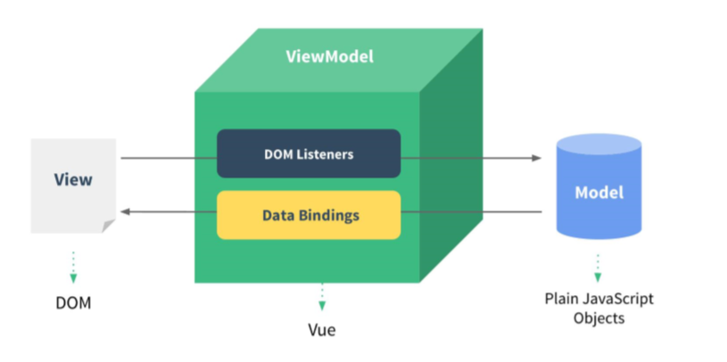

# Vue学习笔记

[TOC]

## 一、基本使用

### 1、使用Vue步骤

​	第一步：引入Vue.js对象。

​	第二步：调用Vue的实用模块。

### 2、Vue的HelloWorld

```vue
    <div id="app1">
        <input type="text" v-model="username_my">
        <p>hello, {{username_my}}</p>
    </div>

    <script type="text/javascript" src="../js/vue.js"></script>
    <script type="text/javascript">
        const vm = new Vue({
            el: '#app1',  //element，也就是元素的意思
            data: {  //数据
                //给这个 username_my 对象添加默认数据
                username_my: ''
            }
        })
    </script>
```


## 二、Vue认识 -- MVVM

​	MVVM 结构是Vue的总体架构模式：

- **V**  -- 表示的是 View，主要是用于数据的展示。
- **VM** -- 表示的是 ViewModel，主要是用于数据绑定、Dom监听。
- **M** -- 表示的是Model，主要是用于数据的存储。


## 三、Vue语法

### 1、Vue的 v-model

- 基本介绍：Vue中的 v-model标签主要是用来实现数据双向绑定的操作的。
- 使用方式：
- 第一步：为input标签里面添加属性  **v-model="msg"**。
- 第二步：创建vm对象，用来配置options对象，然后用于对象与接收的数据的双向绑定。

```vue
const vm = new Vue({
    el: '#app1',  //element，也就是元素的意思
    data: {  //数据
    	//给这个 username_my 对象添加默认数据
    	username_my: ''
    }
})
```

- 使用场景：Vue中的 v-model能够使用在 **单选框、复选框、下拉框、input标签**中。

### 2、双大括号表达式

​	双大括号表达式主要是用于获取到 model中的数据的纯文本的值。

```vue
    new Vue ({
        el: "#div1",
        data: {
            content: "<a href='www.baidu.com'>百度一下</a>",
            imgUrl: "http://www.atguigu.com/images/download/bdb.jpg"
        }
    })
    
    <!--显示的数据为：-->
    <p>{{content}}</p>  
```

### 3、toUpperCase() 方法

​	toUpperCase() 方法是将数据中的小写字母转换为大写字母。

```vue
    new Vue ({
        el: "#div1",
        data: {
            content: "<a href='www.baidu.com'>百度一下</a>",
            imgUrl: "http://www.atguigu.com/images/download/bdb.jpg"
        }
    })
    
    <!--将数据中的字母转换为大写：-->
    <p>{{content.toUpperCase()}}</p>  
```

### 4、数据绑定：v-text  、 v-html

- **使用 v-text 取出 data中的纯文本数据，不会将数据进行转义的操作。**
- **使用 v-html 取出 data中的数据，会将数据进行转义的操作。**

```vue
   <h3>使用数据绑定的操作</h3>
    <p v-text="content"></p>   <!--显示的数据为：<a href='www.baidu.com'>百度一下</a>-->
    <p v-html="content"></p>    <!--显示的数据为： 百度一下-->
    
     new Vue ({
            el: "#div1",
            data: {
                content: "<a href='www.baidu.com'>百度一下</a>",
                imgUrl: "http://www.atguigu.com/images/download/bdb.jpg"
            }
        })
```

### 5、强制数据绑定 v-bind

​	强制数据绑定的操作是将数据与对应的标签进行绑定，并将data中的数据进行转义并执行。例如：直接给img标签中的 src属性强制绑定一个图片地址，能够实现图片地址的查询。

- 绑定语法：  **v-bind:src="data中的数据的名称"**
- 简单语法：  **:src="data中的数据的名称"**

```vue
    <!--数据强制绑定-->
      <!--直接图片的地址绑定到这个src中-->
      <!--上面一句话的简单语法-->
    
     new Vue ({
            el: "#div1",
            data: {
                content: "<a href='www.baidu.com'>百度一下</a>",
                imgUrl: "http://www.atguigu.com/images/download/bdb.jpg"
            }
        })
```

### 6、绑定监听事件

​	Vue中绑定监听事件，主要是先为对应的标签添加监听器，然后在 VM对象中的 methods标签中编写对应的监听的方法。

- 绑定语法： **v-on:click=" 对应的方法名称 "**
- 简单写法： **@click=" 对应的方法名称 "**

​	例如：

```vue
 	<!--绑定监听事件-->
    <button v-on:click="test_click">绑定监听</button>
    <button @click="test_click">绑定监听</button>  <!--上面一段监听的简单语法-->
    
    <script type="text/javascript">
    new Vue ({
        el: "#div1",
        data: {
            content: "<a href='www.baidu.com'>百度一下</a>",
            imgUrl: "http://www.atguigu.com/images/download/bdb.jpg"
        },
        //这里面写的是方法
        methods: {
            test_click() {
                alert("绑定监听事件成功")
            }
        }
    })
```

### 7、数据计算属性与监视

#### 1）计算属性：

​	在vue中，让两个数据进行计算属性的操作，能够实现下面的功能：

```vue
<div id="demo">
    姓: <input type="text" placeholder="First Name" v-model="firstName"><br>
    名: <input type="text" placeholder="Last Name" v-model="lastName"><br>
    <!--fullName1是根据fistName和lastName计算产生-->
    姓名1(单向): <input type="text" placeholder="Full Name1" v-model="fullName1"><br>

    <p>{{fullName1}}</p>
    <p>{{fullName1}}</p>
</div>

<script type="text/javascript">
    new Vue ({
        el: "#demo",
        data: {
            firstName: '张世林',
            lastName: '二娃'
        },
        //计算属性配置
        computed: {
            //为fullName1设置一个计算属性的操作
            //其实也就是当firstName与lastName的内容发生更改以后，这个方法就会被执行，并将其绑定到对应的那个input标签中去
            fullName1() {
                return this.firstName + '' + this.lastName
            }
        }
    })
```

#### 2）监视

​	监视对应的一个属性，能够实现对监视的对象的监听与查看，例如：

```

```


### 8、绑定 class 与 style


