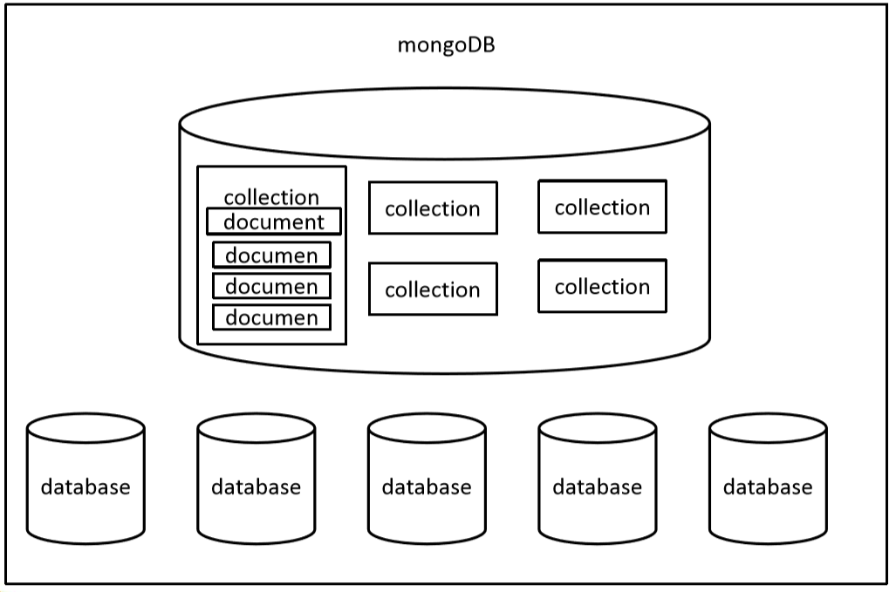
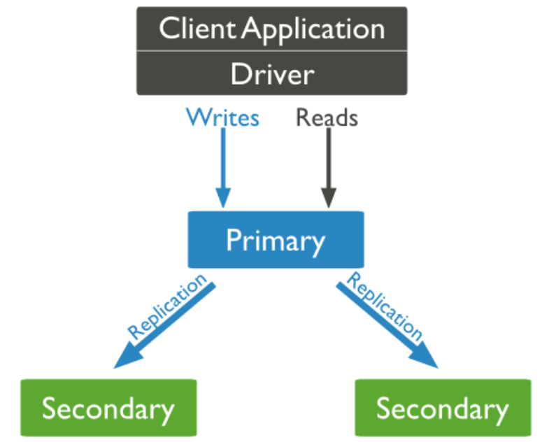
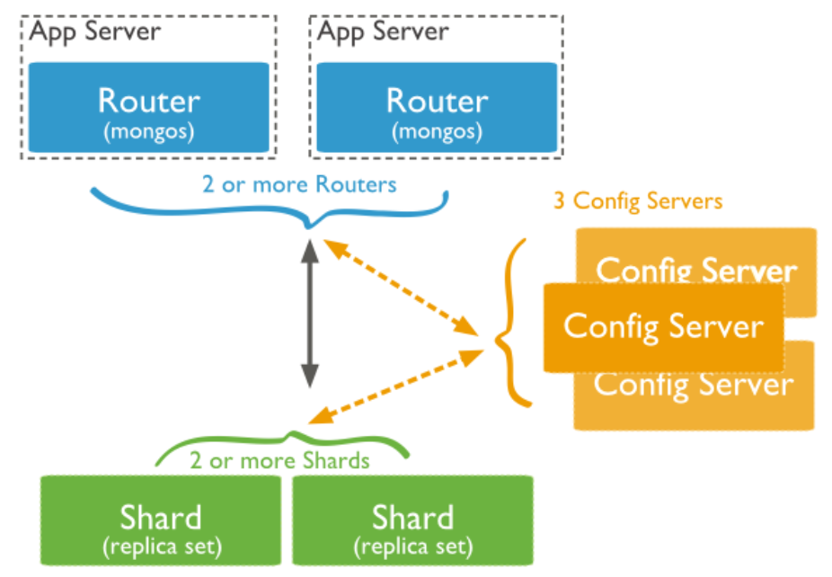

# MongoDB学习笔记

[TOC]


## 一、MongoDB简介

### 1、基础理论

- MongoDB是为快速开发互联网Web应用而设计的数据库系统。
- MongoDB的设计目标是: 极简、灵活、作为Web应用栈的一部分。
- MongoDB的数据模型是面向文档的（面向文档：也就是一种类似于JSON的结果，简单的理解就是存的是各式各样的 JSON数据）。


### 2、安装MongoDB

#### 1）Windows安装

1. 傻瓜式安装 Windows版本的MongoDB文件。
2. 配置MongoDB的环境变量：在PATH路径中添加 MongoDB的 bin 目录。
3. 为 MongoDB 添加一个数据库存放目录：默认是在 C:\data\db 目录中(需手动创建)。
4. 开启MongoDB数据库：打开命令行窗口，输入命令：**mongod**   即可。
5. 连接MongoDB服务器：打开命令行窗口，输入命令：**mongo**   即可。
6. 切换到 admin 管理员用户 ： **-admin**  即可。
7. 关闭数据库：**db.shutdownServer()**  即可（需要使用admin用户）。

##### 更改对应的配置参数命令：

| mongod 后可跟参数                    | 说明                       |
| ------------------------------------ | -------------------------- |
| --help 或者  -h                      | 返回基本帮助和用法文本     |
| --version                            | 返回MongoDB版本            |
| --config<文件名>   或者   -f<文件名> | 指定运行时配置的配置文件   |
| --verbose   或者  -v                 | 增加发送到控制台日志的数量 |
| --quiet                              | 减少发送到控制台日志的数量 |
| --port<端口>                         | 指定启动时调用的端口号     |
| --bind_ip<端口>                      | 指定 id 地址               |
| --maxConns<编号>                     | 指定连接的最大数           |
| --logpath<路径>                      | 指定日志文件的路径         |
| --auth                               | 指定远程主机的身份验证     |
| --dbpath<路径>                       | 指定数据库实例的路径       |
| --nohttpinterface                    | 禁用HTTP接口               |
| --nojournal                          | 禁用日志                   |
| --noprealloc                         | 禁止预分配数据文件         |
| --repair                             | 在所有数据库上运行修复程序 |

sc.exe create MongoDB binPath= "\"F:\Software\mangodb\bin\mongod.exe\" --service -config=\"F:\Software\mangodb\mongod.cfg\"" DisplayName= "MongoDB" start= "auto"

#### 2）Linux安装

1. 配置MongoDB的yum源： vim /etc/yum.repos.d/mongodb-org-3.4.repo

2. 添加内容：

```shell
[mongodb-org-3.4]  
name=MongoDB Repository  
baseurl=https://repo.mongodb.org/yum/redhat/$releasever/mongodb-org/3.4/x86_64/  
gpgcheck=1  
enabled=1  
gpgkey=https://www.mongodb.org/static/pgp/server-3.4.asc
```

3. 更新 yum：  yum  update

4. 安装mongodb： yum -y install mongodb-org

5. 修改配置文件： vim /etc/mongod.conf   ---  注释掉外部绑定本地ip地址访问
6. 启动mongodb： systemctl start mongod.service
7. 关闭mongodb： systemctl stop mongod.service
8. 开机自动启动mongodb： systemctl enable mongod.service
9. 查看mongodb状态： systemctl status mongod.service
10. 连接mongodb： mongo    

### 3、特定的数据库

#### 1）admin数据库

​	从权限的角度来看，这个就是root数据库。如果将一个用户添加到这个数据库，则这个用户自动继承数据库的权限。一些特定的命令或者函数，也只能够在此数据库进运行，比如：关闭服务器等。

​	从存储的数据来看，admin数据库主要是存储MongoDB的用户、角色等信息。

#### 2）local数据库

​	Local数据库，主要是存储本地的数据，不会将数据同步到其他副本和其他节点上面去。这个数据永远不会被复制，可以用来存储线图本地单台服务器的任意集合。

​	从存储的数据来看，Local数据库主要是存储副本集中的配置信息，oplog信息等。这些信息是每一个MongoDB独有的，不需要同步到副本集中其他节点


### 4、MongoDB三大概念

#### 1）数据库（database）

​	数据库也就是相当于一个仓库，在仓库中可以存放集合。

​	数据库的创建：是直接通过use命令来进行执行，如果未有这个数据库，则自动创建。

​	数据库的删除：是直接通过  **db.dropDatabase()**  命令进行删除当前数据库。

#### 2）集合（collection）

​	集合中适用于存放一组数据，在集合中可以存放文档。

​	创建集合：**db.createCollection(name,options)**  来进行集合的创建。

​		name ： 需要创建的集合的名称。

​		options ： 可选参数，指定有关内存大小以及 索引的选项，可以有如下参数：

| 字段        | 类型 | 描述                                                         |
| ----------- | ---- | ------------------------------------------------------------ |
| capped      | 布尔 | （可选）如果为 true，则创建固定集合。固定集合是指有着固定大小的集合，当达到最大值时，它会自动覆盖最早的文档。 **当该值为 true 时，必须指定 size 参数。** |
| autoIndexId | 布尔 | （可选）如为 true，自动在 _id 字段创建索引。默认为 false。   |
| size        | 数值 | （可选）为固定集合指定一个最大值（以字节计）。 **如果 capped 为 true，也需要指定该字段。** |
| max         | 数值 | （可选）指定固定集合中包含文档的最大数量。                   |

​		例如：

```json
db.createCollection("person",{capped:true,autoIndexId:true,size:500000,max:5000})

```

​	删除集合： **db.collection.drop()** 来进行集合的删除操作。例如： db.strudents.drop()

#####         

##### 集合的命名规则

- 集合名不能是空字符串""  和  空字符。
- 集合名尽量不够采用系统关键字和保留关键字。
- 集合名不能够有空格。

#### 3）文档（document）

​	文档是 **数据库中的最小单位**，我们存储和操作的内容主要就是文档。

#### 4）注意

​	在MongoDB中，数据库与集合都不需要手动创建（例如：我使用一个新的数据库，那么我直接写一个数据库名），当真正需要向这个新的数据库或者集合添加文档的时候，就会自动创建出对应的数据库或者集合。




### 5、MongoDB的数据类型

| 数据类型           | 描述                                                         |
| ------------------ | ------------------------------------------------------------ |
| String             | 字符串。存储数据常用的数据类型。在 MongoDB 中，UTF-8 编码的字符串才是合法的。 |
| Integer            | 整型数值。用于存储数值。根据你所采用的服务器，可分为 32 位或 64 位。 |
| Boolean            | 布尔值。用于存储布尔值（真/假）。                            |
| Double             | 双精度浮点值。用于存储浮点值。                               |
| Min/Max keys       | 将一个值与 BSON（二进制的 JSON）元素的最低值和最高值相对比。 |
| Array              | 用于将数组或列表或多个值存储为一个键。                       |
| Timestamp          | 时间戳。记录文档修改或添加的具体时间。                       |
| Object             | 用于内嵌文档。                                               |
| Null               | 用于创建空值。                                               |
| Symbol             | 符号。该数据类型基本上等同于字符串类型，但不同的是，它一般用于采用特殊符号类型的语言。 |
| Date               | 日期时间。用 UNIX 时间格式来存储当前日期或时间。你可以指定自己的日期时间：创建 Date 对象，传入年月日信息。 |
| Object ID          | 对象 ID。用于创建文档的 ID。                                 |
| Binary Data        | 二进制数据。用于存储二进制数据。                             |
| Code               | 代码类型。用于在文档中存储 JavaScript 代码。                 |
| Regular expression | 正则表达式类型。用于存储正则表达式。                         |


## 二、MongoDB基础操作

### 1、基本操作命令

- 查看当前所有的数据库： show databases     或者  show  dbs
- 进入到指定的数据库： use  数据库名(数据库名可以是不存在，也可以存在)
- 查看当前的数据库名： db
- 显示当前数据库的所有集合： show collections

### 2、数据库CRUD命令

#### 1）新增

- **① **向当前数据库的一个集合中添加一个文档： 

  ​	命令： db.<collection>.insert(doc)

  ​	例如：db.students.insert({name:"张世林",age:21,gender:"boy"})

- **② **向当前数据库的一个集合中添加多个文档：

  ​	命令：db.<collection>.insert([  doc1,doc2,....  ])

  ​	例如：

  ```json
      db.students.insert([
          {name:"付世平",age:21,gender:"girl"},
          {name:"周小燕",age:22,gender:"girl"}
      ]);
  ```

- **③** 向集合中插入一个文档对象：

  ​	命令：db.<collection>.insertOne(doc)

  ​	例如：db.students.insertOne({"name":"dsf"})

- **④** 向集合中插入多个文档对象：

  ​	命令：db.<collection>.insertMony(docs)


#### 2）id的生成方式：

- **方式一**：插入的每一条数据都会 **调用ObjectId()** 方法自动生成一个id值，这个id值是根据时间戳更规则生成的，确保每一条数据的单一性。格式为：

  - 前 4 个字节表示创建 **unix** 时间戳,格林尼治时间 **UTC** 时间，比北京时间晚了 8 个小时

  - 接下来的 3 个字节是机器标识码

  - 紧接的两个字节由进程 id 组成 PID

  - 最后三个字节是随机数

  - 如果需要获取文档的创建时间，可以直接调用 ： 

    ```js
    var newObject = ObjectId()
    newObject.getTimestamp()
    ```

- **方式二**：使用  _id:"id值"  方式来进行手动指定。id值可以是任何类型的数据。

  ​	例如：db.students.insertOne({"_id":"2","name":"tom"})


#### 3）查询

- 查询当前集合中的所有文档：

​		命令：db.students.find()

​		例如：查询到的结果为一个集合中的所有文档。

- 如果需要格式化显示查询到的数据：

  ​	命令： db.students.find().pretty()

- 按照条件查询单条记录：

  ​	命令：db.<collection>.findOne( {查询对象} )

  ​	例如：db.students.findOne({name:"张世林"})

- 按照条件进行查询 —— **直接传入对象进行查询**：

  ​	命令：db.<collection>.find( {查询对象} )

  ​	例如：

  ```java
  //查询 id = 1 的文档
  db.students.find({_id:"1"})
      
  //查询 id = 1 而且 name = “张世林”  的文档
  db.students.find({_id:"1", "name“："张世林"})
  ```

- and 查询：

  ​	直接将查询条件封装为一个对象，例如：

  ​		db.col.find(   {key1:value1 ,  key2:value2}  ).pretty()

- or 查询：

  ​	使用关键字来进行 or 条件的查询

  ​	db.col.find(
     		{
  ​      			$or: [
  ​         			{key1: value1}, {key2:value2}
  ​      			]
     		}
  ​	)

- 查询集合中总共有多少条文档：

  ​	命令一：db.<collection>.find().count()

  ​	命令二：db.<collection>.find().length()

  ​	例如：db.students.find().count()      和     db.students.find().length()

- 查询的条件运算符：

  | 操作       | 格式                     | 范例                                        | RDBMS中的类似语句       |
  | ---------- | ------------------------ | ------------------------------------------- | ----------------------- |
  | 等于       | `{<key>:<value>`}        | `db.col.find({"by":"菜鸟教程"}).pretty()`   | `where by = '菜鸟教程'` |
  | 小于       | `{<key>:{$lt:<value>}}`  | `db.col.find({"likes":{$lt:50}}).pretty()`  | `where likes < 50`      |
  | 小于或等于 | `{<key>:{$lte:<value>}}` | `db.col.find({"likes":{$lte:50}}).pretty()` | `where likes <= 50`     |
  | 大于       | `{<key>:{$gt:<value>}}`  | `db.col.find({"likes":{$gt:50}}).pretty()`  | `where likes > 50`      |
  | 大于或等于 | `{<key>:{$gte:<value>}}` | `db.col.find({"likes":{$gte:50}}).pretty()` | `where likes >= 50`     |
  | 不等于     | `{<key>:{$ne:<value>}}`  | `db.col.find({"likes":{$ne:50}}).pretty()`  | `where likes != 50`     |


#### 4）修改

- 修改的方式①  ——  **直接将新对象全部替换旧对象**：

  ​	命令：db.<collection>.update( 查询条件对象,  新对象 )

  ​	解释：第一个参数是根据查询条件查询到对应的文档，然后将后面的新对象进行update。

  ​	例如： db.students.update( {"name":"张世林"}  ,  {"age":"55"}  );

- 修改方式②  ——   **修改指定的属性字段，而不全部替换**： 

  ​	命令：db.collection.update(
     	 		<query>,
     			<update>,
    			 {
  ​    				upsert: <boolean>,
  ​     				multi: <boolean>,
  ​     			writeConcern: <document>
     			}
  ​		)

  | 参数         | 说明                                                         |
  | ------------ | ------------------------------------------------------------ |
  | query        | update的查询条件，类似sql update查询内where后面的。          |
  | update       | update的对象以及更新的操作符，包括(  $ , $inc  ,$set  ,$unset  等  ) |
  | upsert       | 可选，这个参数的意思是，如果不存在update的记录，是否插入objNew,true为插入，默认是false，不插入。 |
  | multi        | 可选，mongodb 默认是false,只更新找到的第一条记录，如果这个参数为true,就把按条件查出来多条记录全部更新。 |
  | writeConcern | 可选，抛出异常的级别。                                       |

  ​		例如：

  ```
  db.anmails.update(
      {"name":"田水龙"},    
      {        
      	$set:        
      	{"age":23}    
      }
  )
  ```


#### 5）删除

- 2.6之前的版本删除方式：

  ```
  db.collection.remove(
     <query>,
     <justOne>
  )
  ```

- 2.6之后的版本删除方式：

  ```
  db.collection.remove(
     <query>,
     {
       justOne: <boolean>,
       writeConcern: <document>
     }
  )
  ```

| 参数         | 说明                                                         |
| ------------ | ------------------------------------------------------------ |
| query        | （可选）删除文档的条件                                       |
| justOne      | （可选）如果设置为true或者 1，则只删除一条文档，否则默认为false，删除多条文档。 |
| writeConcern | （可选）抛出异常的级别                                       |

​		例如：db.students.remove(

​				{"name":"付世平"},

​				{

​					justOne:false

​				}

​			)


## 三、MongoDB条件运算符

### 1、大于 ( > )  -- $gt

​	使用 $gt 可以用来表示 大于 符号，用于符号运算。例如：

```json
	db.col.find(
		{
			likes:  { $gt : 100 }
	})
```

### 2、大于等于( >= ) -- $gte

​	使用 $gte 可以用来表示大于等于 符号，用于符号运算。例如：

```
	db.col.find(
		{
			likes:  { $gte : 100 }
	})
```

### 3、小于( < ) -- $lt

​	使用 $lt 可以用来表示 小于 符号，用于符号运算。例如：

```json
	db.col.find(
		{
			likes:  { $lt : 150 }
	})
```

### 4、小于等于( <= ) -- $lte

​	使用 $lte 可以用来表示 小于等于 符号，用于符号运算。例如：

```
	db.col.find(
		{
			likes:  { $lte : 150 }
	})
```

### 5、使用( < ) 和 ( > ) 联合查询 -- $lt 和 $gt

​	使用 运算符联合查询，能够实现区间运算。例如：

```json
	db.col.find(
		{
			likes : {$lt :200, $gt : 100}
	})
```


## 四、Limit、Skip、sort方法

### 1、Limit() 方法--限制行数

​	使用 Limit() 方法来进行读取指定数量的数据记录。传入 Limit() 方法的参数是一个整数数值。

​	例如：

```json
	db.col.find().limit(3)
```

### 2、Skip() 方法--跳过行数

​	使用 Skip() 方法来跳过指定数量的文档。传入 Skip() 方法的参数是一个整数数值。

​	例如：

```json
	db.col.find().skip(2)
```

### 3、sort() 方法--排序

​	在MongoDB中使用 sort() 方法进行文档的排序操作。

​	sort() 方法可以通过参数指定排序的字段。

​	sort() 方法可以通过 1 为升序， -1 为降序。

​	例如：

```
	db.col.find().sort(
		{ "likes":-1 }
	)
```


## 五、MongoDB索引

### 1、索引简介

​	索引通常能够提高查询效率。索引能够有效的避免大多数时间的查询进行全集合的扫描操作。

​	索引是一种特殊的数据结果，索引存储在一个易于遍历读取的数据集合中，索引是对数据库表中一列或者多列的只进行排序的一种结构。

### 2、创建索引方式

- 方式一：3.0.0 版本之前创建索引 ensureIndex() 方法创建

- 方式二：3.0.0版本之后使用方法 createIndex() 方法来创建索引。

### 3、语法实现

​	createIndex()方法基本语法格式：**db.collection.createIndex(keys, options)**

​		keys 表示你要创建的索引字段，1 为升序索引， 2 为降序索引。

​		options 表示创建索引的 **可选** 属性。主要可选的内容为：

| Parameter          | Type          | Description                                                  |
| ------------------ | ------------- | ------------------------------------------------------------ |
| background         | Boolean       | 建索引过程会阻塞其它数据库操作，background可指定以后台方式创建索引，即增加 "background" 可选参数。 "background" 默认值为**false**。 |
| unique             | Boolean       | 建立的索引是否唯一。指定为true创建唯一索引。默认值为**false**. |
| name               | string        | 索引的名称。如果未指定，MongoDB的通过连接索引的字段名和排序顺序生成一个索引名称。 |
| dropDups           | Boolean       | 3.0+版本已废弃。在建立唯一索引时是否删除重复记录,指定 true 创建唯一索引。默认值为 **false**. |
| sparse             | Boolean       | 对文档中不存在的字段数据不启用索引；这个参数需要特别注意，如果设置为true的话，在索引字段中不会查询出不包含对应字段的文档.。默认值为 **false**. |
| expireAfterSeconds | integer       | 指定一个以秒为单位的数值，完成 TTL设定，设定集合的生存时间。 |
| v                  | index version | 索引的版本号。默认的索引版本取决于mongod创建索引时运行的版本。 |
| weights            | document      | 索引权重值，数值在 1 到 99,999 之间，表示该索引相对于其他索引字段的得分权重。 |
| default_language   | string        | 对于文本索引，该参数决定了停用词及词干和词器的规则的列表。 默认为英语 |
| language_override  | string        | 对于文本索引，该参数指定了包含在文档中的字段名，语言覆盖默认的language，默认值为 language. |

​	例如：在后台创建 升序  复合 索引,在后台执行。

```json
	db.col.createIndex(
		{"age":1,"name":-1},
		{background: true}
	)
```


## 六、MongoDB集合

​	MongoDB主要是用于处理数据（统计平均值、求和值等），并返回计算后的数据结果。

### 1、聚合方法--aggregate() 方法

​	MongoDB中的聚合，使用的方法是 aggregate() 方法。

​	方法：**db.<collection>.aggregate(AGGREGATE_OPERATION)**


## 七、MongoDB备份与恢复

### 1、MongoDB备份

#### 1）备份mongodb服务器的一个数据库

​	mongodb中，使用的是 **mongodump** 命令进行数据备份操作。

```shell
# 这个命令不需要连接到mongodb服务器，只需要shell窗口
mongodump -h dbhost  -d dbname  -o dbdirectory
# 例如： mongodump -h 192.168.21.157  -d py3  -o /usr/local/copymongo/
```

- -h ： 指定MongoDB服务器的地址。
- -d ： 需要备份的数据库的名称。
- -o ： 备份的数据存放的位置，主要是指存放到哪个文件夹中。

#### 2）备份mongodb的所有数据库

```shell
mongodump --host HOST_NAME --port PORT_NUMBER
# 例如： mongodump --host runoob.com --port 27017
```

#### 3）备份mongodb指定的数据库的数据

```shell
mongodump --dbpath DB_PATH --out BACKUP_DIRECTORY
# 例如： mongodump --dbpath /data/db/ --out /data/backup/
```

#### 4）备份指定数据库的指定的集合的数据

```shell
mongodump --collection COLLECTION --db DB_NAME
# 例如：mongodump --collection mycol --db test
```


### 2、MongoDB数据恢复

#### 1）恢复数据基本命令：

```shell
# 这个命令只需要在shell窗口执行
mongorestore -h <hostname><:port> -d dbname <path>
```

- --host <:port>, -h <:port>：      MongoDB所在服务器地址，默认为： localhost:27017

- --db , -d ：    需要恢复的数据库实例，例如：test，当然这个名称也可以和备份时候的不一样，比如test2

- --drop：       恢复的时候，先删除当前数据，然后恢复备份的数据。就是说，恢复后，备份后添加修改的数据都会被删除，慎用哦！

- <path>：    mongorestore 最后的一个参数，设置备份数据所在位置，例如：c:\data\dump\test。

  你不能同时指定 <path> 和 --dir 选项，--dir也可以设置备份目录。

- --dir：    指定备份的目录，你不能同时指定 <path> 和 --dir 选项。

## 八、MongoDB主从复制

### 1、基本介绍

​	MongoDB复制是将数据同步到多个服务器的过程。

​	复制提供了数据的冗余备份的操作，并在多个肚脐上存储数据副本，提高了数据的可用性和安全性。能够有效的保障数据的安全、无故障维护、分布式读取数据等。

### 2、MongoDB主从复制原理

​	**特征**：MongoDB的复制至少应该包含两个节点。其中一个节点是主节点，负责处理客户端的请求，其余的都是从节点，负责复制主节点的数据。

​	**主从方式**：MongoDB各个节点常见的搭配方式：一主一从，一主多从。

​	**复制原理**：MongoDB中的主节点记录在其上的所有操作oplog，从节点氢气轮询主节点获取这些操作，然后对自己的数据副本执行同步操作，从而保证从节点的数据与主节点的数据一致。

​	**复制方式**：

​		复制的操作至少是针对两个节点的。

​		A节点是主节点，用于处理客户端数据的请求操作。

​		其余节点是从节点，用于定时的复制主节点上面的数据。

​		主节点记录在其上的所有操作，**从节点定期轮循主节点**获取这些操作，然后对自己的数据副本执行数据同步操作，保证数据交互的一致性。




### 3、主、副节点特征

- 副节点能够有N个节点。
- 任何节点可作为主节点。
- 所有的写入操作只能够在主节点上进行操作。
- 自动故障转移。
- 自动恢复。


### 4、设置MongoDB主从复制---从服务器备份数据

1. 第一步：先创建对应的 mongodb 集群的数据存放的文件夹：

   ```shell
   # 创建两个文件夹，一个是 主mongodb的数据存放目录，一个是从mongodb数据存放目录
   [root@localhost mongodb]# mkdir masterdb
   [root@localhost mongodb]# mkdir solverdb
   ```

2.  使用如下命令启动两个 mongodb 服务器（这里就不会用到默认的配置文件了）：

   ```shell
   # 指定 IP地址   端口号   数据存放位置   这个集群的名字
   mongod --bind_ip 192.168.21.157 --port 27018 --dbpath /usr/local/mongodb/masterdb --replSet rs0
   mongod --bind_ip 192.168.21.157 --port 27019 --dbpath /usr/local/mongodb/solverdb --replSet rs0
   ```

3. 连接上对应的两个 mongodb服务器：

   ```shell
   # 使用ip地址，端口号进行连接
   mongo --host 192.168.21.157 --port 27018 
   mongo --host 192.168.21.157 --port 27019
   ```

4.  设置主MongoDB：选择端口号为 27018 的设置为主服务器  ---  在端口为27018的机器上输入命令

   ```shell
   # 选择对应的 MongoDB 服务器执行命令，设置为 主服务器
   rs.initiate()
   ```

5.  查看当前集群状态： ---  在端口为27018的机器上输入命令

   ```shell
   # 输入命令即可看见当前集群有几个服务器(目前只有一台服务器在集群中)
   rs.status()
   ```

6.  添加从服务器到这个集群中： ---  在端口为27018的机器上输入命令

   ```shell
   # 指定从服务器的  ip地址，端口号
   rs.add('192.168.21.157:27019')
   ```

7.  继续查看集群状态，现在有两台机器： ---  在端口为27018的机器上输入命令

   ```shell
   # 输入命令即可看见当前集群有几个服务器(目前只有一台服务器在集群中)
   rs.status()
   ```

8.  在从服务器上输入命令，确认作为从服务器： ---  在端口为27019的机器上输入命令

   ```shell
   # 在从服务器上执行确认作为从服务器的命令
   rs.slaveOk()
   ```

9.  成功建立起了mongodb的主从复制的集群了。

10. 移除从服务器：

    ```shell
    # 将从服务器从集群中进行移除
    rs.remove('192.168.21.157:27019')
    ```


### 5、主从自动切换原理

​	**在mongodb集群中，当主服务器宕机以后，从服务器会自动选择一台服务器转换为主服务器。**

​	重新启动的主服务器则自动转换为从服务器，需要确认是否转换为从服务器，执行命令：

```shell
	# 确认转换为从服务器
	rs.slaveOk()
```

​	执行命令完成以后，这个之前的主服务器则变成了从服务器了。


## 九、MongoDB监控

### 1、基本介绍

​	在MongoDB中，部署服务以后，需要了解服务的运行情况，查看对应的服务器的性能。能够很好的掌握服务器的运行情况。

### 2、mongostat命令

​	**mongostat**  是mongodb服务器提供的状态监测工具，在命令行下面使用。它能够在固定的时间间隔 (默认时间是1秒钟) 内循环输出mongodb的运行状态。

```shell
# 直接在命令行窗口进行输命令：
mongostat
```

​	如果需要监测其他的服务器，使用  mongostat --help 查看输入的命令：

```shell
mongostat --help
```

### 3、mongotop命令

​	mongotop 是用来跟踪一个 MongoDB的实例，查看哪些大量的事件花费在读取和写入数据。

​	mongotop 每隔几何的水平统计数据，默认是一秒循环。

```shell
# 直接在命令行窗口输入命令：
mongotop
```

```shell
# 设置循环输出时间：
mongotop 10
```

```shell
# 显示每个数据库锁的信息：
mongotop --locks
```

如果需要获取 mongotop 的其他参数，输入 mongotop --help 即可：

```shell
mongotop --help
```

### 4、输出的各段字段的含义

- **ns**：    包含数据库命名空间，后者结合了数据库名称和集合。
- **db： **   包含数据库的名称。名为 . 的数据库针对全局锁定，而非特定数据库。
- **total： **mongod花费的时间工作在这个命名空间提供总额。
- **read：**提供了大量的时间，这mongod花费在执行读操作，在此命名空间。
- **write：**提供这个命名空间进行写操作，这mongod花了大量的时间。

 

## 九、MongoDB分片

### 1、基本介绍

​	在MongoDB的设计中，存在着另外一种主从复制的操作。当存储海量数据的时候，一台机器无法瞒住存储和操作数据的规模，则需要进行数据分割，使得数据库系统能够存储更多的数据。

### 2、分片原理




## 九、安全管理

### 1、安全管理策略

​	在mongodb中，采用了 **角色-用户-数据库** 三者关联的安全管理方式。

​	常用的系统角色：

 - root ： 只用于在admin数据库中进行使用，可以针对任何数据库执行读写操作。
 - Read ： 只允许用户读取指定数据库，只针对一个数据库有读的操作。
 - readwrite ： 允许用户读写指定的数据库，只针对一个数据有读写操作。

### 2、创建用户

```json
# 创建一个 用户名为 admin，密码为 123，权限为 root，所属数据库为 admin 的一个用户
db.createUser({
	user:'admin',
	pwd:'123',
	roles:[{
		role:'root',
		db:'admin'
	}]
})

# 创建一个 用户名为 zsl，密码为 123456，权限为 readWrite，所属数据库为 cal 的一个用户
# 创建的 用户，只能针对那个数据库进行操作，除非有root权限
db.createUser({
    user:'zsl',
    pwd:'123456',
    roles:[{
        role:'readWrite',
        db:'cal'
    }]
})
```


### 3、开启安全策略--启用身份验证

1. 在  /etc/mongod.conf  文件中修改代码：

```yml
security:
    authorization: enabled
```

2.  重新启动服务 ： systemctl restart mongod.service

3.  使用这个账号连接到对应的数据库：

   ```java
   // 用户名  密码  权限数据库
   mongo -u admin -p 123 --authenticationDatabase admin
   ```

 

## 十一、MongoDB关系

### 1、基本介绍

​	MongoDB的关系主要是体现在多个文档之间在逻辑上的相互联系。

​	文档之间是使用嵌入和引用来建立联系。

​	MongoDB中的关系主要有：

- 1 : 1 （一对一）
- 1 : N （一对多）
- N : 1 （多对一）
- N : N （多对多）

### 2、嵌入式关系

​	**例如**：一个用户可以有多个地址，也就是一对多的关系。

​	用户文档：

```
	{
       "_id":ObjectId("52ffc33cd85242f436000001"),
       "name": "Tom Hanks",
       "contact": "987654321",
       "dob": "01-01-1991"
	}

```

​	地址文档：

```
    {
       "_id":ObjectId("52ffc4a5d85242602e000000"),
       "building": "22 A, Indiana Apt",
       "pincode": 123456,
       "city": "Los Angeles",
       "state": "California"
    } 
```

​	**使用嵌入式关系来表示一个 用户有多个地址：**

```
{
   "_id":ObjectId("52ffc33cd85242f436000001"),
   "contact": "987654321",
   "dob": "01-01-1991",
   "name": "Tom Benzamin",
   "address": [
      {
         "building": "22 A, Indiana Apt",
         "pincode": 123456,
         "city": "Los Angeles",
         "state": "California"
      },
      {
         "building": "170 A, Acropolis Apt",
         "pincode": 456789,
         "city": "Chicago",
         "state": "Illinois"
      }]
} 
```

### 3、引用式关系

​	引用式关系的设计，能够将用户数据文档和地址数据文档进行分割，使用id来进行联系。

```json
{
   "_id":ObjectId("52ffc33cd85242f436000001"),
   "contact": "987654321",
   "dob": "01-01-1991",
   "name": "Tom Benzamin",
   "address_ids": [
      ObjectId("52ffc4a5d85242602e000000"),
      ObjectId("52ffc4a5d85242602e000001")
   ]
}
```


## 十、SpringBoot整合MongoDB

### 1、第一种方式：使用 Repoistory

1. 第一步：添加jar包

```xml
<dependency>
	<groupId>org.springframework.boot</groupId>
	<artifactId>spring-boot-starter-data-mongodb</artifactId>
</dependency>
```

2. 添加配置文件

```yml
spring:
  data:
    mongodb:
      uri: mongodb://localhost:27017/test
```

3. 创建对应的继承了 MongoRepository 的接口。

```java
@Component
public interface PersonRegistry extends MongoRepository<Person,Integer> {

}
```

4. 创建对应的实体类。

```java
@Data
@AllArgsConstructor
@NoArgsConstructor

/**
 * @Document 注解主要是用于表示这个文档对应的哪个集合
 */
@Document(collection = "persons")
/**
 * 创建复合索引
 */
@CompoundIndexes({
    @CompoundIndex(name = "password_idCard", def = "{'password': 1, 'idCard': -1}")
})
public class Person {

    /**
     * @Id 注解是用于指定主键
     */
    @Id
    private Integer id;

    /**
     * 表示该字段需要声明索引
     */
    @Indexed
    private String userName;

    private String password;

    /**
     * 用于表示一个字段，可以取别名
     */
    @Field(value = "Birth")
    private Date birth;

    private String idCard;

    /**
     * @Transient 表示忽略这个字段，数据库不录入这个字段
     */
    @Transient
    private String aaa;

}
```

5. 直接注入  PersonRegistry 对象即可实现 仓库的使用。

```java
    @Autowired
    private MongoRepository repository;
```


### 2、使用 MongoTemplate 模板

1. 添加jar包。
2. 添加配置文件。
3. 添加对应的javabean对象。
4. 直接注入 MongoTemplate 对象。

```java
@Autowired
private MongoTemplate mongoTemplate;
```

5. 调用 MongoTemplate 提供的方法。

```java
@Autowired
    private MongoTemplate mongoTemplate;

    /**
     * 保存一条文档
     */
    public void save(Person person){
        mongoTemplate.save(person);

    }
    public void saveWithCollection(Person person){
        mongoTemplate.save(person,"persons");
    }

    /**
     * 根据 name 属性进行查找
     * @param name
     * @return
     */
    public Person findTestByName(String name) {
        Query query=new Query(Criteria.where("userName").is(name));
        Person person =  mongoTemplate.findOne(query , Person.class);
        return person;
    }

    public WriteResult updateBySet(Person person) {
        Query query = new Query(Criteria.where("id").is(person.getId()));
        Update update = new Update().set("userName", person.getUserName()).set("password", person.getPassword());
        //修改返回来的第一条数据
        WriteResult writeResult = mongoTemplate.updateFirst(query, update, Person.class);
        //修改返回来的所有数据
        //WriteResult writeResult1 = mongoTemplate.updateMulti(query, update, Person.class);

        return writeResult;
    }

    public WriteResult deleteById (Integer id) {
        Query query = new Query(Criteria.where("id").is(id));
        WriteResult writeResult = mongoTemplate.remove(query,Person.class);

        return writeResult;
    }
```


### 3、MongoDB的注解使用方式

- **@Id**  注解：用于标记该字段是对应的MongoDB的主键。

- **@Indexed**  注解：用于标明该字段需要创建索引。
- **@Field(value = "Birth")**  注解：用于标识该字段是一个属性字段，可以为该字段取别名。
- **@Transient**  注解：用于标识该字段不参与到数据库的增删改查操作。
- **@Document(collection = "persons")**  注解：用于标识该bean是一个MongoDB的文档，可以设置集合的名字。
- **@CompoundIndexes**  注解：用于创建复合索引，是和 **@CompoundIndex**  注解一起使用，标记在类上。
- **@CompoundIndex**(name = "password_idCard", def = "{'password': 1, 'idCard': -1}") 用于创建复合索引，标记在类上。