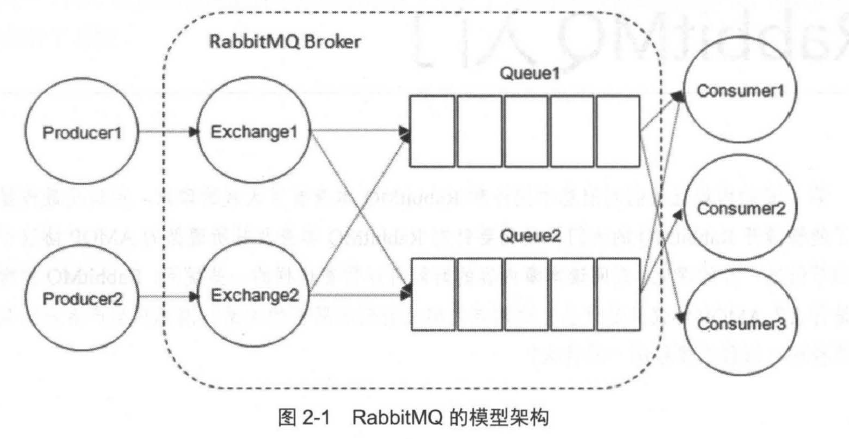
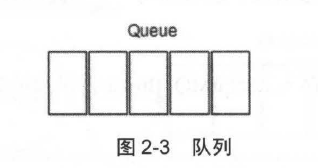
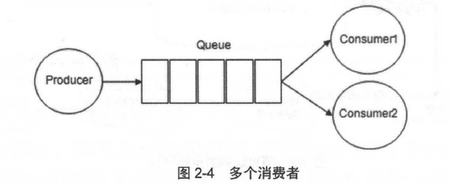
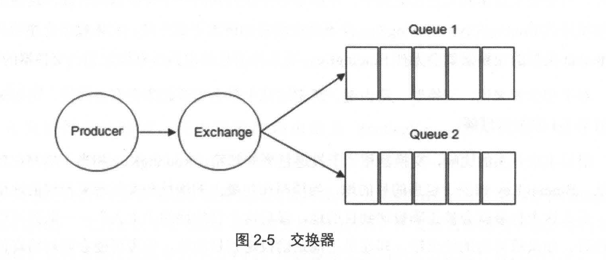
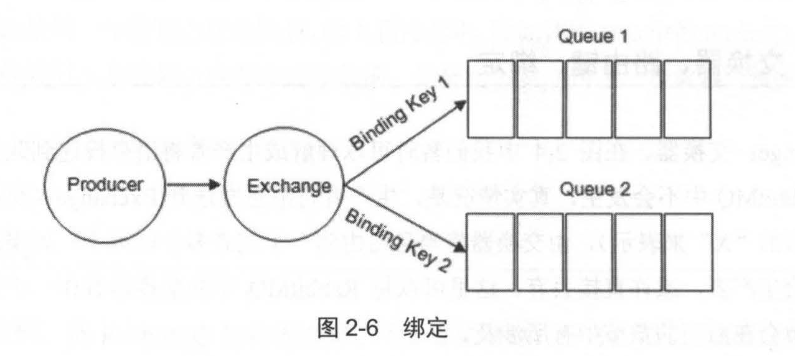
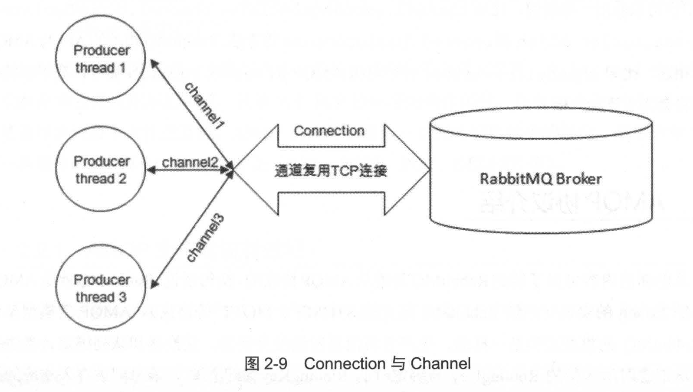
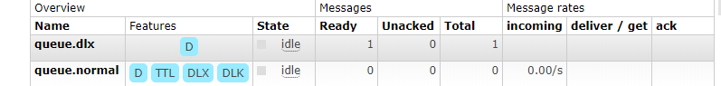
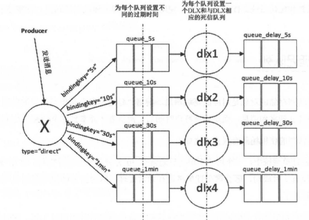

## 一 消息基本介绍

### 1 消息中间件

​	消息（Message）使之在应用之间传送的数据，消息包含了文本数据、json数据等格式。

​	消息队列中间件（Message Queue Middleware），是指利用高效可靠的消息传递机制进行与平台无关的数据交流，并给予数据通信来进行分布式系统的集成，能够在分布式的环境下尽心进程之间的通信。

### 2 消息传递方式

#### 2.1 点对点（P2P）

>  	点对点的消息传递方式是基于队列来实现的，消息生产者发送消息到队列中，消息消费者从队列中接收待消息，队列的存在使得消息的异步传输成为了可能。

#### 2.2 发布/订阅（Pub/Sub）

> ​	发布订阅模式定义了如何向一个内容节点发布和订阅消息，这个内容节点被称为： ***主题(`Topic`)***。
>
> ​	***`Topic`***可以类比为消息传递过程中的中介，消息发布者发布消息到某一个主题中，而消息订阅者则从主题中订阅消息。主题是的消息的订阅者与消息的发布者互相之间保持独立，不需要进行接触即可保证消息的传递。

#### 2.3 中间件作用

- **解耦** ：应用程序之间通过实现消息中间件提供的统一的API，实现数据在不同的微服务之间的异步传递功能，同时能够触发对应的应用程序执行相应的操作，实现的是一种事件驱动模型。
- **冗余（存储）**：为了避免消息在数据的传递或者处理中失败的情况，将数据进行持久化的存储，直到其完全被正确处理以后再进行删除。
- **扩展性**：消息中间件解耦了应用的处理过程，所以提高消息入队和处理的效率能够更加方便。只需要新增对应的节点即可实现扩容效果。
- **削峰**：在访问量急剧增长的情况下，需要大量的资源来保证高峰的用户的体验。使用消息中间件能够节省项目的资源的投入，让中间件进行消息的分流操作，保证项目能够正常完整运行的操作。
- **顺序保证**：数据处理的顺序是非常重要的，中间件的实现方式包括了队列的功能，先进先出。
- **缓冲**：消息中间件能够作为缓冲层来帮助任务最高效率的去执行计算等操作。
- **异步通信**：消息异步通信

## 二 RabbitMQ基本介绍

### 1 基本特征

- 可靠性: RabbitMQ 使用一些机制来保证可靠性， 如持久化、传输确认及发布确认等。
- 令灵活的路由: 在消息进入队列之前，通过交换器来路由消息。对于典型的路由功能，
  RabbitMQ 己经提供了一些内置的交换器来实现。针对更复杂的路由功能，可以将多个
  交换器绑定在一起， 也可以通过插件机制来实现自己的交换器。
- 扩展性: 多个RabbitMQ 节点可以组成一个集群，也可以根据实际业务情况动态地扩展
  集群中节点。
- 令高可用性: 队列可以在集群中的机器上设置镜像，使得在部分节点出现问题的情况下队
  列仍然可用。
- 令多种协议: RabbitMQ 除了原生支持AMQP 协议，还支持STOMP ， MQTT 等多种消息
  中间件协议。
- 令多语言客户端:R甜bitMQ 几乎支持所有常用语言，比如Java、Python 、Ruby 、PHP 、
  C# 、JavaScript 等。
- 管理界面: RabbitMQ 提供了一个易用的用户界面，使得用户可以监控和管理消息、集
  群中的节点等。
- 令插件机制: RabbitMQ 提供了许多插件， 以实现从多方面进行扩展，当然也可以编写自
  己的插件。

### 2 基本命令

- **`rabbitmq-server -detached`**  后台守护进程的方式启动rabbitmq。
- **`rabbitmqctl status`**  查看rabbitmq的启动状态。
- **`rabbitmqctl cluster_status`**  查看rabbitmq的集群信息。

- **`rabbitmqctl add_user root root`**  新增用户root，密码为 root
- **`rabbitmqctl set_permissions -p / root ".*" ".*" ".*"`**  设置用户权限
- **`rabbitmqctl set_user_tags root adminstrator`**  设置root用户为管理员

###  3 基本概念

#### 3.1 基本模型

​	RabbitMQ主要是一个生产者与一个消费者模型，负责接收、存储和转发消息的操作。RabbitMQ可以理解为一种**交换机模型**。图例为：



#### 3.2 生产者

> ​	生产者Producer，就是投递消息的一方。生产者将消息发送到RabbitMQ中，主要是分为两个部分：**`消息体（payload）与标签（label）`**。
>
> - 消息体一般是带有结构化的数据，比如一个JSON字符串。
>
> - 标签用于描述这条消息，比如交换机的名称和一个路由键。

#### 3.3 消费者

> ​	 消费者Consumer，接收消息的一方。消费者通过连接到RabbitMQ服务器，订阅到对应的队列上，进行消息的消费操作。

#### 3.4 Broker

> ​        消息中间件服务节点Broker。一个RabbitMQ Broker可以看做是一个RabbitMQ的服务节点，或者RabbitMQ的服务实例。大多数情况下，可以将一个RabbitMQ看做是一台RabbitMQ服务器。


#### 3.5 队列

> - **`Queue`**队列,是RabbitMQ的内部对象，**用于存储消息**。
>
>   
>
> -   RabbitMQ的消息只能够存储在队列中，消费者从队列中获取消息进行消费。
>
> - 多个消费者可以订阅同一个主题，这是队列中的消息就会被平均分摊（即：**Round-Robin轮询算法**）。
>
>   

#### 3.6 交换器、路由键、绑定

##### 3.6.1 Exchange：交换器

> ​	生产者将消息发送到Exchange中，再由交换器Exchange将消息路由到一个或者多个队列中。如果路由无法连接到对应的队列中，则会将消息返回给生产者、或者直接丢弃消息。

**交换器的模型：**



**交换器类型：**

> - **`fanout`** ：将所有发送到该Exchange的消息路由到与该Exchange绑定的队列中。
> - **`direct`** ：将消息路由到那些RoutingKey与BindingKey完全匹配的队列中。
> - **`topic`**：将消息路由到BindingKey与RoutingKey相匹配的队列中。
>   - RoutingKey 以一个 “ . ” 为分割的字符串，每分割的字符串，就是对应的一个单词，例如（”com.rabbitmq.client“、“java.util.concurrent”）。
>   - BindingKey与RoutingKey一样也是 “ . ” 进行分割字符串。
>   - **BindingKey中可以存在两种特殊的字符 `*` 和 `#` ，用作模糊匹配：**
>     - `*` ：模糊匹配单个单词。例如：（“ com.*.java ” ，“ \*.com.\* ”） 。
>     - `#` ：模糊匹配多个单词，也可以是零个。
> - **`headers`** ：header类型的交换器不依赖于路由键的匹配规则来进行消息的路由，而是根据发送的消息内容中的headers属性进行匹配。在绑定队列和交换器时制定一组键值对， 当发送消息到交换器时，RabbitMQ 会获取到该消息的headers (也是一个键值对的形式) ，对比其中的键值对是否完全匹配队列和交换器绑定时指定的键值对，如果完全匹配则消息会路由到该队列，否则不会路由到该队列。headers 类型的交换器性能会很差，而且也不实用，基本上不会看到它的存在。

##### 3.6.2 RoutingKey：路由键

> ​	路由键表示的是生产者将消息发送给交换器Exchange的时候，**设置这个消息的路由规则**。而这个**RoutingKey需要与交换器类型和绑定键（BingingKey）联合使用才能生效。**

##### 3.6.3 BindingKey：绑定键

> ​	RabbitMQ中通过绑定交换器与队列关联起来，在绑定的时候通常会绑定一个绑定键（ BindingKey），这样子RabbitMQ就能够正确的将消息路由到队列中了。
>
> ​	生产者将消息发送给交换机的时候，需要一个RoutingKey；
>
> ​	消息通过Exchange发送给对应的队列时，需要BindingKey；
>
> ​	只有RoutingKey与BindingKey能够正常匹配的话，才能够正确生效。RoutingKey相当于邮寄的包裹上面的地址，BindingKey相当于是实际的收货地址，如果存在实际的收货地址，则RoutingKey才能够实现真正的效果。
>
> ​	**通常情况下，一般是将BindingKey与RoutingKey不做区分，统称：RoutingKey。**



#### 3.7 运行流程

##### 3.7.1 生产者发送消息

运行流程为：

> - 第一步：生产者与RabbitMQ建立一个Collection链接，开启一个信道（Channel）。
> - 第二步：生产者声明一个交换器，设置交换器的属性，比如交换器的类型、是否持久化等。
> - 第三步：生产者声明一个队列，并设置队列的相关属性，比如：是否排他、是否持久化、是否自动删除等。
> - 第四步：生产者通过路由键将交换器和队列进行绑定起来。
> - 第五步：生产者将消息发送到RabbitMQ Broker中。
> - 第六步：相应的交换器根据接收到的路由键查找相匹配的队列。
>   - 存在对应的消息队列：将消息存入到消息队列中。
>   - 不存在对应的消息队列：将消息进行回退或者直接丢弃。
> - 第七步：关闭信道，关闭连接。

代码实现为：

- 第一步：创建连接工厂

```java
public class ConnectionFactoryBean {

	public static final String IP_ADDRESS = "192.168.3.131";
	public static final String USERNAME = "root";
	public static final String PASSWORD = "root";
	public static final int PORT = 5672;

	public static ConnectionFactory getConnectionFactory() {
		com.rabbitmq.client.ConnectionFactory connectionFactory = new com.rabbitmq.client.ConnectionFactory();
		connectionFactory.setHost(IP_ADDRESS);
		connectionFactory.setPort(PORT);
		connectionFactory.setUsername(USERNAME);
		connectionFactory.setPassword(PASSWORD);
		return connectionFactory;
	}

	public static Connection getConnection() throws IOException, TimeoutException {
		Connection connection = ConnectionFactoryBean.getConnectionFactory().newConnection();
		return connection;
	}

}
```

- 第二步：生产者发送消息

```java
public class Producer {

	//设置交换机的名称
	public static final String EXCHANGE_NAME = "exchange_demo";
	public static final String ROUTING_KEY = "routingkey_demo";
	public static final String QUEUE_NAME = "queue_demo";

	public static void main(String[] args) throws IOException, TimeoutException {
		//得到对应的rabbitmq连接
		Connection connection = ConnectionFactoryBean.getConnection();

		//得到Channel
		Channel channel = connection.createChannel();
		//创建一个 type="direct"，持久化的、非自动删除的交换器
		channel.exchangeDeclare(EXCHANGE_NAME, "direct", true, false, null);
		//创建一个持久化的、非排他的、非自动删除的队列
		channel.queueDeclare(QUEUE_NAME, true, false, false, null);
		//将交换器与队列通过路由进行绑定在一起
		channel.queueBind(QUEUE_NAME, EXCHANGE_NAME, ROUTING_KEY);

		//发送一条消息
		String message = "我的第一个rabbitmq项目";
		channel.basicPublish(EXCHANGE_NAME, ROUTING_KEY, MessageProperties.PERSISTENT_TEXT_PLAIN, message.getBytes());

		//关闭对应的资源数据
		channel.close();
		connection.close();
	}

}
```

##### 3.7.2 消费者接收消息

运行流程为：

> 第一步：消费者连接到RabbitMQ Broker，建立连接Connection，开启信道Channel。
>
> 第二步：消费者向RabbitMQ Broker请求消费相关的队列的消息，设置相应的回调函数。
>
> 第三步：等待RabbitMQ Broker回应并投递相应队列中的消息，消费者接受消息。
>
> 第四步：等待消费者确认（ack）已经正确的接受并处理了消息。
>
> 第五步：RabbitMQ从队列中删除对应的已经被确认的消息。
>
> 第六步：关闭channel、关闭connection。

代码实现为：

第一步：创建连接工厂

```java
public class ConnectionFactoryBean {

	public static final String IP_ADDRESS = "192.168.3.131";
	public static final String USERNAME = "root";
	public static final String PASSWORD = "root";
	public static final int PORT = 5672;

	public static ConnectionFactory getConnectionFactory() {
		com.rabbitmq.client.ConnectionFactory connectionFactory = new com.rabbitmq.client.ConnectionFactory();
		connectionFactory.setHost(IP_ADDRESS);
		connectionFactory.setPort(PORT);
		connectionFactory.setUsername(USERNAME);
		connectionFactory.setPassword(PASSWORD);
		return connectionFactory;
	}

	public static Connection getConnection() throws IOException, TimeoutException {
		Connection connection = ConnectionFactoryBean.getConnectionFactory().newConnection();
		return connection;
	}

}
```

第二步：创建消费者进行消息的消费。

```java
public class Consumer {

	//设置交换机的名称
	public static final String EXCHANGE_NAME = "exchange_demo";
	public static final String ROUTING_KEY = "routingkey_demo";
	public static final String QUEUE_NAME = "queue_demo";
	private static final String IP_ADDRESS = "192.168.3.131";
	private static final int PORT = 5672;
	public static final String USERNAME = "root";
	public static final String PASSWORD = "root";

	public static void main(String[] args) throws IOException, TimeoutException {
		//得到对应的链接
		Address[] addresses = new Address[]{new Address(IP_ADDRESS, PORT)};

		Connection connection = ConnectionFactoryBean.getConnection();
		Channel channel = connection.createChannel();
		//设置客户端最多接收未被ack的消息的个数
		channel.basicQos(64);
		com.rabbitmq.client.Consumer consumer = new DefaultConsumer(channel) {
			@Override public void handleDelivery(String consumerTag, Envelope envelope, AMQP.BasicProperties properties,
												 byte[] body) throws IOException {
				System.out.println("recve message:" + new String(body));
				try {
					TimeUnit.SECONDS.sleep(1);
				} catch (InterruptedException e) {
					e.printStackTrace();
				}
				channel.basicAck(envelope.getDeliveryTag(), false);
			}
		};

		channel.basicConsume(QUEUE_NAME,consumer);
		try {
			TimeUnit.SECONDS.sleep(5);
		} catch (InterruptedException e) {
			e.printStackTrace();
		}
		channel.close();
		connection.close();

	}

}

```

#### 3.8  Connection

>  	生产者与消费者之间，都需要连接到RabbitMQ Broker。而建立的TCP连接就是Connection。

#### 3.9 Channel

> ​	当Connection连接起以后，需要建立起一条AMQP信道（也就是Channel），每一条指令都是通过创建的信道来完成的。**建立的TCP连接，采用的是NIO的非阻塞式的IO 多路复用模型。**



## 三 客户端开发

### 1 连接RabbitMQ

#### 1.1 参数连接

```java
	public static ConnectionFactory getConnectionFactory() {
		com.rabbitmq.client.ConnectionFactory connectionFactory = new com.rabbitmq.client.ConnectionFactory();
		connectionFactory.setHost(IP_ADDRESS);
		connectionFactory.setPort(PORT);
		connectionFactory.setUsername(USERNAME);
		connectionFactory.setPassword(PASSWORD);
		return connectionFactory;
	}

	public static Connection getConnection() throws IOException, TimeoutException {
		Connection connection = getConnectionFactory().newConnection();
		return connection;
	}
```

#### 1.2 URL连接

```java
ConnectionFactory factory = new ConnectionFactory();
factory.setUri( "amqp:lluserName:password@ipAddress:portNumber/virtualHost");
Connection conn = factory.newConnection();
Channel channel = conn.createChannel();
```

#### 1.3 连接异常

- **ShutdownSignalException**--当Channel 或者 Connection连接处于关闭的时候，会抛出异常。

- **IOException**--避免connection连接意外关闭。
- **SocketException**--避免Socket意外关闭连接。

#### 1.4 验证连接

> 使用 RabbitMQ提供的 isOpen() 方法来检测Channel或者Connection是否正确开启。

```java
//isOpen() 方法源码
public boolean isOpen() {
    synchronized(this.monitor) {
        return this.shutdownCause == null;
    }
}
```

注意：通常情况下，无需验证Channel 和 Connection 是否正确的连接，只需要进行对应的异常捕获即可。

### 2 Exchange、Queue、Bind

#### 2.1 交换机--Exchange

##### 2.1.1 创建交换机

​	exchangeDeclare() 方法具有多个重载方法，浙西从在方法都是由下面则个方法中的雀神的某一些参数构成的。方法源码为：

```java
    Exchange.DeclareOk exchangeDeclare(String exchange,
                                              String type,
                                              boolean durable,
                                              boolean autoDelete,
                                              boolean internal,
                                              Map<String, Object> arguments) throws IOException;
```

-  **`Exchange.DeclareOk`** 方法返回值，用于标识成功创建了一个交换器。
- **`exchange`** 交换器的名称。
- **`type`** 交换器的类型，在重载方法里面有枚举对象(**BuiltinExchangeType**)作为参数。

- **`durble`** 设置是否持久化。
  - true ： 表示将其设置为持久化的 Exchange。
  - false：表示将其设置为非持久化分Exchange。
- **`autoDelete`** 设置是否自动删除。
  - true：表示设置为自动删除。自动删除的条件是：字少有一个队列或者交换机与该交换机进行绑定，之后所有的交换器绑定的队列或者交换器都与此交换器解绑。
  - false：表示设置为不自动删除。
- **`internel`** 设置是否是内置的。
  - true：表示的是内置的交换器，客户端程序无法直接发送消息到这个交换器中，只能通过交换器路由到达交换器。
  - false：表示客户端程序可以直接发送消息到这个交换器中。
- **`arguments`** 其他一些结构化的参数，比如 alternate-exchaneg。

##### 2.1.2 验证交换机是否存在

​	exchangeDeclarePassive()方法能够**验证对应的交换器是否存在**。

```java
    /**
     * Declare an exchange passively; that is, check if the named exchange exists.
     * @param name check the existence of an exchange named this
     * @throws IOException the server will raise a 404 channel exception if the named exchange does not exist.
     */
    Exchange.DeclareOk exchangeDeclarePassive(String name) throws IOException;
```

​	使用方式：

```java
/**
 * 验证对应的 exchange 是否存在
 * 		如果不存在，则抛出异常，且关闭channel
 * 		如果存在，则正常返回
 */
AMQP.Exchange.DeclareOk declareOk =channel.exchangeDeclarePassive(EXCHANGE_NAME);
```

##### 2.1.3 删除Exchange

​	删除Exchange交换机对应的三种方式：

```java
Exchange.DeleteOk exchangeDelete(String exchange, boolean ifUnused) throws IOException;

void exchangeDeleteNoWait(String exchange, boolean ifUnused) throws IOException;

Exchange.DeleteOk exchangeDelete(String exchange) throws IOException;
```

​	参数表示的含义为：

- **`exchange`** 交换机的名称。
- **`ifUnused`** 是否在交换机没有使用的情况下进行删除。
  - true：只能够在交换机没有使用的情况下进行删除。
  - false：无论什么情况下，都要对交换机进行删除操作。

#### 2.2 队列--Queue

##### 2.2.1 创建队列

​	queueDeclare() 方法，用于创建对应的队列。

```java
/**
* 默认创建一个有rabbitMQ自动命名的、排他的、自动删除的、非持久化的队列。
*/
Queue.DeclareOk queueDeclare() throws IOException;

Queue.DeclareOk queueDeclare(String queue, 
                             boolean durable, 
                             boolean exclusive, 
                             boolean autoDelete,
                             Map<String, Object> arguments) throws IOException;

```

​	参数详情：

- **`queue`** 队列的名称。
- **`durble`** 设置是否进行持久化。

  - true：将队列设置为持久化。
  - false：将队列设置为非持久化。

- **`exclsive`** 设置是否具有排他性。

  - true：将其设置为队列排他性。表示的意思是该队列对首次声明它的连接可见，并在连接断开时自动删除。
  - false：将其设置为非排他性。

- **`autoDelete`** 设置是否自动删除。
  - true：设置为自动删除。自动删除的前提是至少一个消费者连接到这个队列，之后所有与这个队列连接的消费者都断开时，才会自动删除。
  - false：设置为不自动删除。

- **`arguments`** 设置队列的一些对应的参数。

  注意事项：

> ​	生产者和消费者都能够使用 queueDeclare来声明一个队列，但是如果消费者在同一个信道上订阅了另外一个队列，则无法再次声明队列了。必须要先取消订阅，然后将信道设置为“传输”模式，之后才能声明队列。

##### 2.2.2 验证队列是否存在

​	使用 queueDec1arePassive() 方法能够验证队列是否存在。

```java
Queue.Dec1areOk queueDec1arePassive(String queue) throws IOException;
```

##### 2.2.3 删除队列

```java
Queue.DeleteOk queueDelete(String queue) throws IOException;

Queue.DeleteOk queueDelete(String queue, boolean ifUnused, boolean ifEmpty) throws IOException;

void queueDeleteNoWait(String queue, boolean ifUnused, boolean ifEmpty) throws IOException;

```

​	参数说明：

- **`queue`** 需要删除的队列。
- **`ifUnused`** 设置是否队列在使用的情况下进行删除。
  - true：队列没有使用的情况下才能够进行删除的操作。
  - false：直接删除队列，无论队列是否正在使用。

- **`ifEmpty`** 设置是否队列为空才删除。
  - true：必须队列为空以后，才能够进行删除。
  - false：无论队列是否为空，都可以进行删除。

##### 2.2.4 清空队列

​	清空队列中的内容信息，而不删除队列本身。

```java
Queue.PurgeOk queuePurge(String queue) throws IOException;
```

#### 2.3 绑定--queueBind

##### 2.3.1 绑定交换机与队列

​	使用queueBind() 方法 将交换机Exchange与queue进行绑定的操作。

```java
Queue.BindOk queueBind(String queue, String exchange, String routingKey) throws IOException;

Queue.BindOk queueBind(String queue, String exchange, String routingKey, Map<String, Object> arguments) throws IOException;

void queueBindNoWait(String queue, String exchange, String routingKey, Map<String, Object> arguments) throws IOException;
```

​	参数介绍：

- **`queue`** 队列名称。
- **`exchange`** 交换器的名称。
- **`routingKey`** 用于绑定队列和交换器的路由键。
- **`argument`** 定义绑定的一些对应的参数。

##### 2.3.2 解绑交换机与队列

​	使用queueUNBind() 方法能够实现队列与交换机的解绑。

```java
Queue.UnbindOk queueUnbind(String queue, String exchange, String routingKey) throws IOException;
  
Queue.UnbindOk queueUnbind(String queue, String exchange, String routingKey, Map<String, Object> arguments) throws IOException;

```

#### 2.4 绑定--exchangeBind

​	不仅可以将队列与交换机进行绑定，也能够使用交换机与交换机进行绑定。

```java
Exchange.BindOk exchangeBind(String destination, String source, String routingKey) throws IOException;

Exchange.BindOk exchangeBind(String destination, String source, String routingKey, Map<String, Object> arguments) throws IOException;

void exchangeBindNoWait(String destination, String source, String routingKey, Map<String, Object> arguments) throws IOException;

```

​	示例代码为：

```java
channel.exchangeDeclare( " source " , "direct " , false , true , null) ;
channel.exchangeDeclare( "destination " , " fanout " , false , true , null );
channel.exchangeBind( "destination " , "source " , "exKey");
channel.queueDeclare( "queue " , false , false , true , null );
channel.queueBind( " queue " , " dest 工nation " ， "" ) ;
channel.basicPublish( "source " , "exKey" , nu l l , "exToExDemo ". getBytes ()) ;
```

### 3 发送消息

#### 3.1 发送消息方法

​	使用 Channel类中的 basicPublish() 方法，进行消息的发送操作。

```java
void basicPublish(String exchange, 
                  String routingKey, 
                  BasicProperties props, 
                  byte[] body) throws IOException;

void basicPublish(String exchange, 
                  String routingKey, 
                  boolean mandatory, 
                  BasicProperties props, 
                  byte[] body) throws IOException;

void basicPublish(String exchange, 
                  String routingKey, 
                  boolean mandatory, 
                  boolean immediate, 
                  BasicProperties props, 
                  byte[] body) throws IOException;

```

​	参数说明：

- **`exchange`** 交换机
- **`routingKey`** 路由键
- **`mandatory`** 
- **`immediate`**
- **`props`**
- **`body`**

#### 3.2 消息发送

​	（**重点代码**）发送消息，使用的是channel对应的basicPublish()方法，代码示例：

```java
Map<String,Object> map = new HashMap<String,Object>();
map.put("localtion", "here");
map.put("time","today");
channel.basicPublish(EXCHANGE_NAME,	ROUTING_KEY, new AMQP.BasicProperties()
                     .builder()
                     //设置对应的headers
                     .headers(map)
                     //消息类型属性
                     .contentType("text/plain")
                     //设置消息是否持久化
                     //	2 表示的是将消息进行持久化。
                     .deliveryMode(2)
                     //设置消息优先级为1
                     .priority(1)
                     //设置消息过期时间
                     .expiration("60000")
                     .build(),
                     message.getBytes());

```

### 4 消费消息

#### 4.1 消费模式

​	在RabbitMQ中的消费，主要是分为两种：**推（Push）模式和拉（Pull）模式**。

- 推模式采用的是Basic.Consume进行消费。
- 拉模式采用的是Basic.Get进行消费。

#### 4.2 推模式

##### 4.2.1 基本介绍

​	在推模式中，可以使用持续订阅的方式来进行消息消费，使用到的相关类：

- `com.rabbitmq.client.Consumer`

- `com.rabbitmq.client.DefaultConsumer`

  接受消息通常是采用两种方式：

- 实现 Consumer接口。

- 竭诚DefaultConsumer类。

  在调用Consumer相关的API方法时，不同的订阅采用的是不同的消费者标签(`consumerTag`)来进行区分。同一个Channel中的消费者也需要通过唯一的消费者标签来进行区分操作。

##### 4.2.2 方法重载

```java
String basicConsume(String queue, 
                    boolean autoAck, 
                    String consumerTag, 
                    boolean noLocal, 
                    boolean exclusive, 
                    Map<String, Object> arguments, 
                    DeliverCallback deliverCallback, 
                    CancelCallback cancelCallback, 
                    ConsumerShutdownSignalCallback shutdownSignalCallback) throws IOException;

```

​	参数介绍：

- **`queue`** 队列名称
- **`autoAck`** 设置是否自动确认，通常建议设置为false，不自动确认。
- **`consumerTag`** 消费者标签，用于区分多个消费者。
- **`noLocal`** 设置为true，表示不能够将同一个Connection中生产者发送的消息传递给这个Connection的消费者。
- **`exclusive`** 设置是否排他。
- **`arguments`** 设置一些必要的参数。
- **`callback`** 设置消费者的回调函数，用于处理RabbitMQ推送过来的消息。

##### 4.2.3 代码实现

```java
	public static void main(String[] args) throws IOException, TimeoutException {
		Connection connection = ConnectionFactoryBean.getConnection();
		Channel channel = connection.createChannel();
		channel.basicQos(64);
		boolean ask = false;
		channel.basicConsume("test_queue", ask, "consumerTag",
				new DefaultConsumer(channel) {
					@Override public void handleDelivery(String consumerTag, 
                                      Envelope envelope,
									  AMQP.BasicProperties properties,
									  byte[] body) throws IOException {
						String routKey = envelope.getRoutingKey();
						String contentType = properties.getContentType();
						long deliveryTag = envelope.getDeliveryTag();
                        //将ACK设置为false，能够显式的ack操作
						channel.basicAck(deliveryTag, false);
					}
				});
	}
```

#### 4.3 拉模式

##### 4.3.1 基本介绍

​	拉模式是通过 **`channel.basicGet`** 方法可以单条的获取信息，其返回值是GetResponse。调用方法为：

```java
GetResponse basicGet(String queue, boolean autoAck) throws IOException;
```

​	参数表示为：

- **`queue`** 队列名称。
- **`autoAck`** 是否自动确认消息接收成功。

##### 4.3.2 代码示例

```java
public static void main(String[] args) throws IOException, TimeoutException {
		Connection connection = ConnectionFactoryBean.getConnection();
		Channel channel = connection.createChannel();
		channel.basicGet("test_queue", false);
	}
```

#### 4.4 消息确认

​	为了保证消息从队列中可靠地达到消费者，RabbitMQ提供了确认消息机制（message ack）。

- **`autoAck==false`**：**消费者订阅队列时，当autoAck等于false的时候，RabbitMQ会等待消费者显式的回复确认信号以后才从内存中移除消息。** 

- **`autoAck==true`**：**当autoAck参数为true的时候，RabbitMQ会自动把发送出去的消息置位确认，然后直接从内存中进行删除。**

  ​	采用消息确认机制，将其设置为false，消费者能够有足够的时间去处理消息（任务），不同担心消息处理过程中消费者进程挂掉易购消息丢失的问题，因为RabbitMQ会一直等待消息，直到收到消费者显式的返回的Basic.Ack为止。

  **RabbitMQ不会为未确认的消息设置过期时间，它判断此消息是否需要重新投递给消费者的唯一依据就是消费该消息的消费者链接是否已经断开**，这么设计的原因是RabbitMQ允许消费者消费一条消息的时间很久很久。


### 四 RabbitMQ进阶

#### 4.1 消息去来

​	**`mandatory`**和**`immediate`**是channel.basicPublish() 方法中的两个参数,其功能为：**当消息传递过程中不可达目的地时将消息返回给生产者的功能**。RabbitMQ提供了备份交换器（Alternate Exchange）可以将未能被交换器路由的消息存储起来。

##### 4.1.1 mandatory参数

​	**`mandatory`**参数，交换器无法根据自身的类型和路由键找到一个符合条件的队列：

- **true**：RabbitMQ将会调用 Basic.Return() 命令将消息返回给生产者。

- **false**：RabbitMQ将消息直接丢弃。

  生产者需要重新获取没有被正确路由的消息，可以使用 channel.addReturnListener来添加ReturnListener监听器实现。例如：

  ```java
  channel.addReturnListener(new ReturnListener() {
  	@Override public void handleReturn(int replyCode, String replyText, String exchange, String routingKey,AMQP.BasicProperties properties, byte[] body) throws IOException {
  		String msg = new String(body);
  		System.out.println("未能够正确将消息传递出去：" + msg);
  	}
  });
  ```

##### 4.1.2 immediate参数（少用）

​	**`immediate`**参数设置，当与路由键匹配的所有队列都没有消费者时，该消息会通过Basic.Return返回至生产者。

- **true**：当消息路由不存在消费者时，直接将消息返回给生产者。
- **false**：当消息的路由不存在消费者，也会将消息放置在队列中等待。

##### 4.1.3 备份交换机

​	 备份交换机（Alternate Exchange），其主要的作用：当生产者发送消息携带了**`mandatory`**参数，则有两种处理方式：

- 第一种，在生产者代码中添加ReturnListener的编程逻辑。
- 第二种，使用备份交换机，将未被路由的消息存储在RabbitMQ中，再在需要的时候去处理它。


#### 4.2 过期时间（TTL）

​	TTL，Time To Live的简称，即过期时间。RabbitMQ可以对消息和队列设置TTL。

##### 4.2.1 设置消息TTL

- 方式一：通过队列属性设置，队列中的所有消息都有着相同的过期时间。

  ```java
  Map<String,Object> map = new HashMap<String,Object>();
  map.put("x-message-ttl", 6000);
  channel.queueDeclare(QUEUE_NAME, true, false, false, map);
  ```

  

- 方式二：针对消息本身进行单独设置，每一条消息TTL都可以不同。

  ```java
   AMQP.BasicProperties.Builder builder = new AMQP.BasicProperties().builder();
   builder.deliveryMode(2);
   builder.expiration("60000");
   AMQP.BasicProperties properties = builder.build();
   channel.basicPublish(EXCHANGE_NAME, QUEUE_NAME, true, properties,  message.getBytes();
  
                        
   
  ```

  **注意：**当同时具有两种时间，则消息的TTL将以两者之间较小的一个数值为准。消息在队列中一旦超出TTL时间，则会自动变为“死信”，消费者无法再收到该消息。

#### 4.3 死信队列（DLX）

​	死信队列（DLX），也称为 “死信交换器”。消息变成死信队列的情况：

- 消息过期。

- 消息拒绝。

- 队列长度达到最大。

  设置死信队列的方式：

  ```java
  channel.exchangeDeclare("dlx_exchange", "direct");
  //指定哪一个是死信交换器
  map.put("x-dead-letter-exchange", "dlx_exchange");
  //指定路由键，可以默认使用远队列路由键
  map.put("x-dead-letter-routing-key", "dlx-routing-key");
  channel.queueDeclare("dlx_queue", false, false, false, map);
  
  ```

  使用死信交换器来存放死信数据，待到超时，直接将数据存放到死信队列中。使用方式为：

  ```java
  //得到Channel
  Channel channel = connection.createChannel();
  //创建一个死信交换机
  channel.exchangeDeclare("exchange.dlx", BuiltinExchangeType.DIRECT, true);
  //创建一个正常的交换器
  channel.exchangeDeclare("exchange.normal", BuiltinExchangeType.FANOUT, true);
  Map<String, Object> map = new HashMap<String, Object>();
  map.put("x-message-ttl", 10000);
  map.put("x-dead-letter-exchange", "exchange.dlx");
  map.put("x-dead-letter-routing-key", "routingKey");
  //绑定队列
  channel.queueDeclare("queue.normal", true, false, false, map);
  channel.queueBind("queue.normal", "exchange.normal", "");
  channel.queueDeclare("queue.dlx", true, false, false, null);
  channel.queueBind("queue.dlx", "exchange.dlx", "routingKey");
  
  //发送一条消息
  String message = "我的第一个rabbitmq项目";
  
  channel.basicPublish("exchange.normal", "rk", MessageProperties.PERSISTENT_TEXT_PLAIN, message.getBytes());
  
  ```

  


#### 4.4 延迟队列

##### 4.4.1 基本介绍

​	**延迟队列存储的对象是对应的延迟消息**。”延迟消息“指的是生产者将消息发送以后，并不想让消费者立即拿到消息，而是在特定的时间以后，消费者才能拿到这个消息进行消费。

##### 4.4.2 使用场景

- 订单系统中，用户下单以后再30分钟之内都能够进行支付。如果30分钟未能够完成支付工作，则需要将这条订单数据进行异常处理。使用延迟队列即可处理。
- 用户希望通过手机远程遥控家里的智能设备定时工作任务，可以使用延迟队列推送指令。

##### 4.4.3 使用方式

​	<font style="color: red">RabbitMQ没有直接支持延迟队列的功能。</font>

​	RabbitMQ只能够使用 **死信队列（DLX）+ 过期时间（TTL）**来模拟延迟队列功能。

​	通常情况下，将设置有过期时间（这里类比于延迟时间）的消息发送至对应的正常队列中，但是没有对应的消费者，则会在消息过期的时候将数据存放到对应的死信队列里，消费者直接消费死信队列中的信息即可实现延迟队列的功能。



#### 4.5 优先级

​	优先级队列表示的是**高优先级的队列具有高的优先权**，**优先级高的消息具有有限被消费的特权**。

##### 4.5.1 优先级队列

​	在参数args中使用 **`x-max-priority`** 来设置队列优先级。

```java
Map<String,Object> map = new HashMap<String,Object>();
//设置队列的优先级
map.put("x-max-priority", 10);

Channel channel = connection.createChannel();
channel.exchangeDeclare(EXCHANGE_NAME, "direct", true, false, null);
channel.queueDeclare(QUEUE_NAME, true, false, false, map);
```

##### 4.5.2 优先级消息

​	使用的是BasicProperties参数来设置消息的优先级。

```java
//设置消息优先级
AMQP.BasicProperties.Builder builder = new AMQP.BasicProperties().builder();
builder.priority(5);
AMQP.BasicProperties build = builder.build();
channel.basicPublish(EXCHANGE_NAME,	ROUTING_KEY, build, message.getBytes());
```

​	优先级消息具有优先被消费的特权，但是：在消费者消费消息的速率大于生产者的速率，且Broker中没有消息堆积的情况下，对发送的消息设置优先级是没有意义的。

#### 4.6 消息持久化

​	消息持久化的操作，主要是用于提高RabbitMQ的可靠性，以防止异常情况(重启、关闭、宕机等)消息数据丢失。持久化主要分为三个部分：

- 交换器Exchange持久化。将durable参数设置为true即可实现持久化，重启RabbitMQ以后，相关的交换器元数据、消息都不会丢失。

- 队列Queue持久化。将durable参数设置为true即可实现持久化，相关元数据、消息都会丢失。

- 消息Message持久化。设置消息的投递模式BasicProperties中的deliverMode属性为2进行持久化，MessageProperties.PERSISTENT TEXT PLAIN也能够设置为持久化。

  **注意：** 

- 消息持久化以后，重启RabbitMQ服务器以后消息仍然存在。

- 队列持久化而消息没有进行持久化的设置，则重启RabbitMQ服务器以后消息会丢失。 

- 消息持久化是将内存中的数据通过I/O操作写入到本地磁盘中进行保存，会严重影响RabbitMQ的性能。

#### 4.7 镜像队列

​	RabbitMQ的镜像队列机制，相当于是配置了多个副本，如果主节点（Master）在特殊事件内宕机以后，其他从节点会自动切换为主节点，保证集群的高可用性。

#### 4.8 生产者确认

​	生产者将消息发送给RabbitMQ服务器，为了确保生产者发送的消息正确的发送到了RabbitMQ中，需要通过两种方式解决：

- 通过事务机制确认（容易降低性能，不常用）。
- 通过发送方确认机制实现（轻量级的机制，常用）。

##### 4.8.1 事务机制

​	RabbitMQ中国的事务机制相关方法有三个：

- **`channel.txSelect`** ：将当前信道设置为事务模式。
- **`channel.txCommit`** ：用于提交事务。
- **`channel.txRollback`** ：用于事务回滚操作。

```java
try {
    //开启事务
    channel.txSelect();
    channel.basicPublish(EXCHANGE_NAME, ROUTING_KEY, MessageProperties.PERSISTENT_TEXT_PLAIN, message.getBytes());
    //提交事务
	channel.txCommit();
} catch (Exception ex) {
    System.out.println("[.]"+ex.toString());
    //如果出现异常情况，则执行 事务回滚操作。
	channel.txRollback();
} finally {
    //关闭对应的资源数据
    channel.close();
    connection.close();
}
```

​	RabbitMQ采用事务来发送消息，当事务未能够提交成功，则需要进行事务的回滚操作，与此同时可以进行消息的重新发送操作。可是这样子可能进入一个恶性循环，造成RabbitMQ性能损失。

##### 4.8.2 发送方确认机制

​	发送方确认（publish confirm）机制，其实现原理是将信道设置为confirm模式，一旦信道进入confirm模式，该信道上面的消息豆浆被指派一个唯一的ID，一旦消息被投递成功，RabbitMQ就会发送一个确认（Basic.Ack，包含生成的唯一ID）给生产者即可。如果消息和队列是可持久化的，那么Ack返回会在写入磁盘之后返回。

​	confirm模式最大的优势在于：异步操作，生产者发送消息以后，能够继续发送下一条消息而不用等待确认消息的返回。

- **普通的confirm操作：**

```java
try {
    //开启confirm
    channel.confirmSelect();
    //发送多条数据
    for (int i = 0; i < 10; i++) {
        channel.basicPublish(EXCHANGE_NAME, ROUTING_KEY, MessageProperties.PERSISTENT_TEXT_PLAIN, message.getBytes());
        //验证是否有返回的唯一id
        if (!channel.waitForConfirms()) {
            System.out.println("send message failed");
            //重新进行一些操作
            //...
        }
    }
} catch (InterruptedException ex) {
    System.out.println("[.]"+ex.toString());
    //如果出现异常情况，则执行 事务回滚操作。
    channel.txRollback();
} finally {
    //关闭对应的资源数据
    channel.close();
    connection.close();
}
```

- **批量confirm操作方法：**

```java
//开启confirm
channel.confirmSelect();
//发送多条数据
for (int i = 0; i < 10000; i++) {
    message = message + i;
    channel.basicPublish(EXCHANGE_NAME, ROUTING_KEY, MessageProperties.PERSISTENT_TEXT_PLAIN, message.getBytes());
    list.add(message);
    //验证是否有返回的唯一id
    try {
        if (num.getAndIncrement() >= sum) {
            num.getAndSet(0);
            //如果发送成功，则需要清空list中的数据
            if (channel.waitForConfirms()) {
                list.clear();
            } else {
                //重新发送消息
            }
        }
    } catch (InterruptedException ex) {
        //重新发送消息
    }
}
```

#### 4.9 消息分发

​	**`channel.basicQos`** 用于设置消费者队列进行消费。RabbitMQ会保存对应的消费者队列，每发送一条消息，则对应的消费者队列数量+1，消费者返回Ack以后，数量-1；当等于设置的Qos的时候，停止向对应的消费者发送消息。

##### 4.9.1 方法重载

```java
void basicQos(int prefetchSize, int prefetchCount, boolean global) throws IOException;

void basicQos(int prefetchCount, boolean global) throws IOException;

void basicQos(int prefetchCount) throws IOException;
```

​	参数介绍：

- **`prefetchCount`** ：允许消费者未返回的Ack最大数量。
- **`prefetchSize`**：消费者所能接收未确认消息的总体大小的上线。
- **`global`**：true表示 信道上所有的消费者都需要准从上限值。

​	使用方式：

```java
	channel.basicQos(6);
```

#### 4.10 消息传输保障

- 生产者开启事务模式或者publisher confirm机制，用以确保消息可以可靠的传输到RabbitMQ中。
- 生产者需要配合使用mandatory参数或者备份交换器来确保消息进行实体化的存储。
- 消息和队列都需要进行持久化处理，用以却白RabbitMQ服务器在遇到异常情况下不会丢失。
- 消费者消费消息的同时需要将autoAck设置为false，然后通过手动确认的方式确认收到消息。


### 5 RabbitMQ管理

#### 5.1 权限管理

##### 5.1.1 多租户与权限

​	每一个RabbitMQ都能够创建虚拟的消息服务器，称之为 虚拟主机（virtual host）。每一个vhost相当于就是一个小型的RabbitMQ服务器，拥有着自己的队列、交换器绑定关系等。vhost相当于物理机中的虚拟机，能够保证逻辑之上的物理隔离操作。

​	vhost是AMQP的基本概念，客户端连接RabbitMQ必须要指定对应的vhost主机。RabbitMQ默认的vhost是 “/” 。

#### 5.1.2 创建vhost

- **`rabbitmqctl add_vhost vhost1`**  添加一个vhost。
- **`rabbitmqctl list_vhosts`** 查看所有的vhost。
- **`rabbitmqctl delete_vhost vhost1`** 删除虚拟机vhost。

5.1.3 授权vhost

​	RabbitMQ中针对vhost授权，来进行权限的控制。所以授权的单位是vhost。

​	相关命令：

- **`rabbitmqctl set_permissions  [-p vhost] {user} {conf} {write}  {read}`**

  参数介绍：

  - vhost ： 授权用户访问权限的vhost名称，默认值为 “/” 。
  - user ：可以访问指定vhost的用户名。
  - conf ：一个用于匹配用户在哪些资源上面可拥有**可配置**的正则表达式。可配置指的是队列与交换器的创建、删除等操作。
  - write ： 一个用于匹配用户在哪些资源上拥有**可写**权限的正则表达式。可写指的是发布消息。
  - read ： 一个用于匹配用户在哪些资源上拥有**可读**权限的正则表达式。可读指的是读取、清空消息队列等操作。

  例如：

  ```shell
  # 配置针对vhost1虚拟主机的zsl用户，只能够有 queue.* 开头的可读可写的权限
  rabbitmqctl set_permissions -p vhost1 zsl "^queue.*" ".*" ".*"
  
  # 配置root用户拥有着所有的可读可写的权限
  rabbitmqctl set_permissions -p vhost1 root ".*" ".*" ".*"
  ```

##### 5.1.4 清除权限

​	清除权限是针对vhost级别的用户而言的。清除权限的命令：

- **`rabbitmqctl clear_permission [-p vhost] {username}`**

  参数介绍：

  - vhost ： 针对的虚拟主机的名称，默认是 “/” 虚拟主机。
  - username ： 禁止访问特定虚拟主机的用户名称。

##### 5.1.5 其他权限操作

- **`rabbitmqctl list_permissions [-p vhost]`** 显示vhost虚拟主机上的权限。
- **`rabbitmqctl list_user_permissions {username}`** 显示用户的权限。

#### 5.2 用户管理

##### 5.2.1 基本命令

​	用户管理是访问权限控制（Access Control）的基本单元。且单个用户可以跨越多个vhost进行不同级别的授权操作。

- **`rabbitmqctl add_user root root`**  新增用户root，密码为 root
- **`rabbitmqctl set_permissions -p / root ".*" ".*" ".*"`**  设置用户权限
- **`rabbitmqctl set_user_tags root adminstrator`**  设置root用户为管理员

- **`rabbitmqctl change_password {username} {new pwd}`** 更改用户密码
- **`rabbitmqctl clear_password {username}`** 清除用户密码
- **`rabbitmqctl authenticate_user {username} {password}`** 验证用户的密码
- **`rabbitmqctl delete_user {username}`** 删除对应的用户

- **`rabbitmqctl list_users`** 查看所有的用户

##### 5.2.2 用户角色

- **`none`** ：无任何角色，新创建的用户角色默认为 none。
- **`management`** ：可以访问 Web管理界面。
- **`policymaker`** ：包含management的所有权限，并且可以管理策略(Ploicy)和参数(Parameter)。
- **`monitoring`** ：包含management的所有权限，并且可以查看到所有连接、信道、节点等信息。
- **`administartor`** ：包含monitoring的所欲权限，且可以管理用户、vhost、权限、策略、参数等。

##### 5.2.3 设置用户角色

- **`rabbitmqclt set_user_tags {username} {tag ...}`** 设置用户具有的角色，可设置多个角色。

  例如：

  ```shell
  rabbitmqctl set_user_tags zsl tag management
  ```

#### 5.3 应用管理

- **`rabbitmqctl stop [pid_file]`** 停止Erlang虚拟机与RabbitMQ服务应用。
- **`rabbitmqctl shutdown`** 停止Erlang虚拟机与RabbitMQ服务应用，会阻塞知道Erlang虚拟机进程退出。
- **`rabbitmqctl stop_app`** 停止RabbitMQ服务，但是Erlang虚拟机仍然运行。
- **`rabbitmqctl start _app`** 重启停止的RabbitMQ服务。
- **`rabbitmqctl wait [pid_file]`** 等待RabbitMQ应用的启动。

- **`rabbitmqctl reset`** 将RabbitMQ节点重置还原为最初状态，相当于格式化。需要先停止RabbitMQ应用。
- **`rabbitmqctl force_reset`** 强制将RabbitMQ节点重置为最初状态。也需要停止RabbitMQ应用。
- **`rabbitmqctl rotate_logs {suffix}`** 指示RabbitMQ节点轮换日志文件。

#### 5.4 集群管理

- **`rabbitmqctl join_cluster {cluster_node} [--ram]`** 将指定的节点加入到指定的集群中。这个命令需要停止RabbitMQ应用并重置节点。
- **`rabbitmqctl cluster_status`** 显示集群状态信息。
- **`rabbitmqctl forget_cluster_node [--offine]`** 将节点从急群众删除。
- **`rabbitmqctl change_cluster_node_type {disc|ram}`** 修改集群节点类型。 
- **`rabbitmqctl update_cluster_nodes {clusterenode}`** 更新集群记录信息。

- **`rabbitmqctl force_boot`** 确保节点可以正常的进行启动。

- **`rabbitmqctl sync_queue [-p vhost] {queue}`** 指定未同步队列queue的slave镜像可以同步master镜像的数据。

#### 5.5 服务端状态

- **`rabbitmqctl list_queues [-p vhost] [queueinfoitem ...]`** 返回对应的vhost虚拟机中所有队列的详细信息。queueinfoitem可以指定的参数：
  - name：队列名称。
  - durable：队列是否持久化。
  - auto_delete：队列是否自动删除。
  - arguments：队列的参数。
  - policy：应用到队列上的策略名称。
  - pid：队列关联的Erlang进程的PID。
  - owner_pid：处理排他队列连接的Erlang进程ID，如果是排他的，则此值为空。
  - exclusive：队列是否是排他的。
  - messages：准备发送给客户端和未应答的总和。

- **`rabbitmqctl list_exchanges [-p vhost] [exchangeinfoitem ...]`** 返回交换器的详细信息。exchangeinfoitem 参数可以指定为：
  - name：队列名称。
  - durable：队列是否持久化。
  - auto_delete：队列是否自动删除。
  - type：交换器类型。
  - internal：是否是内置的。
  - arguments：其他一些结构化参数。
  - policy：应用到交换器上的策略名称。

- **`rabbitmqctl list_bindings [-p vhost] [bindinginfoitem]`** 返回绑定关系的细节。可以指定的参数包括：
  - source_name：绑定中消息来源的名称。
  - source_kind：绑定中消息来源的类别。
  - destination_name：绑定中消息目的地的名称。
  - destination_kind：绑定中消息目的地的种类。
  - routing_key：绑定的路由键。
  - arguments：绑定的参数。

- **`rabbitmqctl list_connections [connectioninfoitem]`** 返回TCP/IP连接的统计信息。可以指定的参数包括：
  - pid：与连接相关的Erlang进程id。
  - name：连接的名称。
  - port：服务器端口号。
  - host：返回反向DNS获取的服务器主机名称，或者IP地址。
  - peer_port：服务器对端端口。
  - ssl：是否启动SSL。
  - channels：该连接中的信道个数。
  - user：连接相关的用户名。
  - vhost：连接相关的vhost名称。
  - timeout：连接超时、协商的心跳间隔，单位为秒。
- **`rabbitmqctl list_channels [channelinfoitem]`** 返回当前所有信道的信息。
  - pid: 与连接相关的Erlang 进程ID 。
  - connection : 信道所属连接的Erlang 进程ID 。
  - -name : 信道的名称。
  - number: 信道的序号。
  - user: 与信道相关的用户名称。
  - vhost : 与信道相关的vhost
  - transactional: 信道是否处于事务模式。
  - confirm : 信道是否处于publisher confirm 模式。
  - consumer count : 信道中的消费者的个数。
  - messages_unacknowledged: 己投递但是还未被ack 的消息个数。
  - messages uncommitted : 己接收但是还未提交事务的消息个数。
  - acks uncomm i tted : 己ack 收到但是还未提交事务的消息个数。
  - messages unconfirmed : 己发送但是还未确认的消息个数。如果信道不处于
    publisher confmn 模式下，则此值为0 。
  - perfetch co u nt : 新消费者的Qos 个数限制。0 表示无上限。
  - global_prefetch_coun t: 整个信道的Qos 个数限制。0 表示无上限。

- **`rabbitmqctl list_consumers [-p vhost]`** 返回消费者的所有信息。
- **`rabbitmqctl status`** 显示Broker的状态信息。
- **`rabbitmqctl node_health_check`** 对RabbitMQ节点进行健康检查，确认应用是否正常。
- **`rabbitmqctl enviroment`** 显示每个运行程序环境中每一个变量的名称和值。
- **`rabbitmqctl report > status.txt`** 为所有的服务器状态生成一个服务器状态报告，并定向到文件中。


