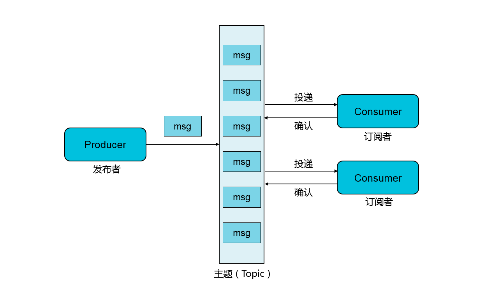

# RocketMQ中间件

## 一、基本介绍

### 1、简介

​	RocketMQ是基于高可用的分布式集群技术的消息中间件MQ，提供的是消息的订阅与发布、消息的轨迹查询、定时消息、资源统计、监控报警灯一系列的消息云服务。

​	RocketMQ中间件能够为分布式应用系统提供异步解耦、削峰填谷的能力，具备了海量消息堆积、高吞吐、可靠重试等性能与机制。

​	RocketMQ采用的是 **`HTTP`** 与 **`TCP`** 协议层面上的接入方式，支持七种语。

### 2、产品功能

#### 1）产品功能图


#### 2）多协议支持

- **`HTTP`** 协议： 采用的是RESTFUL风格的HTTP协议支持，方便接入，跨网能力强。
- **`TCP`** 协议：采用的是更加专业、可靠、稳定的 TCP协议进行SDK的接入。

#### 3）管理工具

- **web控制台**：支持 Topic、生产者、消费者管理，支持消息查询、消息轨迹、资源报表的管理监控。
- **OPEN API**：提供API允许用户将消息队列RocketMQ管理工具集成到自己的控制台中。
- **mqadmin 命令集**：专有云输出提供一套丰富的管理命令集，以命令的方式对消息队列RocketMQ服务进行管理。

#### 4）特色功能

- 事务消息：实现分布式的事务功能，已达到事务最终一致性的目的。
- 定时消息：允许生产者指定消息进行定时（延时）的投递。
- 大消息：允许传递4M以内的消息数据。
- 消息轨迹：通过消息轨迹，用户能够清晰定位消息从发布者发出，经过RocketMQ消息队列，投递到消息订阅者的完整连图，方便定位排查问题。
- 广播消费：允许一个 Group ID的所有标示的consumer都进行消息的消费。
- 顺序消息：允许消息消费者按照消息发送的顺序对消息进行消费。
- 重置消费进度：按照时间重置消费进度，允许用户进行消息回溯或者丢弃废弃消息。
- 死信队列：将无法正常消费的消息存储到特殊的死信队列中供后续的处理。
- 全球消息路由：用于全球不同的地域之间的消息同步复制，保证地域之间的数据一致性。

#### 5）消息收发模型

> ​	消息队列RocketMQ支持 ==**`发布/订阅`**== 模型，消息发布者（生产者）将消息发送至RocketMQ中的某一个 **==`Topic`==** ，多个消息接受者（消费者）订阅该主题以实现接收该消息的功能。

 

### 3、专有名词介绍

- **消息主题** **`Topic`**

> 消息主题，主要是***一级消息类型***，通过 Topic 对消息进行分类。

- **消息 `Message`**

> 消息，消息队列中信息传递的载体。

- **消息唯一标识 `Message ID`**

> 消息的全局唯一标识，由消息队列RocketMQ系统自动生成，标识这某一条消息。

- **消息标签 `Message Key`**

> 消息的业务标识，由消息生产者（Producer）设置，用于唯一标识某业务逻辑。

- **消息标签 `Tag`**

> 消息标签，***二级消息类型***，用以进一步区分某一个Topic下面的消息分类。

- **生产者 `Producer`**

> 消息生产者，也叫消息发布者，负责产生消息进行发送。

- **Producer 实例**

> Producer实例是 Producer的一个对象实例，不同的Consumer实例可以运行在不同的进程或者不同机器上。Producer实例是线程安全的，同一个进程可以多线程共享。

- **消费者 `Consumer`**

> 消息的消费者，也称消息订阅者，负责接收并消费消息。

- **Consumer 实例**

> Consumer的一个对象实例，不同的consumer实例可以运行在不同的进程或程序中。，一个**Consumer实例内部包含了线程池消费消息**。

- **组 `Group`**	

> 一类Producer或者一类Consumer。通常情况下，一类的生产者或者消费者用于处理同一类的消息消息，且发布与订阅消息的逻辑一致。

- **Group ID**

> Group组的标识。

- **投递语义 `Exactly-Once`**

> Exactly-Once投递语义是指发送发消息系统的消息只能被消费端处理并处理一次，即使生产者重试消息发送导致消息重复投递，该消息也在消费端只被消费一次。

- **集群消费**

> 一个Group ID所标识的所有Consumer平均分摊消费消息。例如某个 Topic 有 9 条消息，一个 Group ID 有 3 个 Consumer 实例，那么在广播消费模式下每个实例都会各自消费 9 条消息。

- **广播消费**

> 一个Group ID所标识的所有的Consumer都会各自消费某条消息一次。例如某个 Topic 有 9 条消息，一个 Group ID 有 3 个 Consumer 实例，那么在广播消费模式下每个实例都会各自消费 9 条消息。

- **定时消费**

> Producer将消息发送到消息对垒RocketMQ服务端，并不会立即投递，而是将消息推迟到当前时间点之后的某一个时间以后投递到Consumer进行消费，即称为延时消费。

- **事务消息**

> 消息队列Rocket提供类似 X/OPEN XA的分布式事务功能，通过消息队列RocketMQ的事务消息能够达到分布式事务的一致性。

- **顺序消息**

> 消息队列RocketMQ提供了一种按照顺序进行发布和消费的消息类型，分为***全局顺序消息***和***分区顺序消息***。

- **全局顺序消息**

> 对于指定的一个 Topic，所有消息按照严格的***先入先出（FIFO）***的顺序进行发布和消费。

- **分区顺序消息**

> 对于指定一个Topic，所有的消息根据 **Sharding key**进行区块分区。同一个分区内的消息按照严格的 FIFO顺序进行发布和消费。

- **Sharding key**

> Sharding key是顺序消息中用来区分不同分区的关键字段，和普通消息的key是完全不同的概念。

- **消息堆积**

> Producer已经将消息发送到消息队列中，但是Consumer消费能力有限，未能够间所有的消息在短时间内正确的消费掉，此时在消费队列RocketMQ中保存着大量的未被消费的消息，则称为消费堆积。

- **消息过滤**

> 消费者可以根据消息标签（**Tag**）对消息进行过滤的操作，确保消费者最终只接收被过滤以后的消息类型。消息过滤在消息队列Rocket的服务端进行完成。

- **消息轨迹**

> 在一条消息从生产者发出到订阅者消费处理过程中，由各节点的时间、地点等数据汇集而成的完整链路信息。通过消息轨迹，能够清晰定位消息从生产者发出，经由消息队列RocketMQ服务端，投递给消息消费者的完成链路，方便排查问题。

- **重置消费位点**

> 在消息持久化的范围之内（默认三天），重新设置消费者对其订阅Topic的消费进度。

- **死信队列**

> ​	死信队列用于处理无法被正常消费的消息。当一条消息初次消费失败，消息队列RocketMQ会自动进行 ***消息重试***。当消息重试次数达到最大值以后，消费者依然失败，则表明消费者无法正确的消费该消息，此时，消息队列不会立即 丢弃该消息，则是将其发送到该消费者对应的特殊队列中。
>
> ​	无法消费的消息被称为死信消息（Dead-Letter Message），将存储死信消息的特殊队列称为死信队列。

- **消息路由**

> 消息路由经常用于不同地域之间的消息同步，保证地域之间的数据一致性。消息队列RocketMQ的全球消息路由功能依托于阿里云基础实现高速通道专线，能够实现不同地域之间消息的同步复制

### 3、安装RocketMQ

#### Linux 安装：

- 第一步：环境准备：JDK1.8，Maven3.2+，Git。

- 第二步：克隆RocketMQ代码仓库。

  ```shell
  git clone -b develop https://github.com/apache/rocketmq.git
  ```

- 第三步：跳转到 rocketmq 目录：

  ```shell
  cd rocketmq
  ```

- 第四步：使用Maven编译、安装RocketMQ到Maven的本地库中。

  ```shell
  mvn -Prelease-all -DskipTests clean install -U
  ```

- 第五步：启动RocketMQ

  - 第1点：进入到对应目录

    ```shell
    cd distribution/target/apache-rocketmq
    ```

  - 第2点：启动 Name Server

    ```shell
    nohup sh bin/mqnamesrv
    ```

  - 第3点：启动 Broker

    ```shell
    nohup sh bin/mqbroker -n localhost:9876
    ```

#### Windows安装

- 第一步：下载对应的RocketMQ：[http://rocketmq.apache.org/release_notes/release-notes-4.2.0/](https://link.jianshu.com/?t=http%3A%2F%2Frocketmq.apache.org%2Frelease_notes%2Frelease-notes-4.2.0%2F)

- 第二步：解压项目，配置环境变量：

  - 配置 ROCKETMQ_HOME  ---- RocketMQ对应的地址。
  - 配置 PATH --- RocketMQ目录下的 bin 目录地址。

- 第三步：启动 NameServer

  - 在cmd命令下输入：

    ```shell
    start mqnamesrv.cmd
    ```

- 第四步：启动Broker

  - 在cmd命令下输入：

    ```shell
    start mqbroker.cmd -n 127.0.0.1:9876 autoCreateTopicEnable=true
    ```

- 第五步：安装插件：

  - 插件下载地址：https://github.com/apache/rocketmq-externals.git


## 4、配置与使用

### 1、RocketMQ角色分类

​	RocketMQ主要是由四个角色组合而成:

- ==`Producer`== --- 生产者
- ==`Consumer`== --- 消费者
- ==`Broker`== --- 数据暂存
- ==`NameServer`== --- 消息传输

### 2、参数介绍

- ==`namesrvAddr`== ：表示的是NamerServer的地址，可以存在多个。
- ==`brokerCl usterName`== ：表示的是cluster的地址。

- ==`brokerName`== ：表示的是Broker的名称，Master和Slave是通过使用相同的Broker名称来表明相互之间的关系的。

