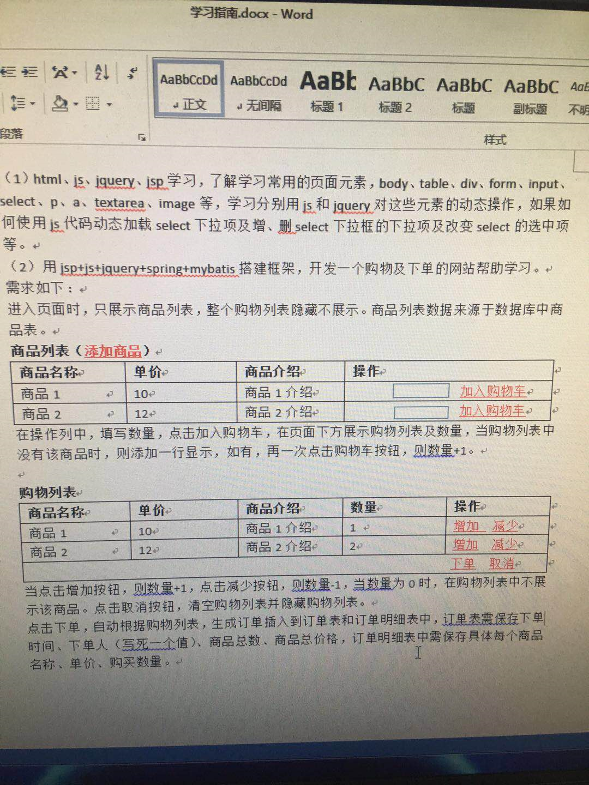

# 工作内容

- 2019.07.08   公司集合，领取电脑，跑了一趟客户现场。

- 2019.07.09   上午，安装电脑；下午，在陈东哥的带领下，了解客户业务，认识软件开发流程。

> 软件开发流程：
>
> - 需求分析
> - 原型设计（勾勒整个项目的静态页面设计，生成静态页面）
> - 概要设计（数据库设计）
> - 项目评审（团队进行项目需求评审）
> - 项目开发
> - 项目测试
> - 项目部署、运维

- 2019.07.10   学习禁毒业务，学习禁毒业务系统流程、数据分析；规划职业方向，学习使用Struts2框架。
- 2019.07.11  使用Spring+Struts2+Mybatis+jQuery搭建一个购物订单生成系统的WEB项目。

> **购物订单生成系统：**
>
> 
>
> **遇见问题：**
>
> - jQuery的each方法，
>   - `return false`相当于for循环中的 `break`方法； 
>   - `return true`相当于for循环中的`continue`方法；
> - 在js中创建button按钮，例如 `<button onClick='delete()'>删除</button>`，如果直接在delete()方法中调用 this 关键字，则代表的是当前window对象。
> - MySQL数据库中的关键字有 `order`。
> - 多表连接查询，可以使用 join 查询操作。

- 2019.07.12  修改前一天做的demo的业务逻辑，完善逻辑结构。
- 2019.07.13  根据学习计划安排，深入学习HTML DOM操作，继续学习JavaScript语言。
- 2019.07.14  
  - 学习JavaScript剩余文档，深入了解了浏览器BOM（Browser Object Model），了解document、location、screen等属性的作用。
  - 学习WebService。主要是使用 Apache CFX的WebService服务的产品，整合Spring框架技术，创建客户端、服务端，用于分布式服务的架构。

  > **遇见问题：**
  >
  > ​    在使用WebService的时候，接口对象的路径、名称等都不能够发生改变，否则服务无法引用。
  >
  > **与微服务分布式比较：**
  >
  > - WebService是分布式的一种落地实现，拥有客户端与服务端，客户端引用服务端暴露的接口，得到对应的json/xml数据。
  > - 微服务架构也是一种分布式架构，它是对服务进行拆分，将不同的服务创建不同的微服务，服务之间使用RPC、HTTP等协议进行通信。微服务架构对服务的拆分比WebService更加细致，颗粒化。服务治理更加完善。

2019.07.22 - 2019.07.24  了解新项目：取证交易分析。主要包括项目的数据库设计、项目前端界面编写方式。深入使用OASIS框架搭建页面。

2019.07.23 ~ 2019.08.01  开发取证交易分析项目。前端界面是采用OASIS框架整合jQuery实现前端界面；后台采用的是原有的项目架构，主要是Struts2框架，操作数据库采用的是avatar框架技术。实现的功能包括：

- 取证交易分析：根据账号获取该账号的交易次数、最早交易时间、最近交易时间、账号姓名等数据展示。
- 共同交易人分析：用户选择或者输入多个需要进行分析的账号，查询交易信息表中的数据，查看这些账号存在的共同交易人。
- 联系人查询：根据聊天记录表，查询聊天信息。
- 吸毒人员资金去向分析：共同交易人分析存入到吸毒资金表和吸毒资金统计表中以后，进行查询操作并展示。

2019.08.12 ~ 2019.08.16  任务中心ID改造。 根据西安对项目的要求，需要将禁毒系统中的主键生成策略更改为统一的策略。主要是将之前代码中使用的MySQL的自增方式、Oracle序列生成方式，更改为IDGenetor.nextId()生成long类型的id。

2019.08.19 ~ 2019.08.20 去刑警总队的客户中心，对任务中心的id改造进行测试工作，主要是进行黑盒测试，通过界面进行正确、异常等数据传递测试，并修改对应的bug。根据需求，修改数据库表结构，并修改bpm文件。

2019.08.21  当天工作主要是在客户中心将项目进行打包、部署上线，维护系统正常运行。

2019.08.22~2019.08.23 两江新区需求优化，熟悉之前两江新区的项目代码与业务，将客户提出的新的需求整理，融会贯通。设计数据库表结构，新增反诈Excel数据文件导入记录表，连通文件存储服务器fastdfs，上传反诈Excel文件，并将其存放至fastdfs文件存储服务器中进行保存。

2019.08.24 主要是实现反诈Excel数据导入功能，以及在文件存储服务器中上传文件、下载文件、删除文件等功能。